# HRI-4851 Configuration

{ht_translation}`[简体中文]:[English]`

**This topic describes how to configure HRI-4851 P2P/P2MP communication.**

## Hardware Connection
1. As shown in the figure,Connect the power wires and data bus of the device.

   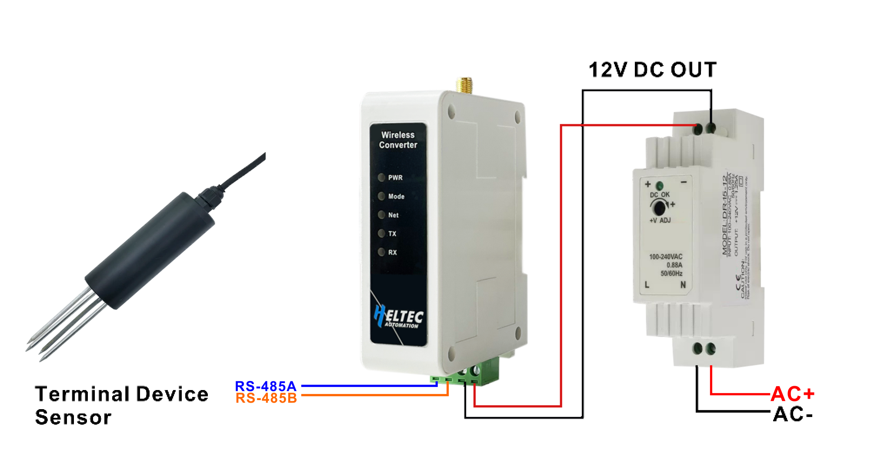 

2. Install the antenna we provided.

   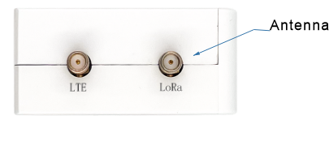 

## Enter Configuration Page
1. Press the RST button, until the white LED flashed quickly, at which point the device enters the configuration mode.

  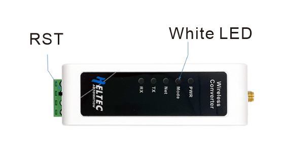

2. In configuration mode (White LED flashed quickly), you can find HRI-485x's Wi-Fi, in general, it has the format"HRI-4851L-xxxx", connect to this WiFi.

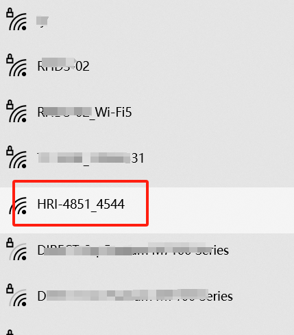

3. Enter *192.168.4.1* through the browser.

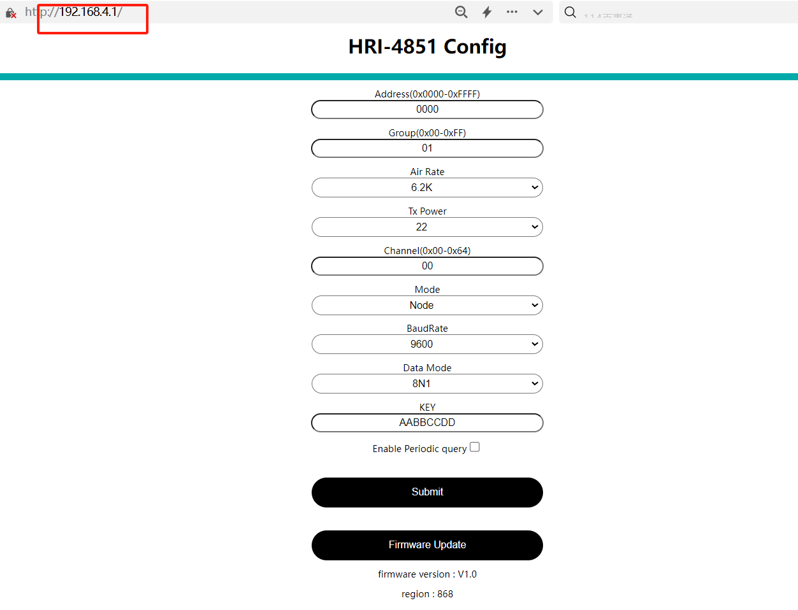

## Configure
1. Enter the configuration page, under the `Mode` option, select `Node`.

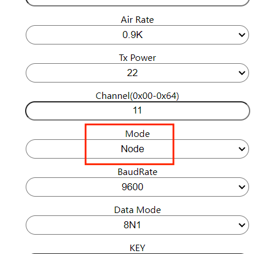

2. In general, HRI-4851 with the **same configuration** can communicate with each other. 

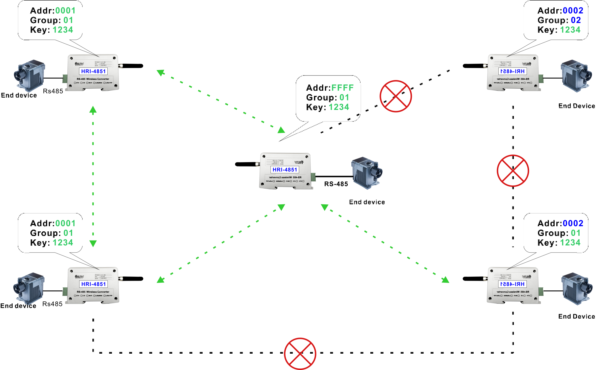

``` {Note} 'BaudRate' 'Data Mode' should be consistent with the terminal device.
```

``` {Tip} When the Address is *FFFF*, the device communicates with a device of any address(Group still has to be the same)
```

3. By clicking the `Enable periodic query` option, you can set up to 10 polling commands, and when multiple commands are run at the same time, they will be executed automatically at five-second intervals.

   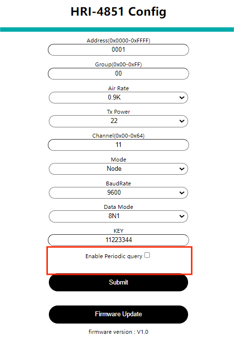

4. Click `Submit` when the configuration is complete. 

**If you need to upload HRI-4851 data to the server, you need to use with HRI-4852: [HRI-4852 User Manual](docs.heltec.org/en/ready_to_use/hri-485x/hri-4852.html)**

## Data Format
As shown above, HRI-4851 with the same parameters can communicate with each other, that is, A terminal sends *0xaa 0xbb*, and B terminal receives *0xaa 0xbb*.

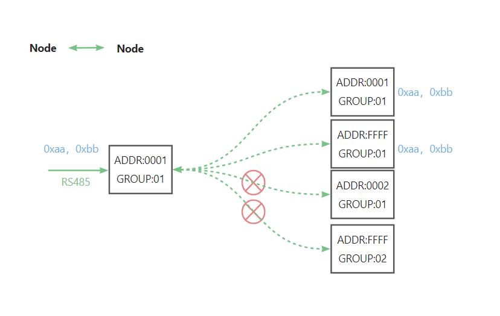

**When you are familiar with the basic functions of HRI-4851 and HRI-4852, you can use the following two functions of HRI-4851 to make more networking methods**

## HRI-4851 Relayer

The HRI-4851 can realize the relay function, and the two terminals of its connection can be either the HRI-4851 or the HRI-4852.

.png)

Enter the configuration page of HRI-4851, select `Relay `in the `Mode` option, and then configure its lora parameters and `Group` to be the same as the two terminals.

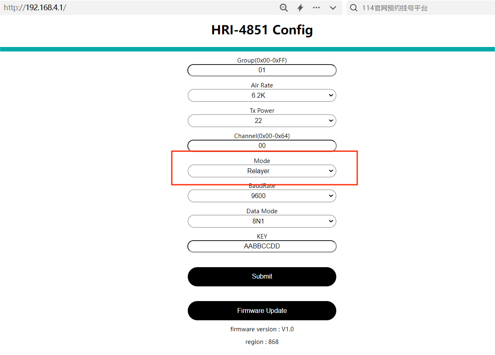

## HRI-4851 Gateway

When HRI-4851 is in gateway mode, it can communicate with all HRI-4851 in the same Group.

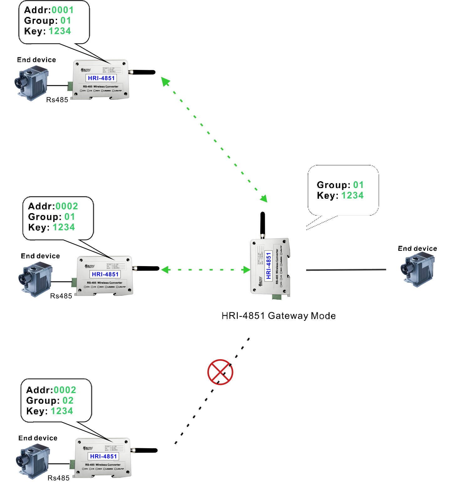

This feature does not connect to a server, but is available directly in the terminal.

Enter the configuration page of HRI-4851, select `Gateway `in the `Mode` option, and then configure its lora parameters and `Group` to be the same as the two terminals.

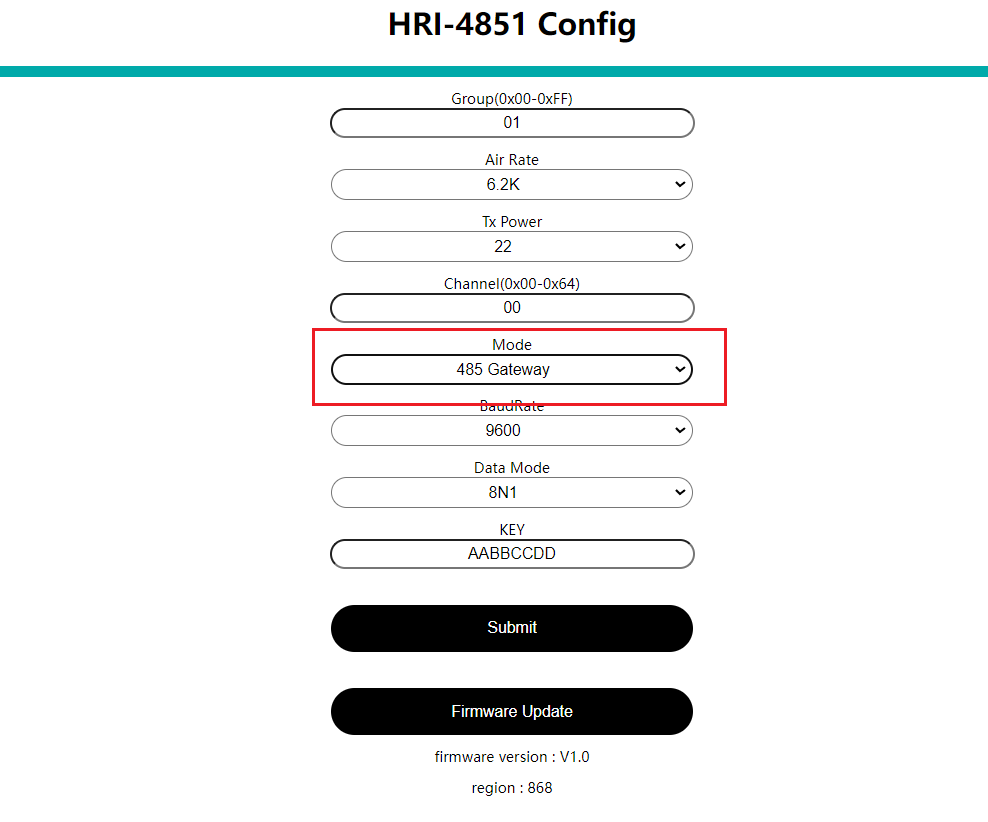

