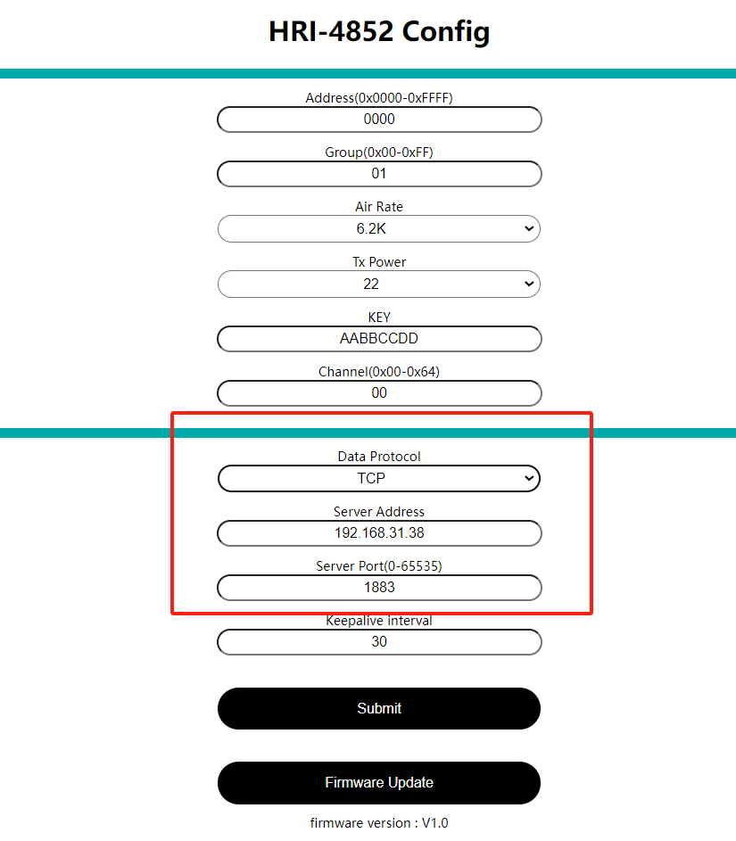

# HRI-4852

{ht_translation}`[简体中文]:[English]`

**HRI-4852 is used as a gateway for HRI-4851. This topic mainly describes how to configure HRI-4852 to send data to the network server.**

## Hardware Connection
1. As shown in the figure,Connect the power wires and data bus of the device.

 

2. Install the antenna we provided. 

 

3. If your device has an LTE version, remember to insert a SIM card

## Enter Configuration Page
1. Press the RST button, until the white LED flashed quickly, at which point the device enters the configuration mode.

2. In configuration mode (White LED flashed quickly), you can find HRI-485x's Wi-Fi, in general, it has the format"HRI-485x-xxxx", connect to this WiFi.

3. Enter *192.168.4.1* through the browser. **Note that if you have just configured another device, don't just refresh '192.168.4.1', you should retype it.** If this triggers a BUG, click this link: [HRI-4852 configuration page fix](https://docs.heltec.org/en/ready_to_use/hri-485x/hri-4852.html#common-problems-and-solutions).

## Configure
1. The parameters in the red box in the following figure are consistent with the HRI-4851 to be connected, and the `Address` can be filled in at will.

 

2. Depending on the server you want to connect to, select the `Protocol`, fill in the `Server Address`, and select the `Server Port`.

 

3. `Keepalive Interval` option is a heartbeat packet that delivery period. Usually this packet is the `Address` of the device.

 

4. When the configuration is completed, click `Submit` and press the `RST` key. The white LED is always on, indicating that the device enters the working mode.

## Data format
The following figure shows the data format of communication between HRI-4852 and HRI-4851:

When the node sends *aa bb*, the server receives *HRI-4852 address + HRI-4851 address +aa bb*;

Similarly, if the server needs to issue *aa bb* instructions to the node, it needs to add the corresponding *HRI-4852 address + HRI-4851 address+ aa bb*.

## Common problems and solutions
+ the browser will not connect
If you type "192.168.4.1", the browser will not connect,please check if you are connected to the WiFi of the device you are configuring.
+ Device not working
After each configuration,you must press the switch to put the device into "work mode".

