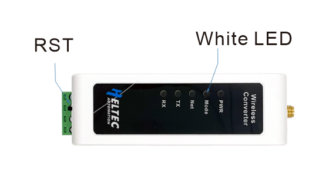

# HRI-4853

{ht_translation}`[简体中文]:[English]`

**HRI-4853 does not have a LoRa function, it will directly send the data of the terminal to the server through Ethernet or LTE.**

## Hardware Connection

**The installation process must be carried out in the case of power failure**.

1. As shown in the figure,Connect the power wires and data bus of the device.

  

2. If your device has an LTE version, remember to insert antenna and SIM card.

## Enter Configuration Page
1. Press the `RST` button, until the white LED flashed quickly, at which point the device enters the configuration mode.

2. In configuration mode (White LED flashed quickly), you can find HRI-485x's Wi-Fi, in general, it has the format"HRI-485x-xxxx", connect to this WiFi.

3. Enter *192.168.4.1* through the browser. **Note that if you have just configured another device, don't just refresh '192.168.4.1', you should retype it.**

## Configure
1. The parameters in the red box in the following figure are consistent with the HRI-4851 to be connected, and the `Address` can be filled in at will.

 

2. Depending on the server you want to connect to, select the `Protocol`, fill in the `Server Address`, and select the `Server Port`.

 

3. When the configuration is completed, click `Submit` and press the `RST` key. The white LED is always on, indicating that the device enters the working mode.

## Data format
The following figure shows the data format of HRI-4853:

## Common problems and solutions
+ the browser will not connect
If you type "192.168.4.1", the browser will not connect,please check if you are connected to the WiFi of the device you are configuring.
+ Device not working
After each configuration,you must press the switch to put the device into "work mode".

