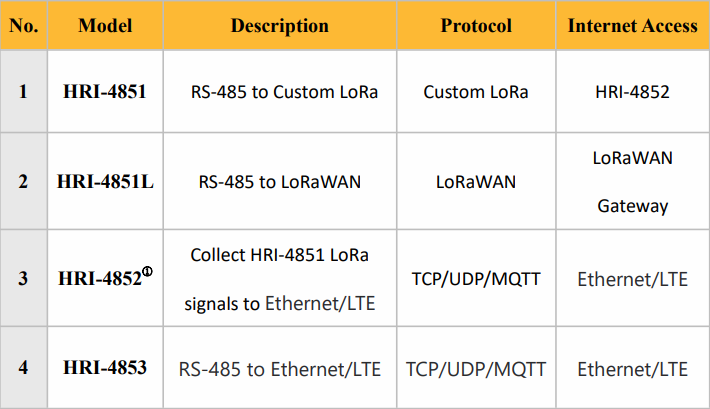

HRI-485x
========
:ht_translation:`[简体中文]:[English]`

The HRI-485x series is a DTU device that converts the RS-485 bus to wireless data. Sub models achieve RS-485 data to LTE (Cat. 1/Cat. 4), private LoRa, standardLoRaWAN, Ethernet, etc. communications method. 

**HRI-485x have following main features:**

+   MCU:ESP32C3-FN4 / ESP32DOWDQ6;
+   LoRa:SX1262;
+   Support LoRaWAN (only HRI-4851L);
+   Support 4G and Ethernet;
+   Support 4.5-28v supply voltage ;
+   Support for data encryption,1024 bytes cache,a single packet supports up to 240 bytes;
+   Support communication key function , effectively prevent data interception;

.. toctree::
    :maxdepth: 2
    Application Example <application_example>
    HRI-4851 <hri-4851>
    HRI-4852 <hri-4852>
    HRI-4853 <hri-4853>
    HRI-4851L(LoRaWAN)<lorawan>
    OTA Upgrade<ota_upgrade>
    -->[General Docs]<-- <https://docs.heltec.org/general/index.html>