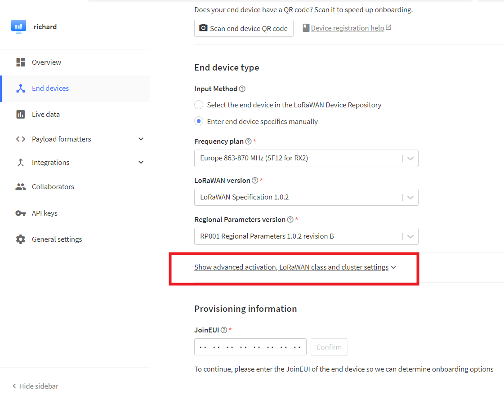

# LoRaWAN
HRI-4851L is a DTU device using LoRaWAN protocol, and its network access must also rely on LoRaWAN gateway and server.
## Hardware Connection
1. As shown in the figure,Connect the power wires and data bus of the device.

 

2. Install the antenna we provided.

 

## Enter Configuration Page
1. Press the RST button, until the white LED flashed quickly, at which point the device enters the configuration mode.


2. In configuration mode (White LED flashed quickly), you can find HRI-485x's Wi-Fi, in general, it has the format"HRI-4851L-xxxx", connect to this WiFi.


3. Enter *192.168.4.1* through the browser.


### Parameter specification
Configure the parameters according to your needs. 

+ `REGION`  LoRaWAN frequency plan, needs to be set same on nodes, gateways, and servers.
+ `Class`  LoRaWAN class capabilities, needs to be set same on nodes, and servers.
+ `OTAA/ABP`  Activation mode,  needs to be set same on nodes, and servers.
+ `ADR` LoRaWAN data rate adaptation, when `Adr` is on, the DR Option is the DR Used for network access request; when `ADR` is off, the DR Is the DR For network access and uplink data.
+ The default port of uplink and downlink is 2;
+ The power is adaptively determined by the `ADR` when the `ADR` is on;
+ `Confirm`  Data received acknowledgment.
+ `485 Baud` RS-485 data baud rate, needs to be same as terminal device.
+ `DEVEUI` `APPEUI` `APPKEY` Identifiers for your LoRaWAN device, These identifiers will be used when you register the device on the server.
+ `Channel`  The channel of LoRaWAN, the channel of the node needs to be included by the channel of the gateway. Performs multiple channel Settings, separated by whitespace, such as "0-2 5 10-17".
+ `INTERVAL` RS-485 query instruction cycles in seconds. 
+ `RETRY`    Number of retransmission attempts.
+ `PRODUCT` Product model.
+ `FIRMWARE` Firmware version.

### RS-485 Setting
Each RS-485 instruction supports up to 32bytes, and if multiple 485 instructions are enabled, the interval between each two instructions is 5S.


**After the configuration is completed, click submit, press the RST when the white LED is always on, and the device enters the working state.**

## Connect to LoRa Servers

**The default downlink port is 2.**

### Connect to TTN/TTS
**Before that, make sure there is a LoRa Gateway active in your [TTN](https://console.thethingsnetwork.org/)/[TTS](https://lora.heltec.org/console) account.**

1. Log in to your TTN/TTS account and click the icon shown by the arrow.


2. Click `Create Organization` to create an Application.


3. Click `Register end device`. 


4. Click`Enter end device specifics manually`, The following options will pop up:


   - `Freq plan` Select the frequency band corresponding to the device.
   - `LoRaWAN version`   Choose 'LoRaWAN Specification 1.0.2'.
   - `Regional Parameters version`  Choose 'RP001 Regional Parameters 1.0.2 revision B'.

```{Note} On server, the default mode is OTAA and CLASS_A, if you need to change this mode, please open the options below.
```



5. Fill in `joinEUI` and click Confirm.

 

``` {Note} The joinEui is represented as AppEui on the device configuration page.
```

 

6. Refer to the configuration page, fill in the `DEVEUI` and `APPKEY`, click `Register end device`.


7. After registration is complete, if all is well, you will see the device active.


8. Give instructions. Click the `Messaging` option, select `Fport 2`, `Bytes`, and enter the downlink command.

   

### Connect to ChirpStack
1. Register a new device in ChirpStack’s “Applications” page. Enter the device name, description, DevEUI. Select Device-profile.


2. Enter the Application key of the device.


3. After registration is complete, if all is well, you will see the device active.


## Important Hints

4. Please double check the following two things:

1. The LoRaWAN parameters are the same as server!
2. The listening frequency of your LoRa Gateway is the same as ESP32 LoRa node's sending frequency. We strictly follow [LoRaWAN™ 1.0.2 Regional Parameters rB](https://resource.heltec.cn/download/LoRaWANRegionalParametersv1.0.2_final_1944_1.pdf);

