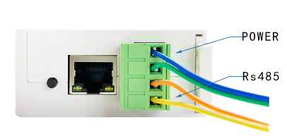
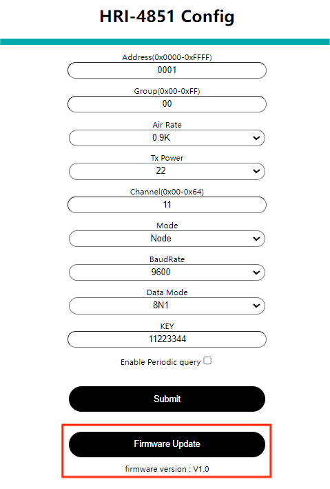

# Getting Started

{ht_translation}`[简体中文]:[English]`

## Download firmware
Search this link for the firmware version you want to download:
[https://resource.heltec.cn/download/HRI-485X/](https://resource.heltec.cn/download/HRI-485X/)

## Enter debug mode
Switch on the power supply, press the button to enter the configuration mode, and then the white light flashes quickly. 



## Enter the configuration page
Locate the device hotspot and connect to it. Enter 192.168.4.1 on the web page to go to the device configuration page. 

```{Tip}If you forget how to access the diagram configuration page, see [Quick Start](https://docs.heltec.org/en/ready_to_use/hri-485x/quick_start.html)

``````
## Firmware upgrade
Click on the red box below, select the firmware you downloaded, and then click Upgrade.



## Relocation information
After the upgrade is complete, all configurations will be reset. You need to go back to the configuration page to complete the configuration

## Common problems and solutions
+ The browser will not connect
If you type "192.168.4.1", the browser will not connect,please check if you are connected to the WiFi of the device you are configuring.
+ Device not working
After each configuration, you must press the switch to put the device into "work mode".
