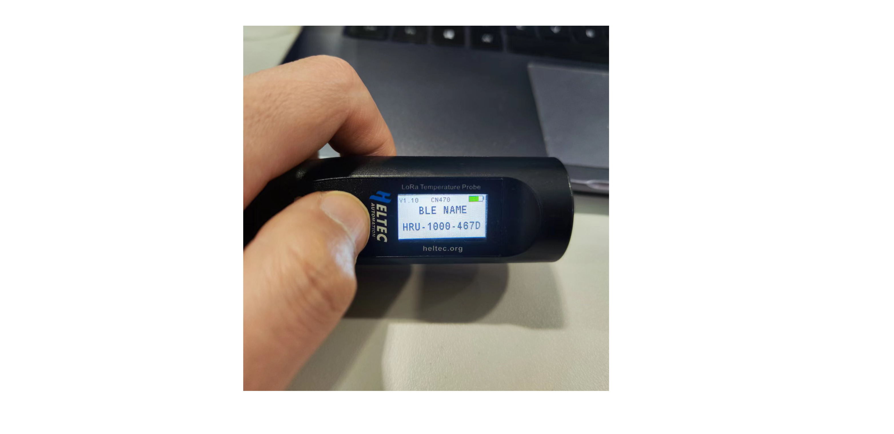
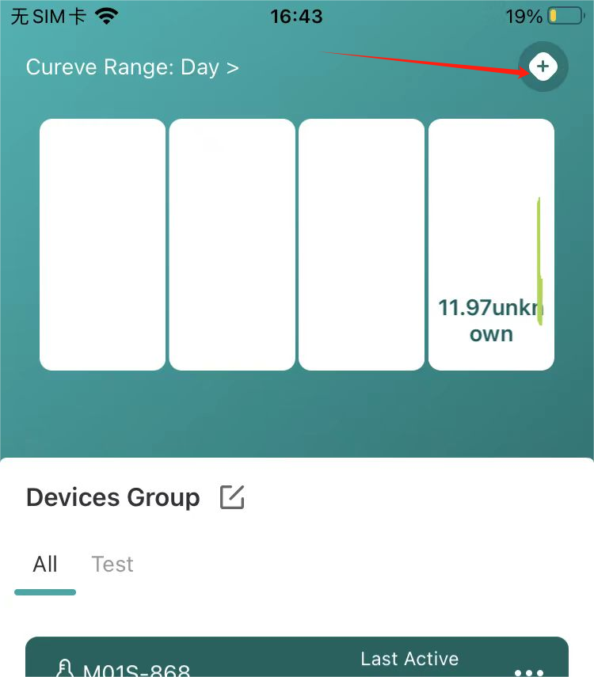
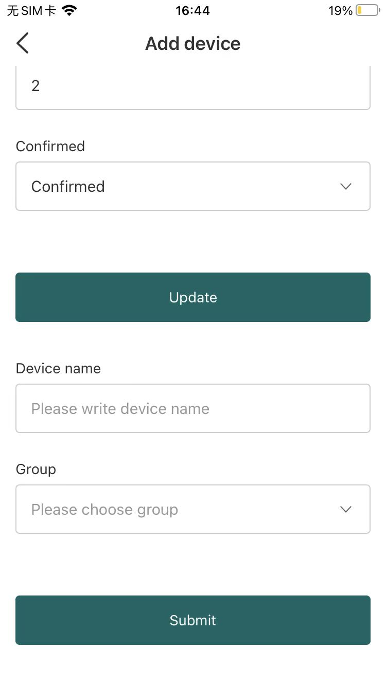
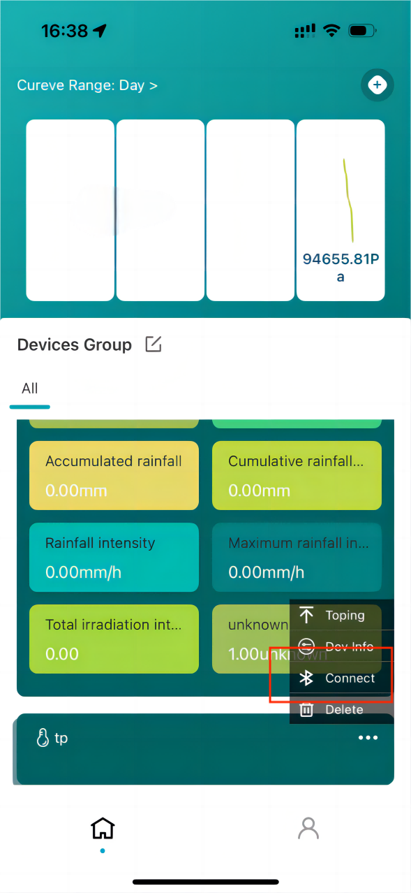
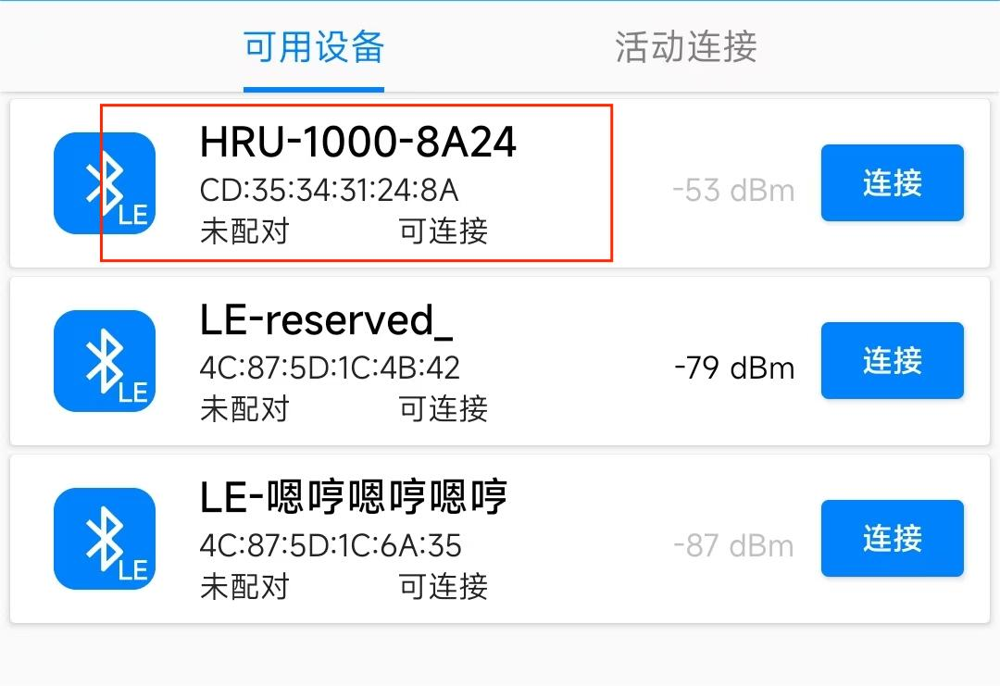
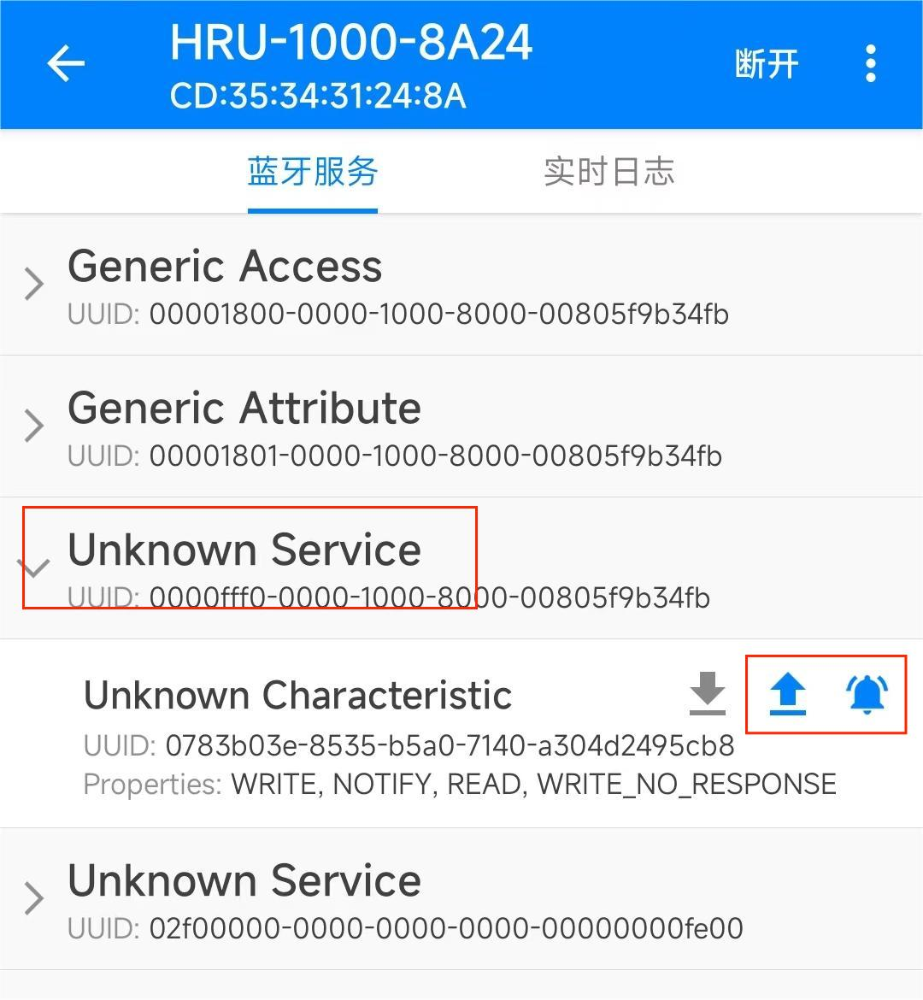
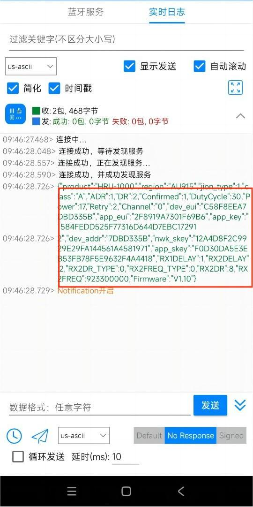
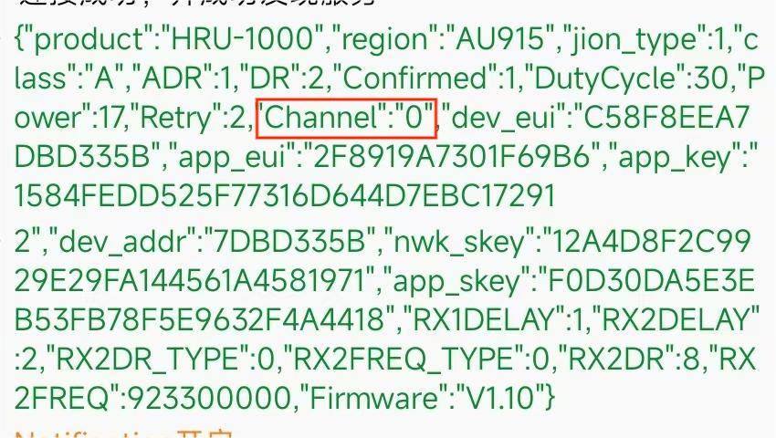
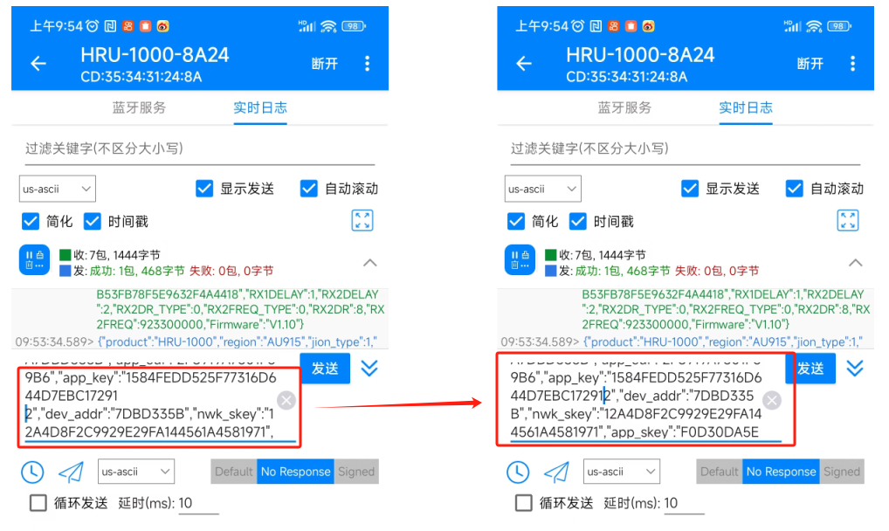

# Configuration
This topic describes how to modify the configuration of HRU-1000.

- [Via SnapEmu](via_snapemu)

- [Via Other Bluetooth debugger](via_other_bluetooth_debugger)

  

(via_snapemu)=

## Register a device in Snapemu for the first time

1. When the screen lights up, quickly double-click the button and the device displays the following information, indicating that the Bluetooth configuration mode has been entered.

2. Click `+` at the top right corner of the SnapEmu APP and select `Bluetooth`.

,

3. Click to connect the device, enter the configuration page, modify the relevant information, and click Update.

   ## Registered devices

   1. Open SnapEmu and click on the device you want to modify,  select `connect`.

      

   2. Enter the configuration page, modify the relevant information, and click `Update`.
   
      (via_other_bluetooth_debugger)=
   
      ## Configuration via other Bluetooth debugger
   
      1. Press the device button and quickly double-click the device button when the screen lights up to make the device enter the Bluetooth debugging mode.
   
         
   
         2. Open your Bluetooth debugging tool, locate the device and connect it.
   
            
   
         3. Click on the "**Unknown Service with **"(UUID:0000fff0 xxxxxx), and open the **write** and **prompt** function.
   
            
   
         4. Switch to the log page and copy the resulting information.
   
            
   
         5. Paste the copied information into the attached field. You can change the DR, channel, DutyCycle, etc. For example you can change the channel to 0-7.
   
            
   
         6. When you change the configuration, the newlines are removed. As shown in the figure.
   
            
   
         7. Click Send, when the configuration is successful, it will prompt "modified successfully".
   
      
