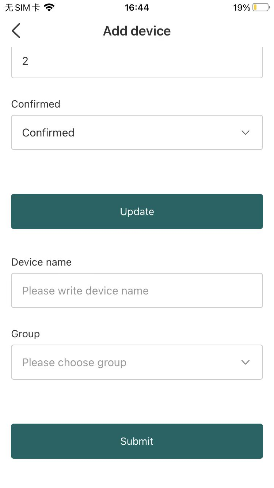

# Connect to LoRa Server
Currently HRU-1000 uses LoRaWAN a communication protocol, and this topic aims to describe how HRU-1000 can be connected to LoRa Server.

## Get device registration information

*Double-click the device button to enter Bluetooth configuration mode.*

*Click `+` at the top right corner of the SnapEmu APP and select `Bluetooth`.*

*Click the discovered device to enter the device configuration screen. You can log device information, or choose to stay on this page for device registration.*

## Connect to LoRa Server

Two commonly used servers, [TTS/TTN](https://www.thethingsindustries.com/) and [ChirpStack](https://www.chirpstack.io/), are introduced here

### Connect to TTS/TTN

*Register a new device in TTN or TTS "Applications",choose `Enter end device specifics manually`.*

*Select the frequency plan, and fill in the corresponding AppEUI, DevEUi, AppKey, and register the device.*

*After registration is complete, if all is well, you will see the device active.*

### Connect to ChirpStack

*Register a new device in ChirpStack’s “Applications” page. Enter the device name, description, DevEUI. Select Device-profile.*

*Enter the Application key of the device.*

*After registration is complete, if all is well, you will see the device active.*

