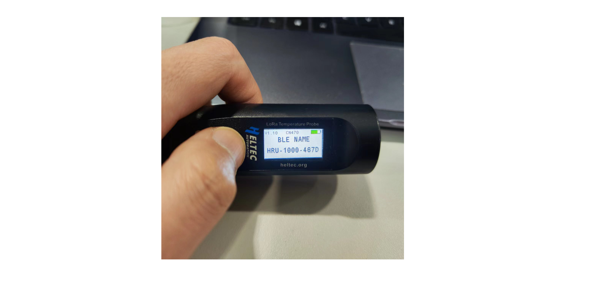

# Connect to SnapEmu APP

{ht_translation}`[简体中文]:[English]`

This topic describes how to register a device with SnapEmu.

## Power on
Long press the device button.

 

## Install the SnapEmu APP
Search the Apple App Store for `SnapEmu`, download and install it.

 

## Register Gateway
Make sure you have LoRa gateway up and registered on SnapEmu.You can refer to the following link:

- [HT-M02](https://docs.heltec.cn/en/gateway/ht-m02_v2/connect_to_server.html#connect-to-snapemu)
- [HT-M01S](https://docs.heltec.cn/en/gateway/ht-m01s_v2/connect_to_server.html#connect-to-snapemu)
- [HT-M7603](https://docs.heltec.cn/en/gateway/ht-m7603/connect_to_server.html#connect-to-snapemu)

## Register Wireless Thermoprobe
HRU-1000 can be registered by scanning the QR code of the device, or paired to register through the Bluetooth.

- [Scaning the QR code](scan-the-qr-code)
- [Bluetooth](bluetooth)

(scan-the-qr-code)=
### Register by scanning the QR code
Open SnapEmu app, Click the icon shown below and select `SCAN` to scan the device QR code.

 

Fill in the device scale and group, add device.

 

The device registration is completed and the data is uploaded.

 

(bluetooth)=
### Register via bluetooth
Double-click the button to enter the device into Bluetooth debug mode.

 

Open SnapEmu app, Click the icon shown below and select `Bluetooth`.

Find the device ID and click Enter.

If you want to change the configuration, click `UPDATE` first. Once you're done, name your devices and group them. Click "Submit".

The device registration is completed and the data is uploaded.

 