# Connect to LoRaWAN Server
This topic describes how to upload the data of HRU-3601 to the LoRa server.
## Register and activate the LoRaWAN gateway
Before that, you have to make sure that you have a LoRaWAN gateway running on the server. If you do not have a LoRaWAN gateway or do not know how to register, you can refer to the Heltec LoRa gateway related instructions, you can choose one of them:

- [HT-M02 Edge LoRa Gateway](https://docs.heltec.org/en/gateway/ht-m02_v2/index.html)
- [HT-M7603 Indoor LoRa Gateway ](https://docs.heltec.org/en/gateway/ht-m7603/index.html)
- [HT-M2802 Indoor LoRa Gateway](https://docs.heltec.cn/en/gateway/ht-m2802/index.html)
- [HT-M01S (Rev. 2.0)](https://docs.heltec.org/en/gateway/ht-m01s_v2/index.html)

## Register and activate HRU-3601
### Get configuration information

Go to the configuration page to get the configuration information for your device, which you'll learn about in the previous topic:
[HRU-3601 Quickstart](https://docs.heltec.org/en/ready_to_use/hru-3601/quick_start.html)

Modify, submit, and save the information on this page to your needs, and they will be used for subsequent registration.

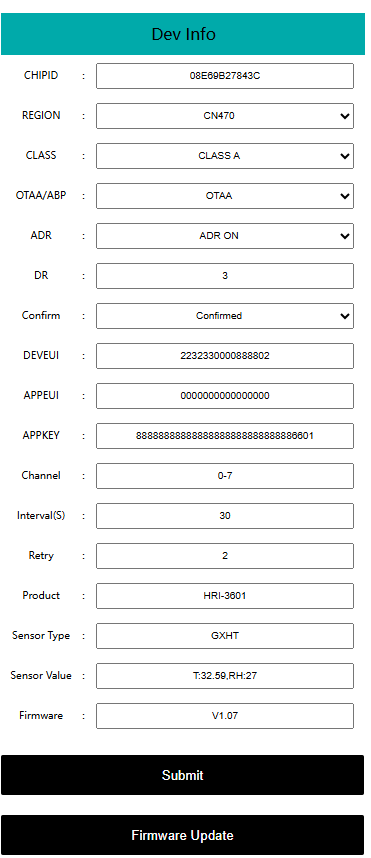

## Connect to LoRa server

[TTS](https://eu1.cloud.thethings.network/console/applications) and [SnapEmu](platform.snapemu.com) are taken as examples here.

- [TTN/TTS](ttn/tts)
- [SnapEmu](snapemu)

(ttn/tts)=

#### Connect to TTN/TTS

Go to the server page and click `Application`->`Add Application`.

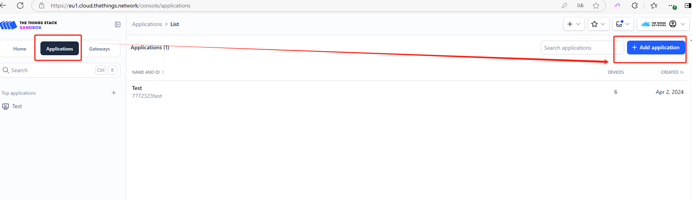

Create an Application. You can fill in any information you want. This is a description of your project.

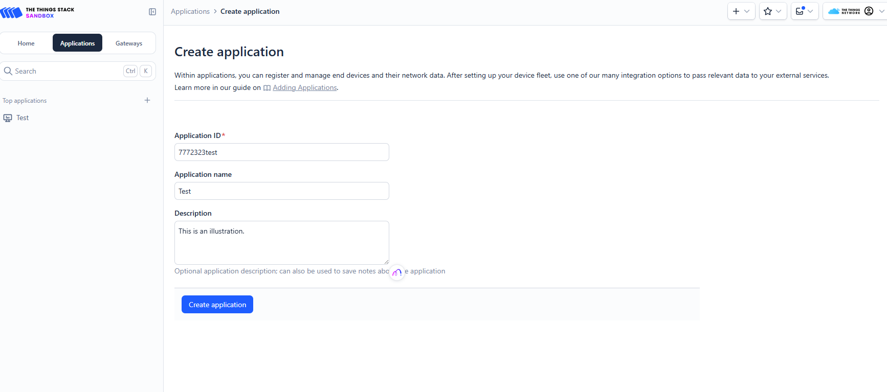

Click `Register end device`

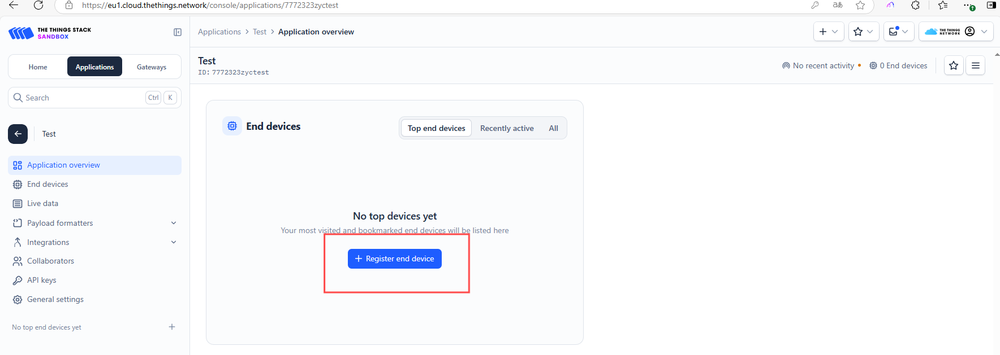

Register a new device in TTN or TTS "Applications",choose `Enter end device specifics manually`.

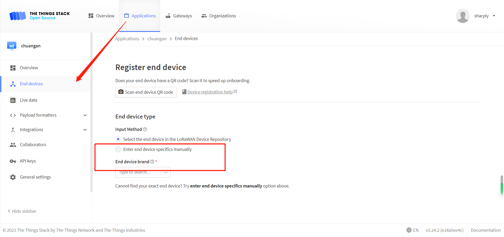

Select the frequency plan, and fill in the corresponding AppEUI, DevEUi, AppKey, and register the device.

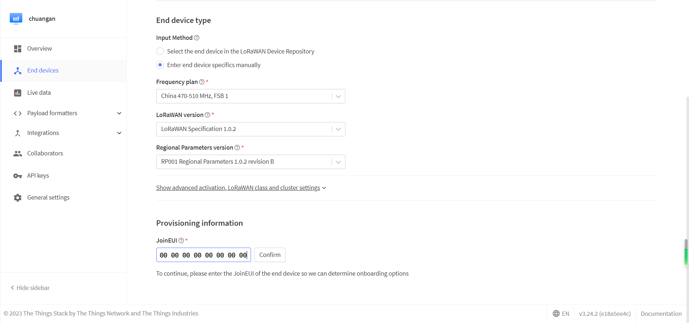
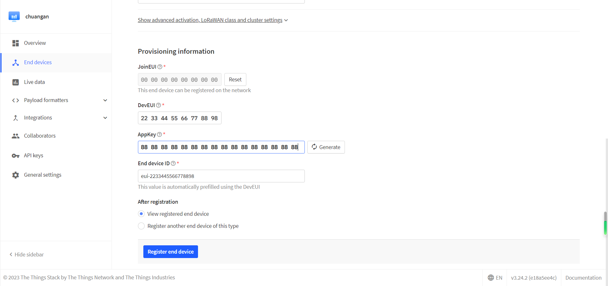

``` {Tip} The **joinEui** here is the **AppEui** on the configuration page, which is "0000000000000000".

```

After registration is complete, if all is well, you will see the device active.

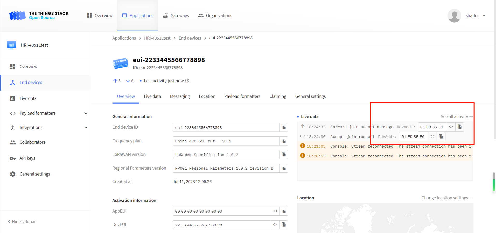

Click `payload formatters`, select `Custom Javascript formatter`, and enter decoding at the position in the figure. Download the decoder here: [HRU-3601 Related Resources](https://resource.heltec.cn/download/HRU3601).

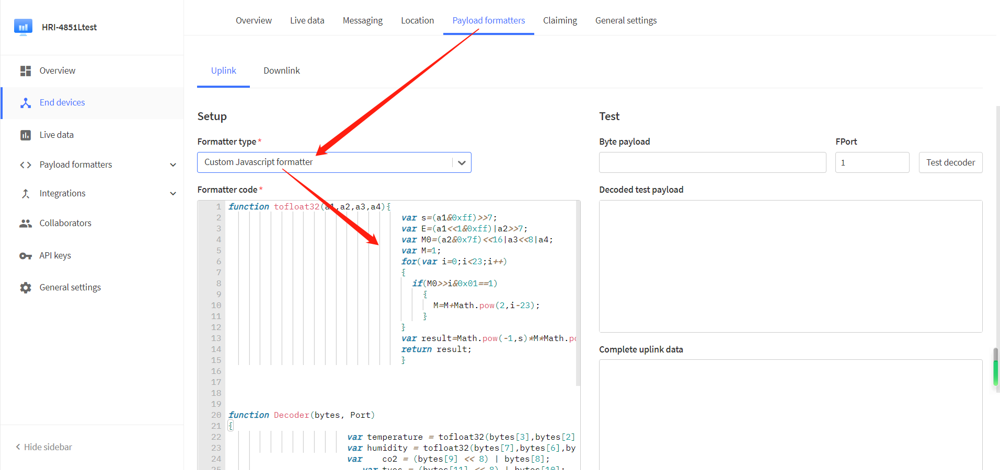

Click `Save change` and move the mouse to the uplink data output to view the data uploaded by HRU-3601.

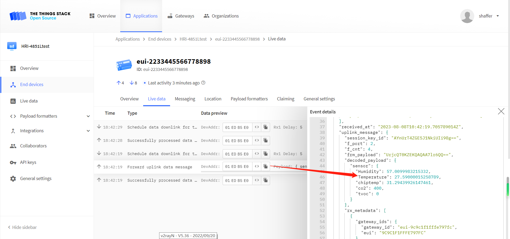

(snapemu)=

#### Connect to SnapEmu

Log into your account on **platform.snapemu.com**, click `device`, `CREATE A NEW DEVICE`.

 *If you're using an APP,click `+` ,select `input`.*

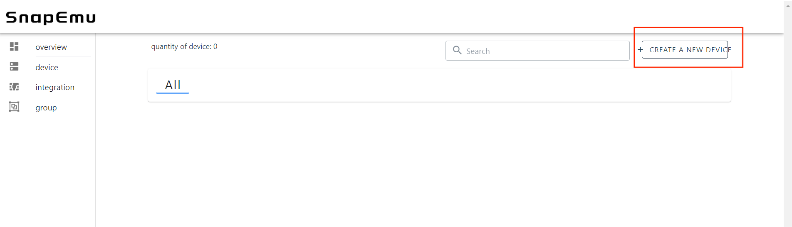

Fill in the device information.

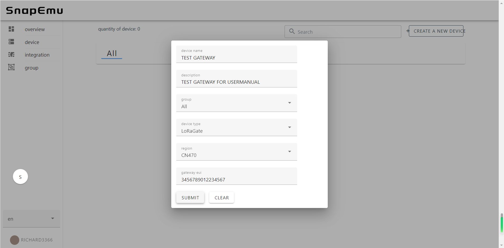

After registration is complete, if all is well, you will see the device active.


## Important Hints

Please double check the following two things:

1. The LoRaWAN parameters is the same as server!
2. The listening frequency of your LoRa Gateway is the same as LoRa node's sending frequency. We strictly follow [LoRaWAN™ 1.0.2 Regional Parameters rB](https://resource.heltec.cn/download/LoRaWANRegionalParametersv1.0.2_final_1944_1.pdf);

