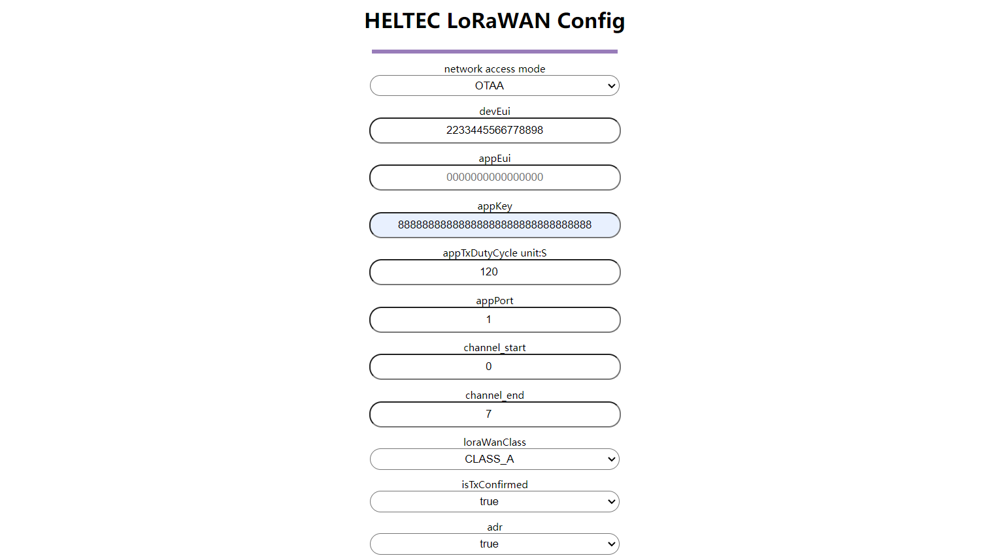

# Connect to LoRaWAN Server
Currently HRU-3601 uses LoRaWAN a communication protocol, and this topic aims to describe how HRU-3601 can be connected to LoRaWAN Server.
## Seting up LoRaWAN Gateway
Before that, make sure there is a LoRa Gateway active in your [TTN](https://console.thethingsnetwork.org/)/[TTS](https://lora.heltec.org/console) account.

## Confirm configuration information
Refer to [Quick Start](https://docs.heltec.org/en/ready2use/hru-3601/quick_start.html) to go to the configuration page of **HRU-3601**.

``` {Tip} In order to explain the corresponding positions of various parameters in the server, we will fill in the specific numbers here, and please fill in the actual use according to your own needs.

```



The details of the introduction of each parameter are as follows:
+ `network access mode` choose `OTAA` or `ABP`, .
+ `devEui` Your node ID, you can fill in your own, must be 16 hexadecimal digits, such as "2233445566778898".
+ `appEui` Feel free to fill it out, must be 16 hexadecimal digits, such as "0000000000000000".
+ `appKey` Feel free to fill it out, must be 32 hexadecimal digits, "88888888888888888888888888888888".
+ `appIxDutyCycle unit:S` the transmission interval of the LoRa signal.
+ `appPort` free choice.
+ `channel start` `channel end` Align with the gateway, For example, if you want to select 0~7, fill in 0 and 7.
+ `loraWanClass` The communication mode of LoRaWAN, we can choose `CLASS A` or `CLASS C`.
+ `isTxConfirmed` Uplink receives confirmation whether it is enabled or not.
+ `adr` Whether data rate adaptation is enabled.

``` {Tip} The above is the configuration page in OTAA mode. If ABP needs to be used, the configuration will be slightly different.

```

## Registering node on server

Register a new device in TTN or TTS "Applications",choose `Enter end device specifics manually`.


Select the frequency plan, and fill in the corresponding AppEUI, DevEUi, AppKey, and register the device.


``` {Tip} The **joinEui** here is the **AppEui** on the configuration page, which is "0000000000000000".

```

After registration is complete, if all is well, you will see the device active.


Click `payload formatters`, select `Custom Javascript formatter`, and enter decoding at the position in the figure. Download the decoder here: [HRU-3601 Related Resources](https://resource.heltec.cn/download/HRU3601).


Click `Save change` and move the mouse to the uplink data output to view the data uploaded by HRU-3601.


## Important Hints

Please double check the following two things:

1. The LoRaWAN parameters is the same as server!
2. The listening frequency of your LoRa Gateway is the same as LoRa node's sending frequency. We strictly follow [LoRaWAN™ 1.0.2 Regional Parameters rB](https://resource.heltec.cn/download/LoRaWANRegionalParametersv1.0.2_final_1944_1.pdf);

