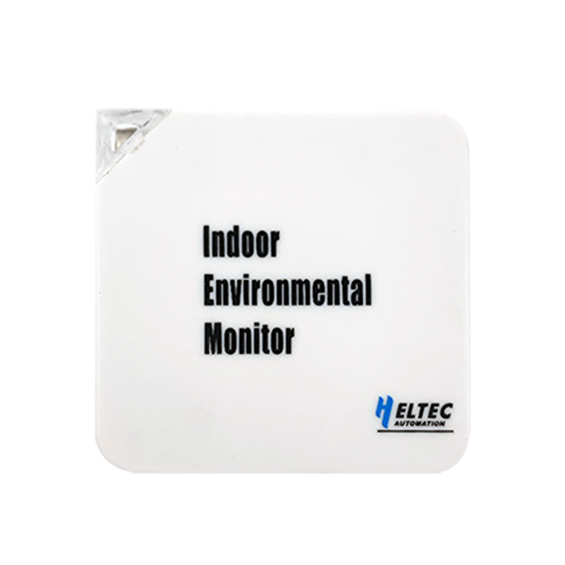

HRU-3601
========
:ht_translation:`[简体中文]:[English]`

HRU-3601 is a low cost indoor environment monitor, the recorded data is uploaded to the cloud server wirelessly, thus realize the remote monitoring of the environment.

.. {Note}::
    The configuration mode causes the device temperature to rise. In this case, the test temperature is usually too high. Please wait patiently for the device to return to the normal temperature.

**HRU-360X have following main features:**

+ Protocol: LoRaWAN;
+ 5v supply voltage ;
+ Stylish and lightweight;
+ Wall mount installation;
+ Easy configuration via Web;
+ -30°C to 60°C maximum operating temperature range;

.. toctree::
    :maxdepth: 2
    
    Quick Start <quick_start>
    Connect to LoRaWAN Server<connect_to_lorawan_server>
    Related resources Download<https://resource.heltec.cn/download/HRU3601>
    Subscribe MQTT Messages from LoRa Server<https://docs.heltec.org/general/subscribe_mqtt_messages.html>
    Publish MQTT Message<https://docs.heltec.org/general/publish_mqtt_message.html#id1>
    -->[General Docs]<-- <https://docs.heltec.org/general/index.html>