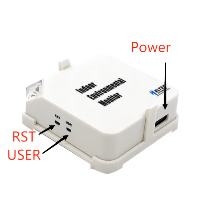
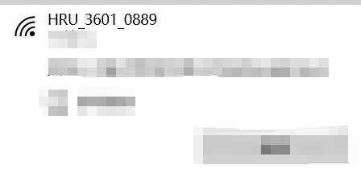

# Quick Start

{ht_translation}`[简体中文]:[English]`

HRU-3601 employs LoRaWAN communication, and utilizes Web for easy configuration via WiFi. The parameters that can monitor include: TVOC, eCO2, temperature and humidity. It has powerful function, light appearance, easy installation, suitable for home life, industrial production and other indoor occasions.

## Power on

Connect the adapter through the USB port. You can also connect a 5V power supply directly via a USB cable.



## Enable device status

Press the `RST` button, and the device indicator turns Green.

Then Press the 'USER' button, the RGB turns blue. At this time, the device goes into configuration mode.

## Enter Configuration Page

At this time, find the WIFi named **HRU-3601-XXXX** through PC or mobile phone, connect to it.



Enter"**192.168.4.1**"in your browser to navigate to the configuration page of HRU-3601.


## Configuration

In the configuration page, you can modify the relevant parameters of LoRa. 

+ `Chip ID` MCU chip ID, When you lose the device LoRaWAN license in some cases, you need to license through it.
+ `REGION` LoRaWAN operating frequency.
+ `CLASS` The working mode of the device.
+ `OTAAA/ABP`  The mode of connecting network.
+ `ADR` Choose whether to enable rate adaptation.
+ `DR` When selecting `ADR` off, select a DR on which the device is working. This option is not valid when DR Is enabled.
+ `Confirm` Whether to enable uplink information confirmation.
+ `DEVEui` DevEUI needs to be consistent with the server.
+ `APPEui` appEUI needs to be consistent with the server, some servers are called "joinEUI".
+ `APPKey` appKey needs to be consistent with the server. 
+ `Channel`  The channel of the corresponding frequency band. For example, if you want to use channel "0", enter "0", and if you want to use channels "0-7", enter "0-7". 
+ `Interval(S)` Interval period of uplink information.
+ `Retry` Number of retransmissions after uplink message failure.
+ `Product` Product model number
+ `Sensor Type` Sensor Type.
+ `Sensor Value` Sensor values.
+ `Firmware` Firmware version.

``` {Tip} The above is the configuration page in OTAA mode. If ABP needs to be used, the configuration will be slightly different.

```

Once the configuration is complete, click Submit. Press the `RST` button.


``` {Note} The configuration mode causes the device temperature to rise. In this case, the test temperature is usually too high. Please wait patiently for the device to return to the normal temperature, which usually takes about 1 hour.
```

## Connect to server

After the device is configured and restarted, you need to register it with your LORAWAN server and ensure that there is a gateway running on the server within the working range of the device, and the LoRa parameters of the gateway must be consistent with the node.
A detailed description can be found in the next topic: [Connect to LoRa server](https://docs.heltec.cn/en/ready_to_use/hru-3601/connect_to_lorawan_server.html)

## Common problems and solutions

+ The browser will not connect

    If you type "192.168.4.1", the browser will not connect,please check if you are connected to the WiFi of the device you are configuring.
+ Device not working

    After each configuration, you must press the `RST` to put the device into work mode.
+ The temperature data is not accurate.

    Some operations may cause CPU temperature to rise, please disconnect the power and allow HRU-3601 to cool down for a period of time.
