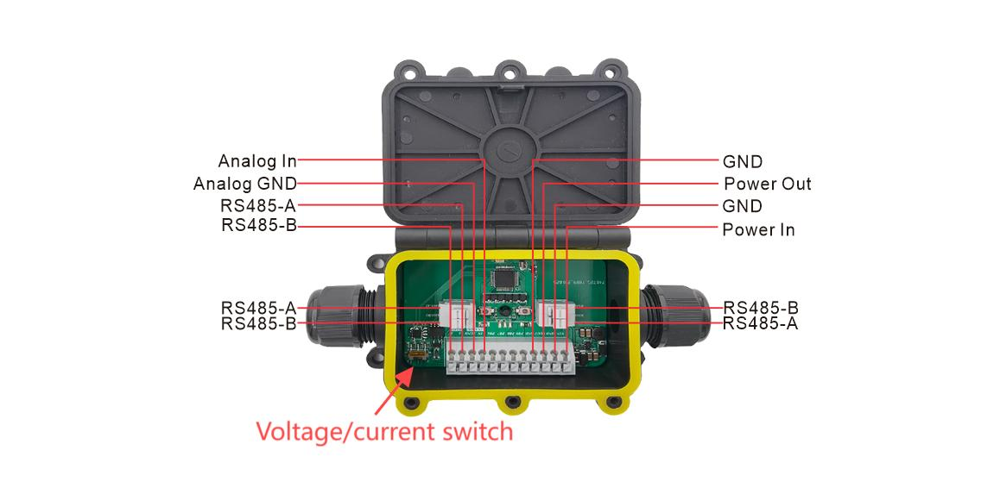

# Getting Started

{ht_translation}`[简体中文]:[English]`

[toc]

## Hardware Connection

### Power input and output
    The voltage range is 4.5~50V, and the output is as much as the input.
### RS485 to RS485
    All RS485 interfaces are connected, you can freely choose one RS485 interface access, and choose another RS485 interface output.
### 4~20mA/1~5V to RS485
    4~20mA/1~5V sensors are accessed from Analog_In and Analog_GND and output to Sensor_Hub/Wireless_ Aggregator from any RS485 interface.
## Dataframe Description

### Description
- Baud Rate: 9600
- Serial Port: 8N1

**0x66**(Slave address)  **0x09**(FUNC)  **0x00 0x00**(Begin address, 2Byte) **0x00 0x00** (Number of registers, 2byte) **CRC16** (CRC Checksum 2Byte)

| Type           | Address | Name    | Quantity | Register Status | Resolution |
| -------------- | ------- | ------- | -------- | --------------- | ---------- |
| INPUT REGISTER | 0x0000  | 4~20 mA | 2        | Read-only       | 1 ua       |
| INPUT REGISTER | 0x0002  | 1~5 V   | 2        | Read-only       | 1 mv       |

Negative: -1 == 0xFFFFFFFF; -2==0XFFFFFFFE;

### Example

#### Reading voltage

- Send: 66 09 00 02 00 02 F5 DD 
- Rec:  66 09 00 00 **0E 0B** 90 7B

0X0000**0E0B** => 3595 mV 

#### Reading current
- Send: 66 09 00 00 00 02 54 1D 
- Rec:  66 09 00 00 **17 70** DB C8 

0X0000**1770** => 6000 uA

## Actual error test

### 1~5V

| Input(mV) | Reading(mV) | Error value(mV) |
| --------- | ----------- | --------------- |
| 1000      | 998         | 2               |
| 2000      | 1996        | 4               |
| 3000      | 2995        | 5               |
| 4000      | 3992        | 8               |
| 5000      | 4988        | 12              |

### 4~20mA

| Input(uA) | Reading(uA)   | Error value(uA) |
| --------- | ------------- | ---------- |
| 4000      | 4001          | 1          |
| 6000      | 5997          | 3          |
| 8000      | 7995          | 5          |
| 10000     | 9991          | 9          |
| 12000     | 12007         | 7          |
| 14000     | 14005         | 5          |
| 16000     | 16005         | 5          |
| 18000     | 18002         | 2          |
| 20000     | 19998         | 2          |
