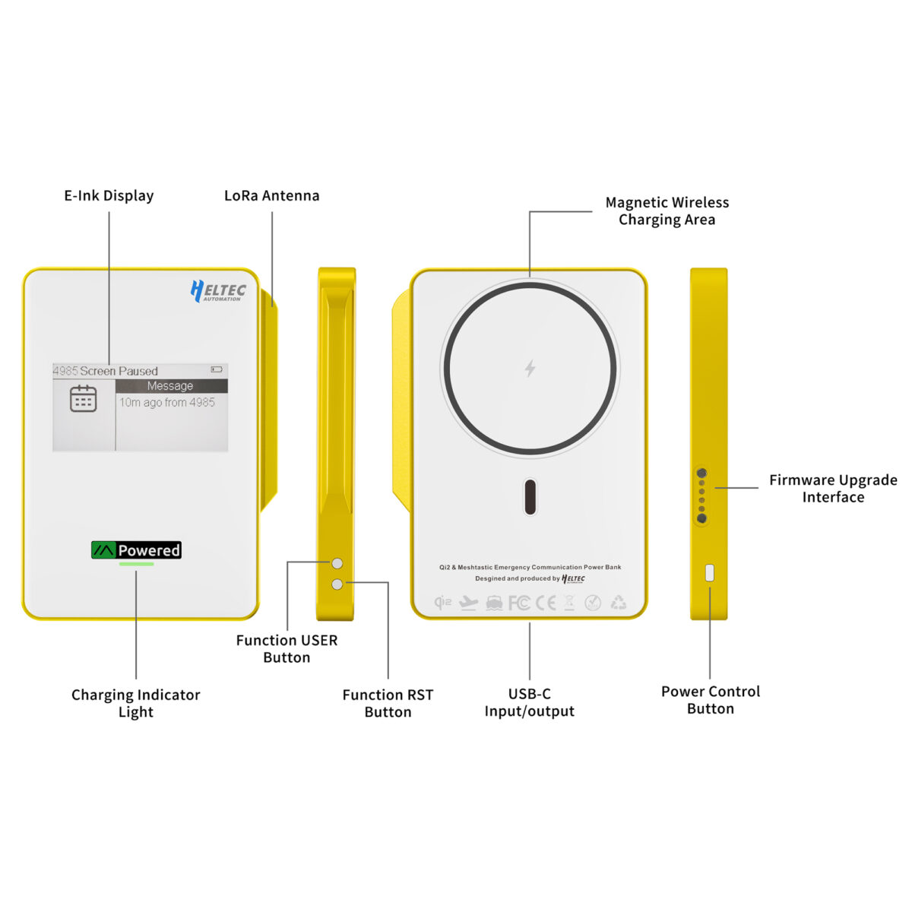
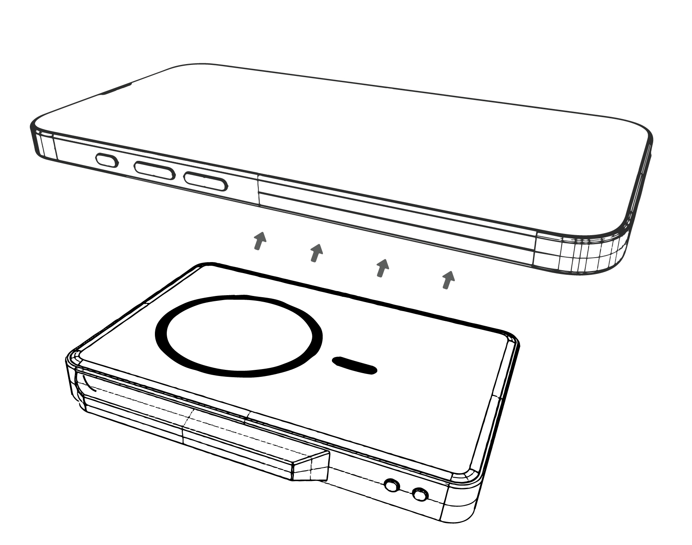
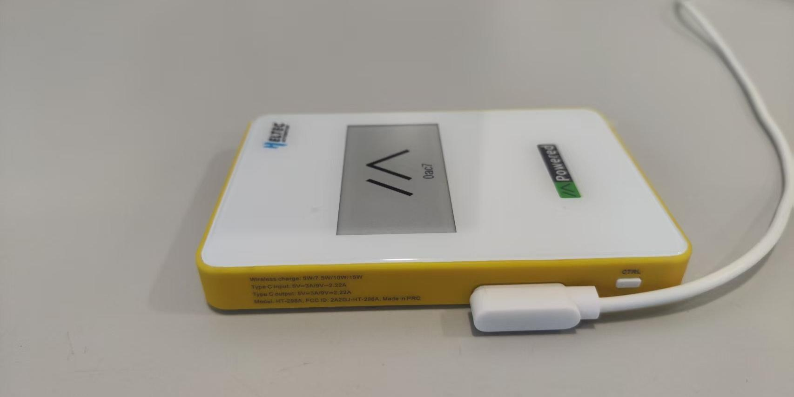
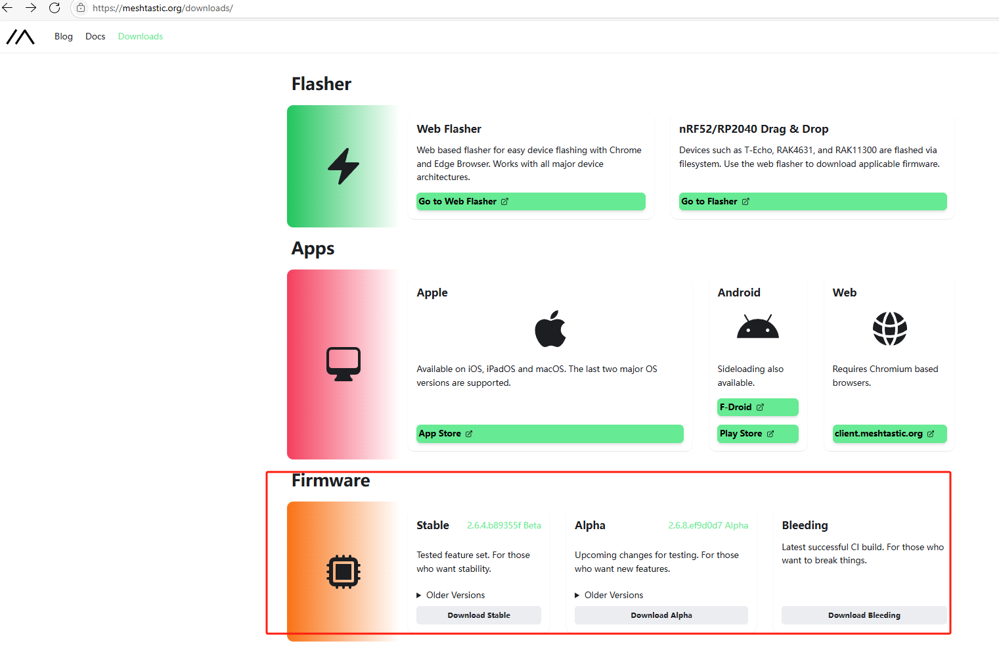
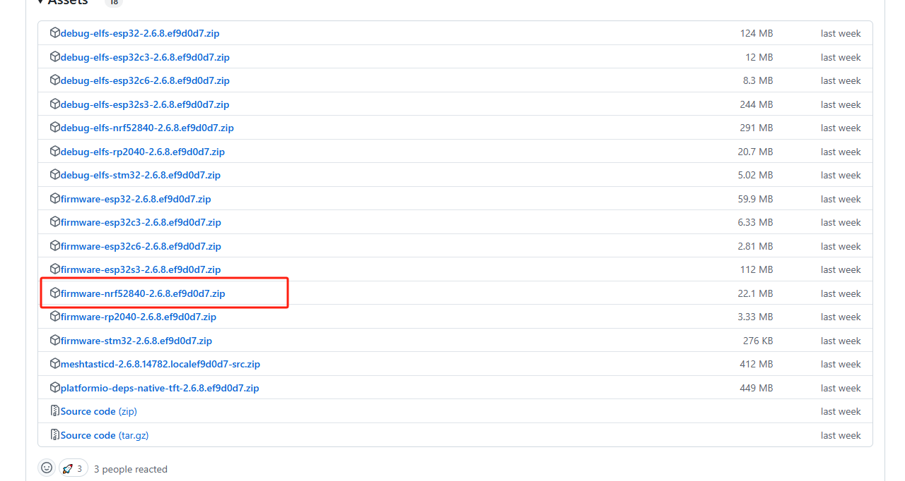
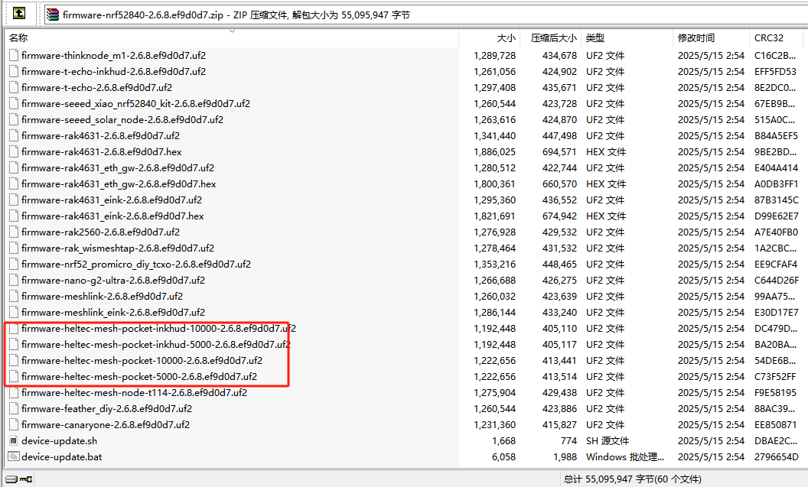

MeshPocket
==========
:ht_translation:`[简体中文]:[English]`

Summry
------
MeshPocket is not only a Qi2 magnetic power bank but also an intelligent device equipped with Bluetooth, LoRa remote communication, and e-ink display, making it the perfect companion for open source projects such as Meshtastic and providing a good solution for outdoor exploration and emergency communication.

Features
--------
- 5000mAh/1Please ensure your phone supports the wireless fast charging protocol.0000mAh battery capacity.
- QI2 compatibility.
- Supports 5W, 7.5W, 10W, and 15W wireless charging .
- Supports 9V-2.22A and 5V-3A USB-C input and output protocols.
- Supports industry-standard protocols like PD, AFC, and Huawei adapter protocols.
- Allows simultaneous charging and discharging.
- Enables both wireless and wired discharging at the same time.
- Supports input overvoltage and undervoltage protection, outputovercurrent and short circuit protection, battery undervoltage protection, NTC temperature protection, chip temperature protection, and charging timeout protection.
- Integrates the nRF52840(BLE ) and SX1262(LoRa).
- Equipped with a 2.13-inch e-ink display, providing clear, power-efficient information updates even in direct sunlight.
- Offers full custom firmware support, allowing developers to adapt it for specialized applications.
- Seamlessly compatible with Meshtastic.

Charging
--------

.. note::
    For first-time use, fully discharge the power bank, then recharge the device to 100%.

Magnetic wireless charging output
^^^^^^^^^^^^^^^^^^^^^^^^^^^^^^^^^
This product supports the automatic induction charging function of magnetic mobile phones. You only need to place the magnetic mobile phone on the magnetic wireless charging area of the mobile power supply to charge normally. Click “CTRL” button to turn on wireless output. Double click **“CTRL”** button to turns off wireless output.

.. note::
    The wireless charger supports MPP, EPP, Samsung 10W, Apple 7.5W, and BPP protocols. Please ensure your phone supports the wireless fast charging protocol.

USB-C power delivery output
^^^^^^^^^^^^^^^^^^^^^^^^^^^
Use the USB-C data cable to connect the device to be charged and the magnetic power bank to charge the device to be charged. Long press “CTRL” to turns off wireless output and wired output.

.. image:: ./img/03.jpg
   :align: center
   :width: 500px
   
USB-C charging input(for power bank)
^^^^^^^^^^^^^^^^^^^^^^^^^^^^^^^^^^^^
Connect one end of the USB-C data cable to the USB-C interface of the mobile power supply, and then connect the other end to the charger to charge the mobile power supply. During charging, the corresponding power indicator light flashes and the remaining power is displayed.

.. image:: ./img/04.jpg
   :align: center
   :width: 500px

Battery Level Indicator
^^^^^^^^^^^^^^^^^^^^^^^

+-------------------+--------------------------------------+
| Remaining battery | Indicator                            |
+===================+======================================+
| 71%-100%          | Green light on steadily              |
+-------------------+--------------------------------------+
| 31%-70%           | Yellow light on steadily             |
+-------------------+--------------------------------------+
| 11%-30%           | Red light on steadily                |
+-------------------+--------------------------------------+
| 5%-10%            | Red light flashing slowly at 0.5Hz   |
+-------------------+--------------------------------------+

.. note::
    ≤5% remaining, it extinguishes and the wired/wireless charging output is turned off, but power can still be supplied to the wireless communication section.

RGB Indicator Description
-------------------------

.. table:: RGB Status Indicators
   :widths: auto
   :align: center

+-----------------------------+----------------+--------------------------------------------------+
| Status                      | Battery Level  | Indicator                                        |
+=============================+================+==================================================+
| Over-discharge/no power     | ≤5%            | Red light flashes rapidly at 2Hz.\               |
|                             |                | Extinguishes after 5 seconds                     |
|                             +----------------+--------------------------------------------------+
|                             | 1-30%          | Red light flashing slowly at 0.5Hz               |
|                             +----------------+--------------------------------------------------+
|                             | 31-70%         | Yellow light flashing slowly at 0.5Hz            |
|                             +----------------+--------------------------------------------------+
|                             | 71-100%        | Green light flashing slowly at 0.5Hz             |
+-----------------------------+----------------+--------------------------------------------------+
| Fully charged               |                | Green light on steadily                          |
+-----------------------------+----------------+--------------------------------------------------+
| Standby (button triggered)  |                | Current battery level color flashes              |
+-----------------------------+----------------+--------------------------------------------------+
| Foreign Object Detection    |                | Yellow light flashes rapidly at 2Hz              |
| (FOD)                       |                |                                                  |
+-----------------------------+----------------+--------------------------------------------------+
| Fault                       |                | Indicator light extinguishes, output shuts down. |
+-----------------------------+----------------+--------------------------------------------------+

Button Description
------------------

.. warning::
    The **USER/RST** function is affected by the Meshtastic firmware version. For specific usage instructions, please refer to the official Meshtastic documentation: meshtastic.org.

+---------+----------------+-------------------------------------------------------+
| Button  | Status         | Description                                           |
+=========+================+=======================================================+
| CTRL    | Single click   | Turns on output. Displays the current battery level   |
|         |                | via LED indicator.                                    |
|         +----------------+-------------------------------------------------------+
|         | Double click   | Turns off wireless output                             |
|         +----------------+-------------------------------------------------------+
|         | Long press     | Turns off wireless output and wired output            |
+---------+----------------+-------------------------------------------------------+
| USER    | Single click   | Toggle Meshtastic options                             |
|         +----------------+-------------------------------------------------------+
|         | Long press     | Select Meshtastic option, Turn off Meshtastic         |
+---------+----------------+-------------------------------------------------------+
| RST     | Single click   | Reset/wake-up Meshtastic                              |
+---------+----------------+-------------------------------------------------------+

Meshtastic
----------
The device comes preloaded with Meshtastic firmware. Firmware updates/flashing can be performed via the side-mounted magnetic programming interface.

Web Flasher
^^^^^^^^^^^
*Under Construction*

Muanual Flasher
^^^^^^^^^^^^^^^
1. Obtain the firmware.

2. Connect the device to the PC using the dedicated magnetic USB cable.

3. Double-click the **USER** button on the device to enter DFU mode. A removable drive named **"HT-n5262"** will appear on the PC.

4. Copy the firmware to this removable disk.

5. The firmware will be successfully installed after the transfer is complete.