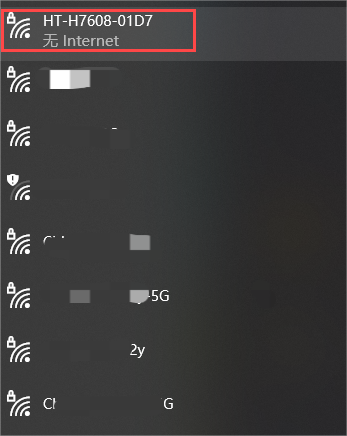
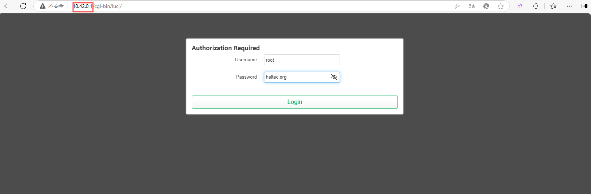

# **Wi-Fi HaLow Gateway(AP) Mode**

{ht_translation}`[简体中文]:[English]`

This section describes how to enable the Gateway (AP) mode on the HelTec Wi-Fi HaLow device.

## Summary
AP mode is a basic operating mode. In Access Point mode, the device can accept connections from HaLow clients.

As shown below:


------------------------------------

## Basic Settings
1. Enter the configuration page, How to enter the configuration mode page” please refer to the corresponding product documentation.

``` {note} If it is a complete reset, you need to select the **Country** and **Hostname**, In summary, if this step appears, make the corresponding selection. If it does not appear, there is no need to take any action.
```

2. Select "**Standard Wi-Fi HaLow**", indicates that you will configure the device in AP-STA mode, click `Next`.

   

3. Select "**Access Point**", indicates that the device will be set to AP (Gateway) mode, click `Next`.

   

4. Set the relevant parameters in the pop-up page, with the parameter descriptions as follows:

   

   - **SSID**, Wi-Fi HaLow gateway(AP) hotspot name.
   - **Password**, Wi-Fi HaLow hotspot gateway(AP) password.
   - **Bandwidth**, different bandwidth configurations affect signal coverage, data transfer rate, and interference resistance. Narrower bandwidths (e.g., 1 MHz) offer better coverage and lower power consumption, while wider bandwidths provide higher data rates but have shorter range and higher power consumption.
   - **Channel**, each bandwidth have some specific frequency as its channels, when there are other Wi-Fi HaLow devices in the area, you can reduce interference by setting different channels.

``` {tip} Available Bandwidths and Channels differ greatly across regions. The higher your bandwidth, the greater the potential throughput of the connection. If you're deploying multiple HaLow access points you may want to select distinct channels and a lower bandwidth to reduce interference.
```

5. You need to select an "upstream network" method, which is how the AP connects to the network. For an explanation of each mode, you can refer to the corresponding descriptions on the page.


``` {note} If you use **Wi-Fi 2.4G** upstream, You need to enter the username and password for this upstream Wi-Fi.
```

6. Enable a 2.4 GHz Wi-Fi Access Point. While the AP provides a HaLow hotspot, it can also offer a standard 2.4G Wi-Fi hotspot. If power consumption is not a concern, we recommend enabling it to facilitate subsequent configuration and management.


7. Similarly, you also need to configure the SSID, password, and encryption for this standard 2.4G Wi-Fi hotspot.


8. Click `Apply`, When the green or blue light remains steady, it indicates that the network connection is successful.

``` {note} If your upstream network is Ethernet, do not forget to connect the network cable.
```

``` {Warning} If you selected Ethernet mode, observe the color of your indicator light, it should be blue for USB cable and green for RJ45 cable. If the color of the light does not match the connection of the cable, you will need to change it to the appropriate color by pressing the button.
```

-----------------------------------------------------

## View and modify the configuration
**You can view the device's own information, downstream device information, and modify device settings on the device's configuration page.**

There are many ways to access the configuration page. Here are two common methods:
### Via AP remote access
1. Connect the PC(Laptop) to the device 2.4G AP. The default SSID is **HT-XXXX-xxxx**, and the default password is **heltec.org**.



2. Enter “192.168.100.1” in the browser. Default account "**root**", default password **"heltec.org"**.




### IP-Based connection
1. Connect the PC(Laptop) to the same LAN as the device, and go to the configration page. Find the IP address of the corresponding device.

2. Go to this IP address, default account "**root**", default password "**heltec.org**".


------------------------------------

For other modes , please refer to the [Wi-Fi HaLow Usage guide](https://docs.heltec.org/en/wifi_halow/halow_guide/index.html).