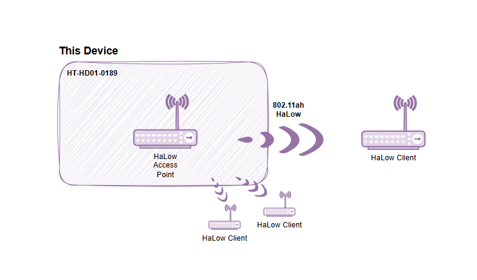

# **Wi-Fi HaLow Gateway(AP) Mode**

{ht_translation}`[简体中文]:[English]`

This section describes how to enable the Gateway (AP) mode on the HelTec Wi-Fi HaLow device.

## Summary
AP mode is a basic operating mode. In this mode, the HT-H7608 acts as a Wi-Fi HaLow gateway, connecting other Wi-Fi HaLow nodes to the LAN or the internet.

As shown below:



------------------------------------

## Enter Configuration page

**How to enter the configuration mode page" please refer to the corresponding product documentation.**
- [HT-H7608](https://docs.heltec.org/en/wifi_halow/ht-h7608/index.html#get-started)
- [HT-HD01](https://docs.heltec.org/en/wifi_halow/ht-hd01/index.html#get-started)
- [HT-HC32](https://docs.heltec.org/en/wifi_halow/ht-hc32/index.html#get-started)
- [HT-HR01](https://docs.heltec.org/en/wifi_halow/ht-hr01/index.html#setup-and-use)

## Basic Settings

1. Enter the configuration page and select "**Standard Wi-Fi HaLow**", click `next`.

   

2. Select "**Access Point**", click `next`.

   

3. Set the relevant parameters in the pop-up page, with the parameter descriptions as follows:

   - **SSID**, Wi-Fi HaLow gateway(AP) hotspot name.
   - **Password**, Wi-Fi HaLow hotspot gateway(AP) password.
   - **Bandwidth**, different bandwidth configurations affect signal coverage, data transfer rate, and interference resistance. Narrower bandwidths (e.g., 1 MHz) offer better coverage and lower power consumption, while wider bandwidths provide higher data rates but have shorter range and higher power consumption.
   - **Channel**, each bandwidth have some specific frequency as its channels, when there are other Wi-Fi HaLow devices in the area, you can reduce interference by setting different channels.

   

--------------------------------

(upstream_network)=
## Upsrteam Network Description
Once you've done this basic setup, you need to choose an "Upstream network" method.This section Outlines the differences between the three method so you can choose the one that suits your needs.


### None
The "None" mode is typically used for creating a local area network. In "None" mode, devices connected to the H7608 cannot access the internet.


None mode IP rules:

   - HT-H7608(Gateway): "10.42.0.1" or "192.168.1.1"
   - Wi-Fi HaLow client: The IP is assigned by the HT-H7608 (Gateway), "192.168.1.x"

### Ethernet
In "Ethernet" mode, the H7608-Gateway is connected to the internet via ethernet cable(RJ45 or USB).


Choose either `Bridge` or `Router` mode based on your needs. The main difference between them lies in the IP assignment rules.

Ethernet Mode IP rules: 

   - HT-H7608(Gateway): The upstream regular router connected to the H7608 assigns the IP. You can obtain it from the router's management interface.
   - Wi-Fi HaLow client: In Router mode, the IP is assigned by the HT-H7608 (Gateway), while in Bridge mode, it is assigned directly by the regular router.

### Wi-Fi 2.4G
In "Wi-Fi" mode, the H7608-Gateway is connected to the internet via Wi-Fi 2.4G, so Wi-Fi HaLow devices connected to its hotspot are also connected to the internet.


``` {note} Enter the SSID and password of the upstream router's Wi-Fi.
```

Wi-Fi Mode IP rules:

   - HT-H7608(Gateway): The upstream regular router connected to the H7608 assigns the IP. You can obtain it from the router's management interface.
   - Wi-Fi HaLow client: The IP is assigned by the HT-H7608 (Gateway).

---------------------------

## Complete configuration
Select Upstream and follow the prompts to complete the configuration and apply.

When the green or blue light remains steady, it indicates that the network connection is successful.

``` {note} If you selected Ethernet mode, observe the color of your indicator light, it should be blue for USB cable and green for RJ45 cable. If the color of the light does not match the connection of the cable, you will need to change it to the appropriate color by pressing the button.
```

-----------------------------------------------------

### View and change the configuration
Depending on what Upstream network mode you have set up, there are different ways to view or change the configuration.
#### None
Connect PC(laptop) to H7608 through a network cable, enter "10.42.0.1" in the browser, The default username is "root" and the default password is "heltec.org". Then you can enter the H7608-AP configuration interface, you can view or change the relevant configuration information.


#### Ethernet & Wi-Fi 2.4G
1. Connect the PC(laptop) to the upstream regular router and access its configuration page.
2. Obtain the IP of the HT-H7608.
3. Enter the IP address in the browser to access its configuration page. The default username is "root" and the default password is "heltec.org". Then you can enter the H7608-AP configuration interface, you can view or change the relevant configuration information.

------------------------------------

For other modes , please refer to the [Wi-Fi HaLow Using guide](https://docs.heltec.org/en/wifi_halow/halow_guide/index.html).
