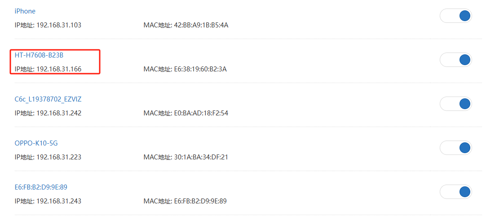

# **Wi-Fi HaLow Gateway(AP) Mode**

{ht_translation}`[简体中文]:[English]`

This section describes how to enable the Gateway (AP) mode on the HelTec Wi-Fi HaLow device.

## Summary
AP mode is a basic operating mode. In Access Point mode, the device can accept connections from HaLow clients.

As shown below:


------------------------------------

## Enter Configuration page

**How to enter the configuration mode page" please refer to the corresponding product documentation.**
- [HT-H7608](https://docs.heltec.org/en/wifi_halow/ht-h7608/index.html#get-started)
- [HT-HD01](https://docs.heltec.org/en/wifi_halow/ht-hd01/index.html#get-started)
- [HT-HC32](https://docs.heltec.org/en/wifi_halow/ht-hc32/index.html#get-started)
- [HT-HR01](https://docs.heltec.org/en/wifi_halow/ht-hr01/index.html#setup-and-use)

## Basic Settings
1. Enter the configuration page, select the `Country`, set the `Hostname`, and click `next`. "Hostname" refers to the hostname of your device in the Wi-Fi HaLow network.

2. Select "**Standard Wi-Fi HaLow**", click `next`.

   

3. Select "**Access Point**", click `next`.

   

4. Set the relevant parameters in the pop-up page, with the parameter descriptions as follows:

   - **SSID**, Wi-Fi HaLow gateway(AP) hotspot name.
   - **Password**, Wi-Fi HaLow hotspot gateway(AP) password.
   - **Bandwidth**, different bandwidth configurations affect signal coverage, data transfer rate, and interference resistance. Narrower bandwidths (e.g., 1 MHz) offer better coverage and lower power consumption, while wider bandwidths provide higher data rates but have shorter range and higher power consumption.
   - **Channel**, each bandwidth have some specific frequency as its channels, when there are other Wi-Fi HaLow devices in the area, you can reduce interference by setting different channels.

``` {tip} Available Bandwidths and Channels differ greatly across regions. The higher your bandwidth, the greater the potential throughput of the connection. If you're deploying multiple HaLow access points you may want to select distinct channels and a lower bandwidth to reduce interference.
```

   

--------------------------------

(upstream_network)=
## Upsrteam Network Description

This section Outlines the differences between the three method so you can choose the one that suits your needs.

Once you've done this basic setup, you need to choose an "Upstream network" method.

If you choose **None**, your device will have a static IP address and run a DHCP server on all interfaces, the HaLow and non-HaLow networks will be isolated from each other. If you choose an upstream network, your HaLow and non-HaLow networks will be connected.


- **None**, your device will have a static IP address and run a DHCP server on all interfaces, the HaLow and non-HaLow networks will be isolated from each other.

- **Ethernet**, **we recommend choosing Bridge mode**, the another mode is "Router". The main difference between them lies in the IP assignment rules.

   - **Bridge**: In Bridge mode this device and the HaLow connected devices obtain IP addresses from your current upstream network.
   - **Router**: In Router mode the HaLow connected devices obtain IP addresses from the DHCP server on this device, and this device uses NAT to forward IP traffic.

- **Wi-Fi(2.4G)**, If you use a Wi-Fi upstream, fill in the Wi-Fi AP credentials. The HaLow connected devices obtain IP addresses from the DHCP server on this device, and this device uses NAT to forward IP traffic.

---------------------------

## Enable 2.4G Wi-Fi Access Point
This HaLow device is also capable of 2.4 GHz Wi-Fi. If you enable a 2.4 GHz Wi-Fi Access Point, you will be able to connect non-HaLow Wi-Fi clients to this device.


After enabling this feature, you need to set the 2.4G Access Point's SSID, password, encryption.


------------------------------------------------------

## Complete configuration
Select Upstream and follow the prompts to complete the configuration and apply.

When the green or blue light remains steady, it indicates that the network connection is successful.

``` {note} If you selected Ethernet mode, observe the color of your indicator light, it should be blue for USB cable and green for RJ45 cable. If the color of the light does not match the connection of the cable, you will need to change it to the appropriate color by pressing the button.
```

-----------------------------------------------------

### View and change the configuration
Depending on what Upstream network mode you have set up, there are different ways to view or change the configuration.
#### None
Connect PC(laptop) to device through a network cable, enter "10.42.0.1" in the browser, The default username is "root" and the default password is "heltec.org". Then you can enter the AP configuration page, you can view or change the relevant configuration information.


#### Ethernet & Wi-Fi 2.4G
1. Connect the PC(laptop) to the upstream regular router and access its configuration page.

2. Obtain the IP.

   

3. Enter the IP address in the browser to access its configuration page. 

   The default username is "root" and the default password is "heltec.org". Then you can enter the configuration page and view or change the relevant setting information.

------------------------------------

For other modes , please refer to the [Wi-Fi HaLow Using guide](https://docs.heltec.org/en/wifi_halow/halow_guide/index.html).