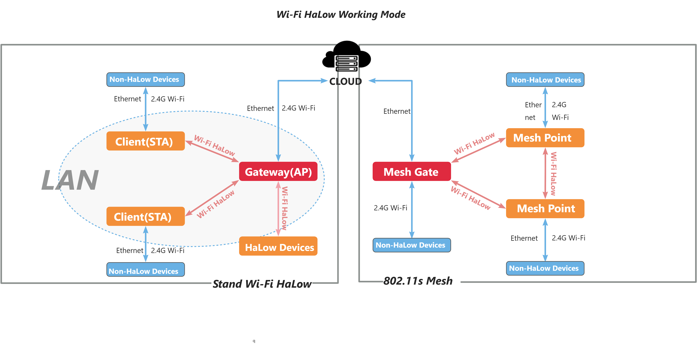
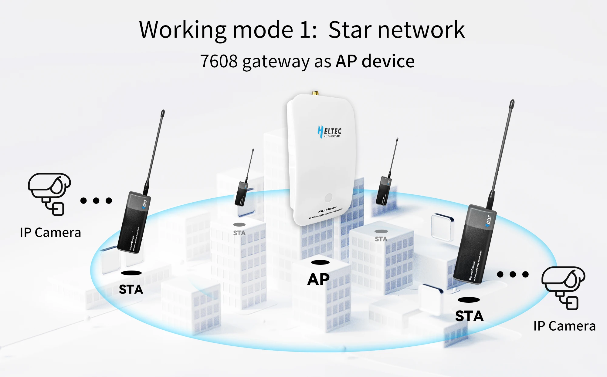

Wi-Fi HaLow Setup Guide
=======================

:ht_translation:`[简体中文]:[Eglish]`

This topic describes the various features and configuration methods of Heltec's Wi-Fi HaLow. 

.. warning::
   Some devices may not support all modes mentioned in this article; for example, HD01 does not support MeshGate-MeshPoint.

Overview
--------
**If you are unsure which operating mode to choose, please refer to the following image:**

AP-STA
^^^^^^

Mesh
^^^^
.. image:: ./img/18.jpg
   :align: center

Setup Guide
-----------
**Once you have clarified how your device operates, refer to the following link to configure your device:**

    
.. toctree::
   :maxdepth: 1

   Gateway(Access Point) <https://docs.heltec.org/en/wifi_halow/halow_guide/gateway.html>
   Client(Station) <https://docs.heltec.org/en/wifi_halow/halow_guide/station.html>
   Mesh_Gate <https://docs.heltec.org/en/wifi_halow/halow_guide/mesh_gate.html>
   Mesh_Point <https://docs.heltec.org/en/wifi_halow/halow_guide/mesh_point.html>