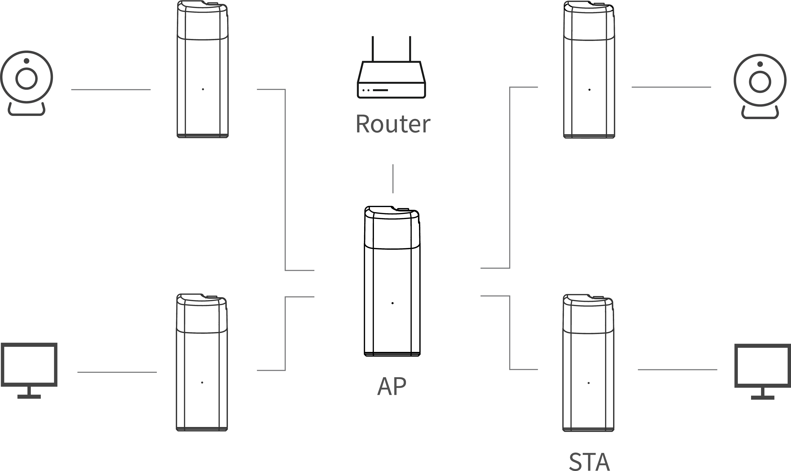
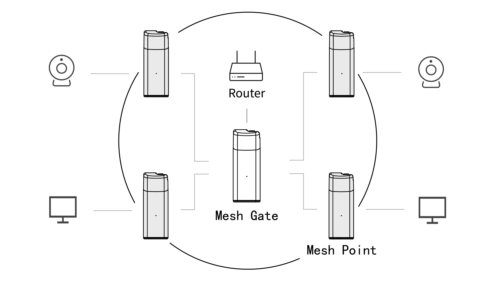

Wi-Fi HaLow Setup Guide
=======================

:ht_translation:`[简体中文]:[Eglish]`

This topic describes the various features and configuration methods of Heltec's Wi-Fi HaLow. 

Overview
--------
The common operating modes of Wi-Fi HaLow are shown in the figure below:

.. image:: ./img/07.png
   :align: center

If you're not sure which operating mode to choose, please read the following introduction. If you've already decided on a mode, you can skip directly to the `Setup Guide <#section_one>`_.

AP-STA Mode
^^^^^^^^^^^

   The AP-STA mode is one of the most common operating modes, involving two roles: AP (Access Point) and STA (Station).

   - Gateway(AP) Mode: The device functions as a HaLow access point, providing HaLow network services and allowing other devices to connect.
   - STA Mode: The device can connect to HaLow_AP as a client, while also acting as an Access Point to allow regular network devices to connect.

   This mode is suitable for scenarios where Wi-Fi HaLow devices need to directly connect to an access point or establish point-to-point communication with other devices.

Mesh Mode
^^^^^^^^^

   Mesh mode is used to create a self-organizing and self-healing network structure among multiple devices. Wi-Fi HaLow supports Mesh mode, allowing devices to relay signals from other devices to extend the network range.

   - Mesh_Gate: Acts as the gateway, bridging the entire mesh network to external networks (e.g., the internet).
   - Mesh_Point: These are the nodes within the mesh network that work together to relay data and ensure network coverage is expanded.

   This mode is suitable for large-scale coverage, high-reliability, and low-latency IoT applications, such as smart cities, smart agriculture, and smart parking.

-------------------------------------------------------------------------

.. _section_one:

Setup Guide
-----------
For the setup methods and details of various modes, please click the following link to view them:

    
- `Gateway(Access Point) <https://docs.heltec.org/en/wifi_halow/halow_guide/gateway.html>`_
- `Client(STA) <https://docs.heltec.org/en/wifi_halow/halow_guide/station.html>`_
- `Mesh_Gate <https://docs.heltec.org/en/wifi_halow/halow_guide/mesh_gate.html>`_
- `Mesh_Point <https://docs.heltec.org/en/wifi_halow/halow_guide/mesh_point.html>`_