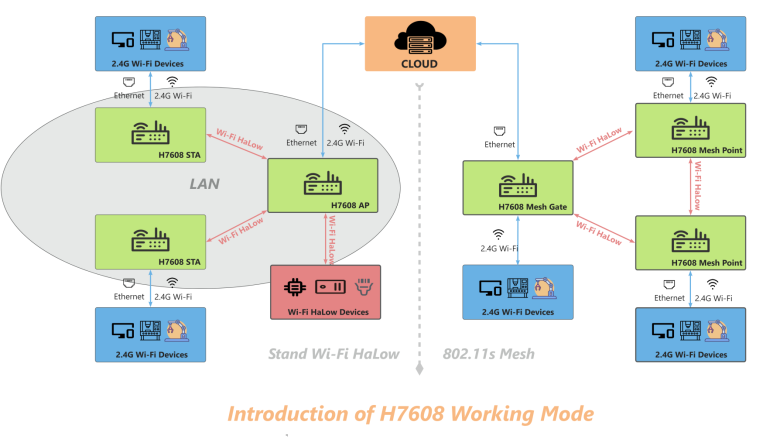

Wi-Fi HaLow Setup Guide
=======================

:ht_translation:`[简体中文]:[Eglish]`

This topic describes the various features and configuration methods of Heltec's Wi-Fi HaLow. 

The common operating modes of Wi-Fi HaLow are shown in the figure below:



Wi-Fi HaLow Operating Modes Overview
------------------------------------

Generally, the common use cases of Wi-Fi HaLow are as follows:

AP-STA Mode
`````````````
   The AP-STA mode is one of the most common Wi-Fi operating modes, involving two roles: AP (Access Point) and STA (Station).

   - AP Mode: The device functions as a Wi-Fi access point, providing wireless network services and allowing other devices to connect.
   - STA Mode: The device acts as a client connecting to the AP to gain network access.
   - Application Scenarios: This mode is suitable for scenarios where Wi-Fi HaLow devices need to directly connect to an access point or establish point-to-point communication with other devices.

Gateway(AP) Mode
`````````````````

   Gateway mode is used to connect a Wi-Fi HaLow network to external networks, such as the internet or a local area network (LAN). The gateway device in this mode acts as a bridge, enabling Wi-Fi HaLow devices to communicate with the main network.

   - Working Principle: The gateway device forwards data between the Wi-Fi HaLow network and other networks, ensuring that local devices can interact with external networks.
   - Application Scenarios: This mode is ideal for IoT devices that need to connect their Wi-Fi HaLow network to the internet, LAN, or cloud platforms, commonly used in smart homes, industrial automation, agricultural monitoring, and more.

Station(STA) mode
`````````````````
   In Station mode, Wi-Fi HaLow devices act as clients, connecting to other Wi-Fi HaLow access points (AP).

   - Working Principle: Devices in this mode connect to a Wi-Fi HaLow network and exchange data via the access point.
   - Application Scenarios: This mode is suitable for applications where devices need to connect to a Wi-Fi HaLow network as clients, such as smart sensors and remote monitoring devices.

Mesh Mode
``````````
   Mesh mode is used to create a self-organizing and self-healing network structure among multiple devices. Wi-Fi HaLow supports Mesh mode, allowing devices to relay signals from other devices to extend the network range.

   Mesh_Gate - Mesh_Point Mode:
   - Mesh_Gate: Acts as the gateway, bridging the entire mesh network to external networks (e.g., the internet).
   - Mesh_Point: These are the nodes within the mesh network that work together to relay data and ensure network coverage is expanded.
   - Application Scenarios: This mode is suitable for large-scale coverage, high-reliability, and low-latency IoT applications, such as smart cities, smart agriculture, and smart parking.

Wi-Fi HaLow Setup Guide
-----------------------
For the setup methods and details of various modes, please click the following link to view them:

.. toctree::
    :maxdepth: 2
    
    Gateway(Access Point) <gateway>
    Client(STA) <station>
    Mesh_Gate <mesh_gate>
    Mesh_Point <mesh_point>