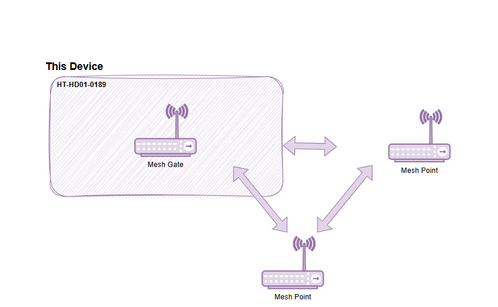
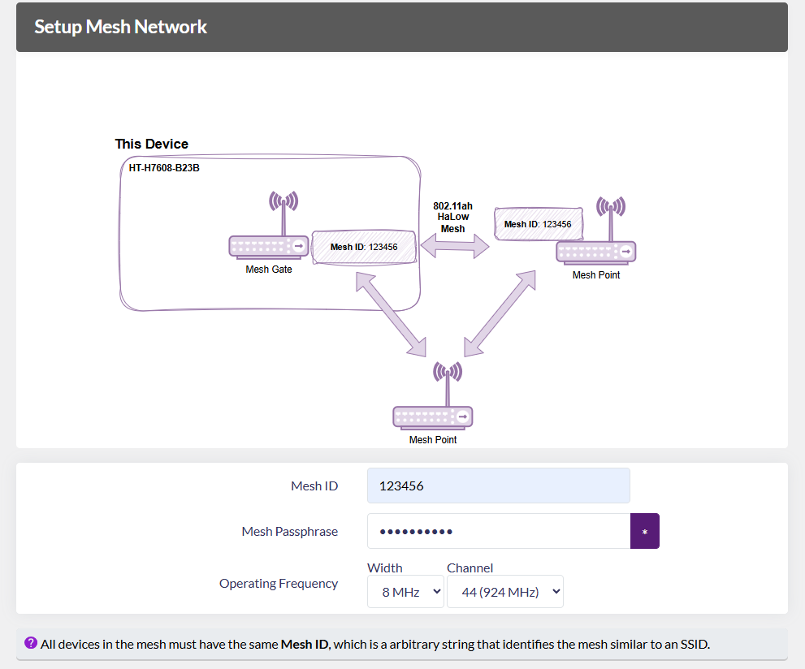
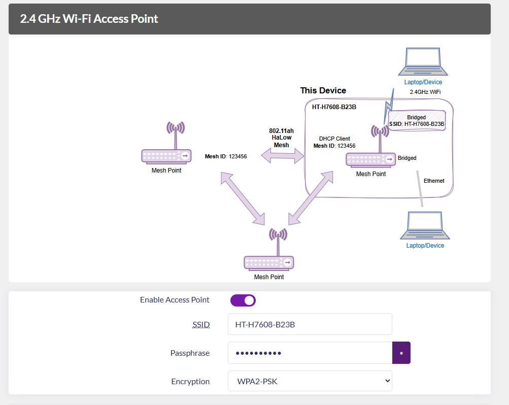

# Wi-Fi HaLow Mesh Point Mode

{ht_translation}`[简体中文]:[English]`

This topic describes how to enable the Mesh_point mode on the HelTec Wi-Fi HaLow device.

## Summary
Mesh Point is a node in an 802.11s mesh network, which has to be in conjunction with the Mesh Gate to work. Mesh Gate provides both a Mesh Point and a co-located non-mesh network (e.g. an AP, an upstream Ethernet connection, etc.). It broadcasts mesh gate announcements to help align the mesh nodes, making it easier for traffic to reach the non-mesh network.

As shown below:

------------------------------------

## Enter Configuration Page

**How to enter the configuration mode page" please refer to the corresponding product documentation.**
- [HT-H7608](https://docs.heltec.org/en/wifi_halow/ht-h7608/index.html#get-started)
- [HT-HD01](https://docs.heltec.org/en/wifi_halow/ht-hd01/index.html#get-started)
- [HT-HC32](https://docs.heltec.org/en/wifi_halow/ht-hc32/index.html#get-started)
- [HT-HR01](https://docs.heltec.org/en/wifi_halow/ht-hr01/index.html#setup-and-use)

## Basic Settings
1. Enter the configuration page, select the `Country`, set the `Hostname`, and click `next`. "Hostname" refers to the hostname of your device in the Wi-Fi HaLow network.

2. Enter the configuration page and select "**802.11s Mesh Wizard**", click `next`.

   

3. Select "**Mesh Point**", click `next`.

   

4. Set the relevant parameters in the pop-up page, with the parameter descriptions as follows:

   

   - **Mesh ID** & **Passphrase**, Set a Mesh ID and passphrase, and only devices with the same ID and Passphrase can form a Mesh network.
   - **Bandwidth** & **Channel**, Available Bandwidths and Channels differ greatly across regions. The higher your bandwidth, the greater the potential throughput of the connection. If you're deploying multiple HaLow access points you may want to select distinct channels and a lower bandwidth to reduce interference.

After completing the above steps, click `Next`.

5. Choose the traffic mode based on your needs, click `next` . 

  **We recommend the "Bridge" mode**. The main differences between the modes are as follows:

|  Mode   | Description  |
|  ----  | :----- |
| None  | Non-HaLow and HaLow networks are isolated. This device will use a static IP address and run a DHCP server on the non-HaLow interface |
| Bridge  | Non-HaLow devices obtain IPs from your HaLow link |
| Extender | Non-HaLow devices obtain IPs from the DHCP server on this device and this device uses NAT to forward IP traffic |

---------------------------

## Enable 2.4G Wi-Fi Access Point
This HaLow device is also capable of 2.4 GHz Wi-Fi. If you enable a 2.4 GHz Wi-Fi Access Point, you will be able to connect non-HaLow Wi-Fi clients to this device.

After enabling this feature, you need to set the 2.4G Access Point's SSID, password, encryption.

------------------------------------------------------
## Complete configuration
Complete the configuration and apply.

When the green or blue light remains steady, it indicates that the network connection is successful.

-----------------------------------------------------

### View and change the configuration

1. Connect the PC(laptop) to the upstream regular router and access its configuration page.

2. Obtain the IP.

   

3. Enter the IP address in the browser to access its configuration page. 

   The default username is "root" and the default password is "heltec.org". Then you can enter the configuration page and view or change the relevant setting information.

------------------------------------

For other modes , please refer to the [Wi-Fi HaLow Using guide](https://docs.heltec.org/en/wifi_halow/halow_guide/index.html).

