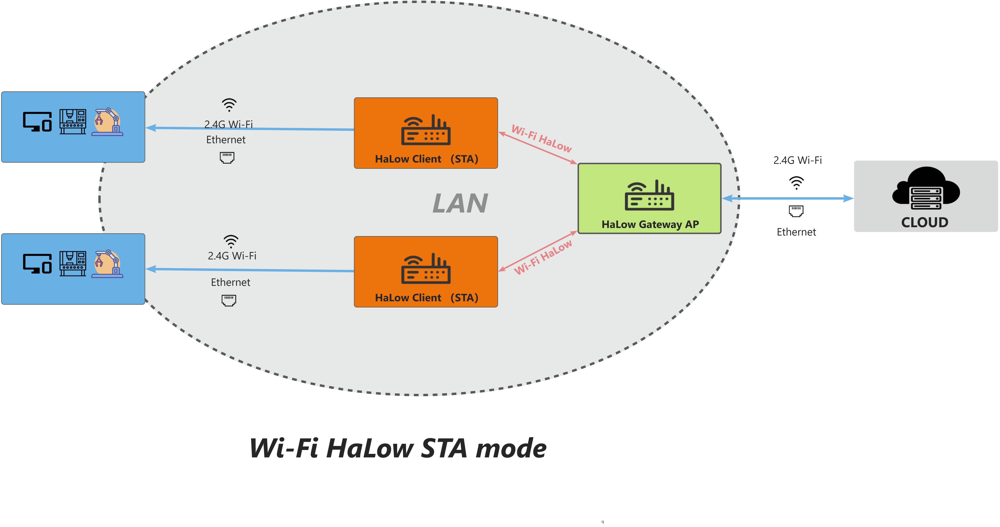
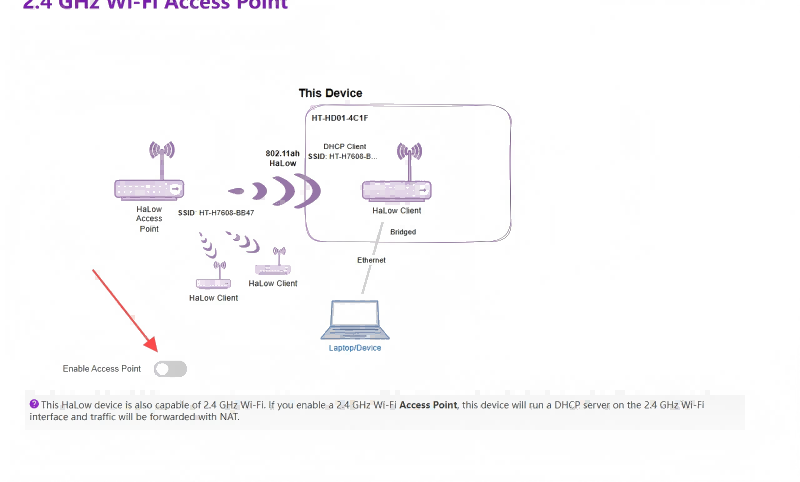
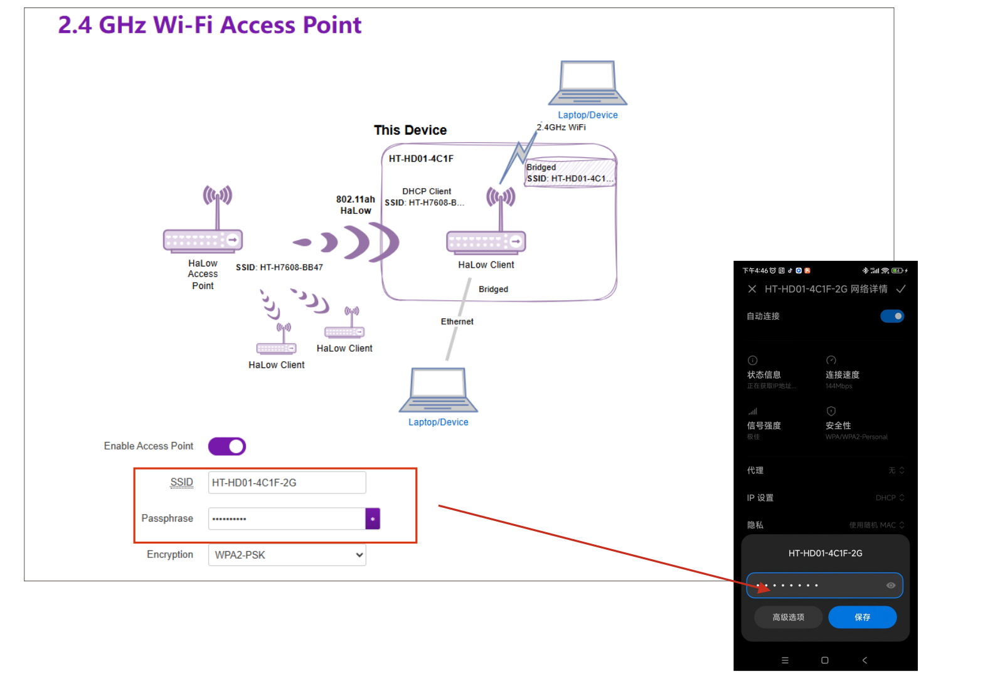

# **Wi-Fi HaLow Client(STA) Mode**

{ht_translation}`[简体中文]:[English]`

This topic introduces the setup and activation of Wi-Fi HaLow Client(STA) mode.

## Summary
As with any Wi-Fi network, HaLow has Clients (also known as stations) which discover and connect to an Access Point. If you select client, non-HaLow devices can use the HaLow link by connecting to the other interfaces.

As shown below:



``` {note} Some devices, such as the HT-HR01, do not have 2.4G Wi-Fi functionality.
```

------------------------------------                            
## Initial Setup
### Enter Configuration page

**How to enter the configuration mode page" please refer to the corresponding product documentation.**
- [HT-H7608](https://docs.heltec.org/en/wifi_halow/ht-h7608/index.html#get-started)
- [HT-HD01](https://docs.heltec.org/en/wifi_halow/ht-hd01/view_and_modify.html)
- [HT-HC32](https://docs.heltec.org/en/wifi_halow/ht-hc32/index.html#get-started)
- [HT-HR01](https://docs.heltec.org/en/wifi_halow/ht-hr01/index.html#setup-and-use)

-------------------------------------------

### Basic Settings

1. Enter the configuration page, select the `Country`, set the `Hostname`, and click `next`. "Hostname" refers to the hostname of your device in the Wi-Fi HaLow network.

2. Select "**Standard Wi-Fi HaLow**", click `next`.

   

3. You can click 'SCAN', or directly enter the hotspot name and password of the Wi-Fi HaLow gateway you want to connect to, click `next`.

   

4. Choose the traffic mode based on your needs, click `next` . 

  **We recommend the "Bridge" mode**. The main differences between the modes are as follows:

|  Mode   | Description  |
|  ----  | :----- |
| None  | Non-HaLow and HaLow networks are isolated. This device will use a static IP address<br>and run a DHCP server on the non-HaLow interface |
| Bridge  | Non-HaLow devices obtain IPs from your HaLow link |
| Extender | Non-HaLow devices obtain IPs from the DHCP server on this device and this device<br>uses NAT to forward IP traffic |

5. This HaLow device is also capable of 2.4 GHz Wi-Fi. If you enable a 2.4 GHz Wi-Fi Access Point, you will be able to connect non-HaLow Wi-Fi clients to this device.



After enabling this feature, you need to set the 2.4G Access Point's SSID, password, encryption.



6. Click `Next`, and `Apply`.

---------------------------

### Complete configuration

When the green or blue light remains steady, it indicates that the network connection is successful.

``` {note} If you selected Ethernet mode, observe the color of your indicator light, it should be blue for USB cable and green for RJ45 cable. If the color of the light does not match the connection of the cable, you will need to change it to the appropriate color by pressing the button.
```

-----------------------------------------

For other modes , please refer to the [Wi-Fi HaLow Using guide](https://docs.heltec.org/en/wifi_halow/halow_guide/index.html).

