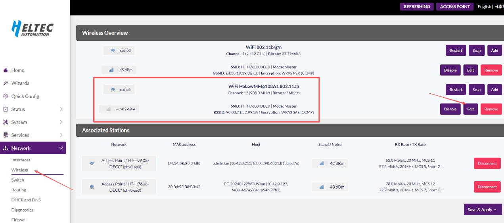
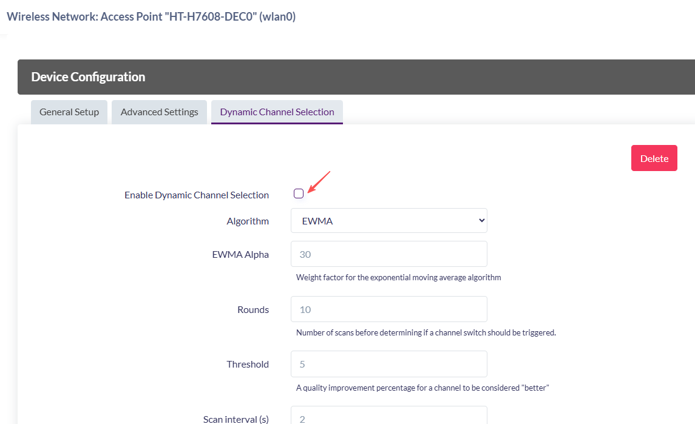
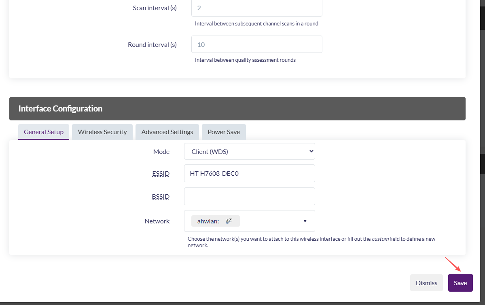

# HT-H7608 FAQ

{ht_translation}`[简体中文]:[English]`

## The configuration page cannot be accessed when reset up via Wi-Fi.
Do not enter the reset up mode via Wi-Fi while connecting the network cable. If this situation occurs, please unplug the power and network cable, and then re-enter the configuration mode.

------------------------------------

## Get device's IP address
If you don't know the IP address of the target device, you can check the configuration (management) page of its upstream device. If the upstream device is in Bridge mode, you will need to check the next upstream device instead.  For example, to locate a HaLow AP device, check the management page of its upstream router. Similarly, to find a HaLow STA device, check the upstream AP's management page—but if that AP is in Bridge mode, you must then check the router above it.

------------------------------------

## Factory resetting
1. Connect the device power, the device RGB light is red, indicating that the device is starting, which takes about 1~2 minutes.
2. After the red light turns off, press and hold the configuration button 10 seconds until the RGB light shows white. Then, it will display alternating yellow and green lights to indicate active configuration mode.
3. Configure the device by following the initial setup procedure：https://docs.heltec.org/en/wifi_halow/ht-h7608/index.html#get-started

-------------------------------------

## To maximize the transmission distance
To maximize the transmission distance of your device, consider the following strategies:
1. Reduce Bandwidth. Generally, the smaller the bandwidth of the AP, the longer the transmission distance. Lower bandwidth increases sensitivity and range but reduces the data rate.
2. The communication quality between the AP and STA is best when their antennas are parallel. Typically, positioning both antennas vertically upward ensures optimal performance.
3. Place the antennas within line of sight (LOS) to minimize obstructions.
4. Install the AP antenna in a high, unobstructed location (e.g., on a rooftop or pole) to maximize coverage and reduce interference.

## For automatic device reset

In the 2025-08-07 firmware, the HT-H7608 introduced an automatic frequency-hopping mechanism for the HaLow Access Point. However, enabling both Mesh and HaLow Access Point simultaneously may cause the device to reboot. Two solutions are currently available.
Once the device has rebooted and started successfully (indicated by the red light turning off), immediately enter Configuration Mode (refer to [this document](https://docs.heltec.org/en/wifi_halow/ht-h7608/index.html#first-enter-configuration-page) for instructions). After entering Configuration Mode, follow the steps below to configure the device:

1. Do not enable HaLow Access Point when using Mesh.
2. If HaLow Access Point needs to be enabled in Mesh mode, it is necessary to disable Dynamic Channel Selection in advance on the configuration page and save the configuration.

