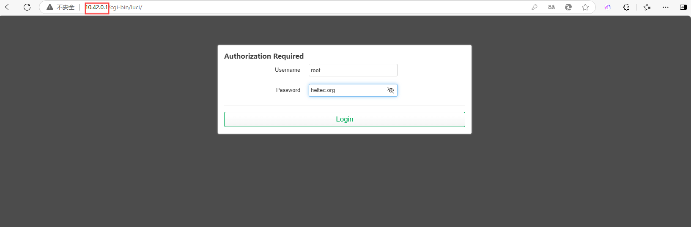

**HT-H7608 Wi-Fi HaLow Router User Guide**

:ht_translation:`[简体中文]:[Eglish]`

Summry
------
HT-H7608 is an innovative WiFi HaLow gateway from Heltec Automation designed to meet the needs of long-distance/high-speed data transmission for IoT applications. The gateway uses WiFi HaLow(IEEE 802.11ah) technology that operates in the sub-1 GHz unlicensed band, which has stronger penetration and larger coverage compared with the traditional WiFi standard.


---------------------------------------------------

Features
--------

- Wi-Fi and Ethernet supported, WiFi HaLow and 2.4GHz dual-band design.
- Long-distance transmission capability.
- Supports access to a large number of devices.
- High transmission speed.
- Flexible networking methods, including AP, STA, Mesh, etc.
- Easy setup and OTA upgrade via the Web UI.
- Light and stylish wall-mounted, simple to install.

--------------------------------------------------

Get Started
-----------
Hardware connection
````````````````````
Connect the device power, the device RGB light is red, indicating that the device is starting, which takes about 1~2 minutes.


------------------------------------------------

First Enter Configuration Page
````````````````````````````````
After the initial power-on, when the device's red light turns off and transitions to a state of alternating yellow and green blinking, it indicates that the device has successfully booted up and entered configuration mode.<br>

.. Tip::
   If your device fails to enter setup mode, press the button with the SIM needle for 3 seconds until the yellow light is on and release it.

.. image:: ./img/03.png
   :align: center
   :width: 300px 

There are two ways to access the configuration page—you can choose either one:

Via Ethernet
^^^^^^^^^^^^

   1. Connect your H7608 to PC(laptop) using Ethernet cable.

   2. Enter "10.42.0.1" in your browser to navigate to the configuration page, the default account as "root" and password as "heltec.org".



Via Wi-Fi
^^^^^^^^^

.. warning::
   Do not enter Wi-Fi configuration page while connected to a network cable. If you do this accidentally, disconnect the power and reconnect.

1. Using the configuration tool (PC or mobile), find the WiFi named "HT-HXXX-xxxx-2G" and connect to it. The default password is "heltec.org".

.. image:: ./img/04.png
   :align: center
   :width: 250px

2. Enter "10.42.0.1" in your browser to navigate to the configuration page, the default account as "root" and password as "heltec.org".


-------------------------------------------------------

Configurantion 
```````````````
HT-H7608 has three typical working modes, please configure according to the specific use mode.

.. image:: ./img/06.png
   :align: center

Click on the following link to get the configuration instructions for the corresponding mode:

- `Gateway(AP) Setup Guide <https://docs.heltec.org/en/wifi_halow/ht-h7608/gateway.html>`_
- `Client(STA) Setup Guide <https://docs.heltec.org/en/wifi_halow/ht-h7608/station.html>`_
- `Mesh Gate Setup Guide <https://docs.heltec.org/en/wifi_halow/ht-h7608/mesh_gate.html>`_
- `Mesh Gate Setup Guide <https://docs.heltec.org/en/wifi_halow/ht-h7608/mesh_point.html>`_

--------------------------------------------

View and modify H7608'S configuration
`````````````````````````````````````
**After "First Configuration" you can view the device's own information, downstream device information, and modify device settings on the device's configuration page.**

There are many ways to access the configuration page. Here are two common methods:

IP-Based Connection
^^^^^^^^^^^^^^^^^^^
1. Connect the PC(Laptop) to the same LAN as the device, and go to the router configration page. Find the IP address of the corresponding device.

.. tip::
   If you don't know the IP address of the target device, you can check the configuration (management) page of its upstream device. If the upstream device is in Bridge mode, you will need to check the next upstream device instead. For example, to locate a HaLow AP device, check the management page of its upstream router. Similarly, to find a HaLow STA device, check the upstream AP's management page—but if that AP is in Bridge mode, you must then check the router above it.

2. Visit to this IP address, default account "**root**", default password "**heltec.org**".

Via AP Remote Access
^^^^^^^^^^^^^^^^^^^^
1. Connect the PC(Laptop) to the device 2.4G AP. The default SSID is **HT-XXXX-xxxx**, and the default password is **heltec.org**.

.. image:: ./img/04.png
   :align: center
   :width: 250px

2. Enter “192.168.100.1” in the browser. Default account "**root**", default password **"heltec.org"**.

.. tip::
   Some early versions might be 192.168.1.1. In None traffic mode, the default IP is 10.42.0.1. 

--------------------------------

.. toctree::
   :maxdepth: 2
   
   Overview<https://docs.heltec.org/en/wifi_halow/ht-h7608/index.html>
   Frequently Asked Questions<faq>
   OTA Firmware Upgrade<ota>
   Heltec General<https://docs.heltec.org/general/index.html>


Resources
---------
You can find most resources related to HT-H7608 at:

`HT-H7608 Resource page <https://resource.heltec.cn/download/HT-H7608>`_


