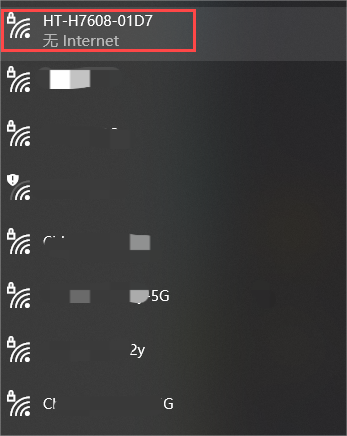
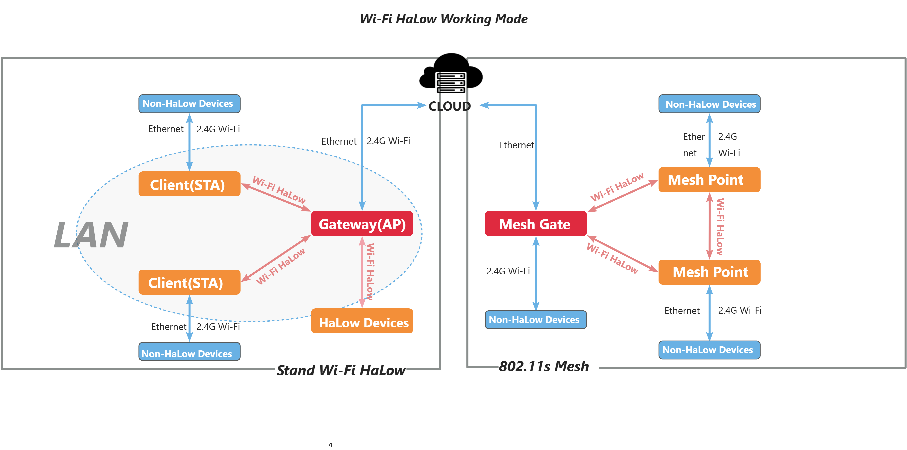

**HT-H7608 Wi-Fi HaLow Router User Guide**

:ht_translation:`[简体中文]:[Eglish]`

Summry
------
HT-H7608 is an innovative WiFi HaLow gateway from Heltec Automation designed to meet the needs of long-distance/high-speed data transmission for IoT applications. The gateway uses WiFi HaLow(IEEE 802.11ah) technology that operates in the sub-1 GHz unlicensed band, which has stronger penetration and larger coverage compared with the traditional WiFi standard.

.. image:: ./img/01.png
   :align: center
   :width: 500x 

---------------------------------------------------

Features
--------

- Wi-Fi and Ethernet supported, WiFi HaLow and 2.4GHz dual-band design.
- Long-distance transmission capability.
- Supports access to a large number of devices.
- High transmission speed.
- Flexible networking methods, including AP, STA, Mesh, etc.
- Easy setup and OTA upgrade via the Web UI.
- Light and stylish wall-mounted, simple to install.

--------------------------------------------------

Get Started
-----------
Hardware connection
````````````````````
Connect the device power, the device RGB light is red, indicating that the device is starting, which takes about 1~2 minutes.

.. image:: ./img/02.png
   :align: center
   :width: 400px 

------------------------------------------------

Enter Configuration Page
`````````````````````````
There are two ways to access the configuration page. You can choose either one.

Via Ethernet
^^^^^^^^^^^^
1. Connect your H7608 to PC(laptop) using Ethernet cable.
2. Press the button with the SIM needle for 3 seconds until the yellow light is on and release it.


3. Enter "10.42.0.1" in your browser to navigate to the configuration page, the default account as "root" and password as "heltec.org".

.. image:: ./img/05.png
   :align: center

Via Wi-Fi
^^^^^^^^^

.. warning::
   Do not enter Wi-Fi configuration page while connected to a network cable. If you do this accidentally, disconnect the power and reconnect.

1. Press the button with the SIM needle for 3 seconds until the yellow light is on and release it.


2. Using the configuration tool (PC or mobile), find the WiFi named "HT-HXXX-xxxx-2G" and connect to it. The default password is "heltec.org".



3. Enter "10.42.0.1" in your browser to navigate to the configuration page, the default account as "root" and password as "heltec.org".

.. image:: ./img/05.png
   :align: center

-------------------------------------------------------

Configurantion 
```````````````
HT-H7608 has three typical working modes, please configure according to the specific use mode.



Click on the following link to get the configuration instructions for the corresponding mode:

- Only about the Gateway mode Guide: `Wi-Fi HaLow Gateway Setup guide <https://docs.heltec.org/en/wifi_halow/halow_guide/gateway.html>`_
- Comprehensive Introduction guide to Wi-Fi HaLow Modes: `Wi-Fi HaLow Setup guide <https://docs.heltec.org/en/wifi_halow/halow_guide/index.html>`_

--------------------------------------------

Related resource
----------------
You can find most resources related to HT-H7608 at:

`HT-H7608 Resource page <https://resource.heltec.cn/download/HT-H7608>`_

-------------------------------------

Frequently asked questions
--------------------------
1. After going into configuration mode, I couldn't find the Wi-Fi in configuration mode.
   
   - Do not connect the cable while in configuration mode. If this happens, you will need to unplug the cable and power, and start again without the network cable.
