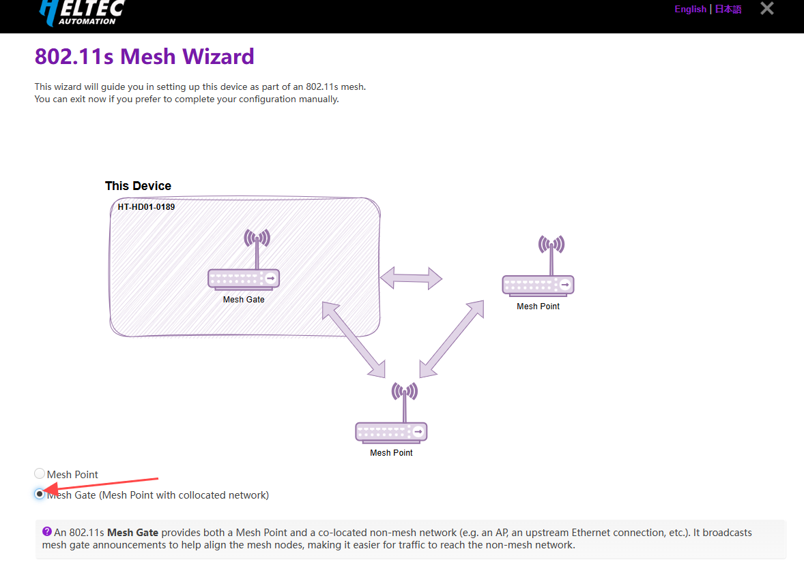
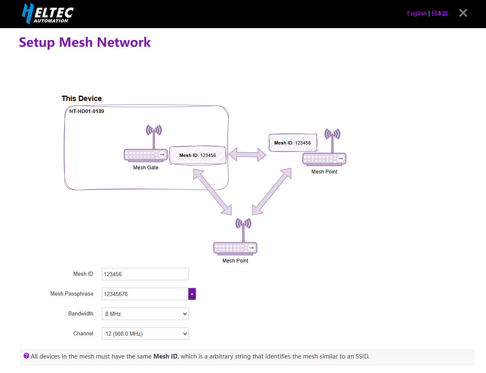
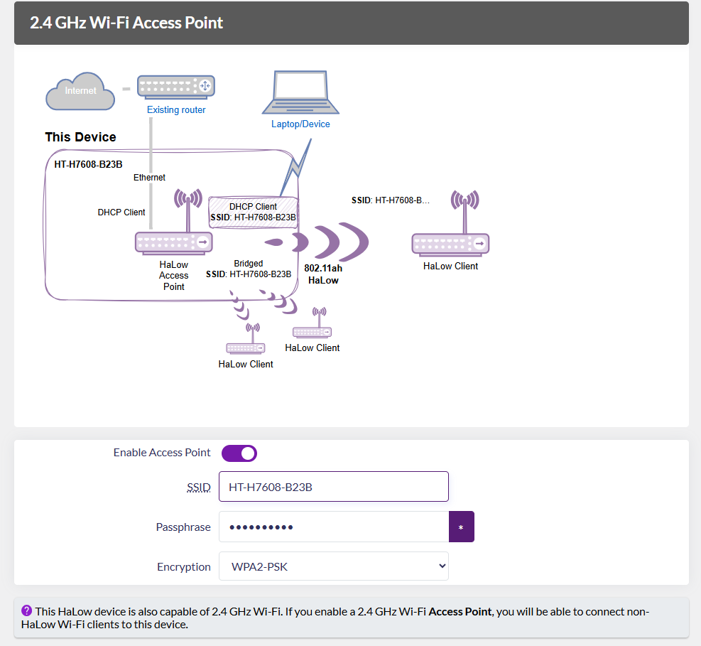

# Wi-Fi HaLow Mesh_Gate Mode

{ht_translation}`[简体中文]:[English]`

This topic describes how to enable the Mesh_Gate mode on the HelTec Wi-Fi HaLow device.

## Summary
A Mesh Gate provides both a Mesh Point and a co-located non-mesh network (e.g. an AP an upstream Ethemnet connection, etc.). it broadcasts mesh gate announcements to help alian the mesh nodes, making it easier for traffic to reach the non-mesh network.

As shown below:

------------------------------------

## Basic Settings
1. Enter the configuration page, select the `Country`, set the `Hostname`, and click `next`. "Hostname" refers to the hostname of your device in the Wi-Fi HaLow network.

2. Enter the configuration page and select "**802.11s Mesh Wizard**", click `next`.

   

3. Select "**Mesh Gate**", click `next`.

   

4. Set the relevant parameters in the pop-up page, with the parameter descriptions as follows:

   

   - **Mesh ID** & **Passphrase**, Set a Mesh ID and passphrase, and only devices with the same ID and Passphrase can form a Mesh network.
   - **Bandwidth** & **Channel**, Available Bandwidths and Channels differ greatly across regions. The higher your bandwidth, the greater the potential throughput of the connection. If you're deploying multiple HaLow access points you may want to select distinct channels and a lower bandwidth to reduce interference.

After completing the above steps, click `Next`.

---------------------------

(upstream_network)=
## Upsrteam Network Description
Once you've done this basic setup, you need to choose an "Upstream network" method.
If you choose **None**, your device will have a static IP address and run a DHCP server on all interfaces, the HaLow and non-HaLow networks will be isolated from each other. If you choose an upstream network, your HaLow and non-HaLow networks will be connected.

Below Outlines the differences between the three method so you can choose the one that suits your needs:

- **None**, your device will have a static IP address and run a DHCP server on all interfaces, the HaLow and non-HaLow networks will be isolated from each other.

- **Ethernet**, **we recommend choosing Bridge mode**, the another mode is "Router". The main difference between them lies in the IP assignment rules.

   - **Bridge**: In Bridge mode this device and the HaLow connected devices obtain IP addresses from your current upstream network.
   - **Router**: In Router mode the HaLow connected devices obtain IP addresses from the DHCP server on this device, and this device uses NAT to forward IP traffic.

- **Wi-Fi(2.4G)**, If you use a Wi-Fi upstream, fill in the Wi-Fi AP credentials. The HaLow connected devices obtain IP addresses from the DHCP server on this device, and this device uses NAT to forward IP traffic.

---------------------------

## Enable 2.4G Wi-Fi Access Point
This HaLow device is also capable of 2.4 GHz Wi-Fi. If you enable a 2.4 GHz Wi-Fi Access Point, you will be able to connect non-HaLow Wi-Fi clients to this device.

Enabling this feature, you need to set the 2.4G Access Point's SSID, password, encryption.

------------------------------------------------------
## Complete configuration
Complete the configuration and apply.

When the green or blue light remains steady, it indicates that the network connection is successful.

------------------------------------

For other modes , please refer to the [Wi-Fi HaLow Usage guide](https://docs.heltec.org/en/wifi_halow/halow_guide/index.html).

