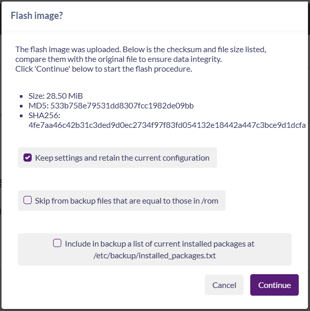

# HT-H7608 OTA Upgrade Procedure

{ht_translation}`[简体中文]:[English]`

[Firmware Download Link](https://resource.heltec.cn/download/HT-H7608/firmware)

1. Access the Configuration Page. For entry methods, refer to: [Access Configuration Page](https://docs.heltec.cn/en/wifi_halow/ht-h7608/index.html#get-started)

2. Navigate to Firmware Update. Click: `Advanced Config` → `System` → `Reset/Flash Firmware` → `Flash Image`


3. Select `Browse`, Choose target firmware, click `Upload`, Waiting for firmware upload to complete...


4. Select whether to **"keep settings and retain the current"** configurations



``` {note} Ensure network and power stability during firmware upgrade.
```

## Firmware Version Update 

HT-H7608 Firmware Version 20250605 update:
- Press the button to change from purple to red.
- In AP and MeshGateway modes, the ETH indicator light for network usage is changed to green, and the USB indicator light for network usage is changed to purple.

HT-H7608 Firmware Version 20250807 update:
- Added support for enabling the HaLow AP function in HaLow Mesh mode, allowing STA devices to connect to Mesh nodes.
- Dynamic Channel Selection (DCS) is enabled by default.

HT-H7608 Firmware Version 20250924 update:
- Fixed a bug where devices kept rebooting after enabling the HaLow AP function in HaLow Mesh mode.

