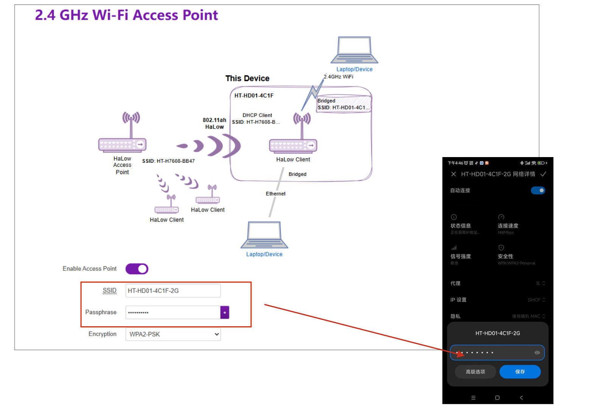

# **Wi-Fi HaLow Client(STA) Mode**

{ht_translation}`[简体中文]:[English]`

This topic introduces the setup and activation of Wi-Fi HaLow Client(STA) mode.

## Summary
As with any Wi-Fi network, HaLow has Clients (also known as stations) which discover and connect to an Access Point. If you select client, non-HaLow devices can use the HaLow link by connecting to the other interfaces.

As shown below:


``` {note} Some devices, such as the HT-HR01, do not have 2.4G Wi-Fi functionality.
```

------------------------------------  

## Basic Settings
1. Enter the configuration page, How to enter the configuration mode page” please refer to the corresponding product documentation.

``` {note} If it is a complete reset, you need to select the **Country** and **Hostname**, In summary, if this step appears, make the corresponding selection. If it does not appear, there is no need to take any action.
```

2. Select "**Standard Wi-Fi HaLow**", indicates that you will configure the device in AP-STA mode, click `Next`.

   

2. Select "**Client**", click `next`.

   

3. You can click `SCAN`, or directly enter the hotspot name and password of the Wi-Fi HaLow gateway(AP) you want to connect to, click `next`.

   

4. Choose the traffic mode based on your needs, click `next` . 

|  Mode   | Description  |
|  ----  | :----- |
| None  | Non-HaLow and HaLow networks are isolated. This device will use a static IP address<br>and run a DHCP server on the non-HaLow interface |
| Bridge  | Non-HaLow devices obtain IPs from your HaLow link |
| Extender | Non-HaLow devices obtain IPs from the DHCP server on this device and this device<br>uses NAT to forward IP traffic |

5. This HaLow device is also capable of 2.4 GHz Wi-Fi. If you enable a 2.4 GHz Wi-Fi Access Point, you will be able to connect non-HaLow Wi-Fi clients to this device.


6. Enable a 2.4 GHz Wi-Fi Access Point. It offer a standard 2.4G Wi-Fi hotspot. After enabling it, the STA will create a standard 2.4G Wi-Fi hotspot for regular devices to access the network.



8. Click `Apply`, When the green or blue light remains steady, it indicates that the network connection is successful.

``` {note} If you selected Ethernet mode, observe the color of your indicator light, it should be blue for USB cable and green for RJ45 cable. If the color of the light does not match the connection of the cable, you will need to change it to the appropriate color by pressing the button.
```

------------------------------------

For other modes , please refer to the [Wi-Fi HaLow Usage guide](https://docs.heltec.org/en/wifi_halow/ht-h7608/index.html#configurantion).
