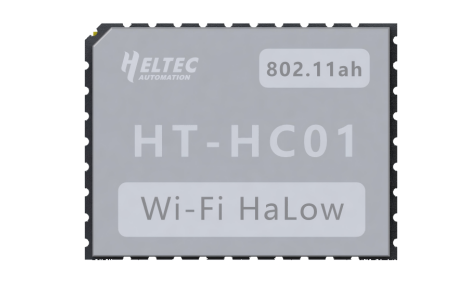
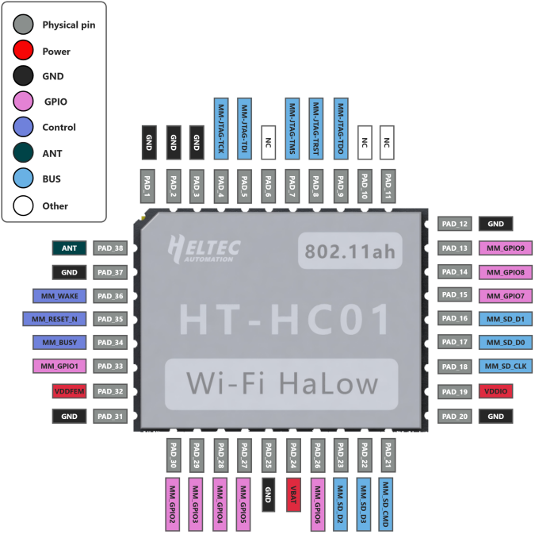

**HT-HC01 Getting Started Guide**

:ht_translation:`[简体中文]:[English]`

Introduction
============
HT-HC01 is a Wi-Fi HaLow module with excellent RF performance, which operates in 902 - 928MHz, with maximum data rates of 32.5Mbps and up to 1-2km transmission range.

Features
--------
- Long-range transmission
- Channel bandwidth options of 1/2/4/8 MHz.
- High data rate
- Support Sub-1 GHz frequency bands, frequency range: 902~928 MHz.
- Max output power:21dBm.
- Hibernate mode (internal/ external wake).
- Wide spectrum of security features.

Important resources
==================

- `HT-HC01 Datasheet <https://resource.heltec.cn/download/HT-HC01/Datasheet>`_
- `HT-HC01 Reference Design <https://resource.heltec.cn/download/HT-HC01/Reference_design>`_
- `HT-HC01 Footprint <https://resource.heltec.cn/download/Heltec_Module_Footprint/HT-HC01>`_

Pin Layout
==========
HT-HC01 pin Layout

SDK Setup
=========
Please proceed to `Heltec Wi-Fi HaLow Get Started <https://docs.heltec.org/en/wifi_halow/get_started/index.html>`_.

Hardware upgrade log
====================

`HT-HC01 hardware upgrade log <https://docs.heltec.org/en/wifi_halow/ht-hc01/hardware_upgrade_log/index.html>`_

Frequently Asked Questions (FAQs)
=================================

`HT-HC01 FAQs <https://docs.heltec.org/en/wifi_halow/ht-hc01/faq/index.html>`_

Related resources
=================

- `Resource Station <https://resource.heltec.cn/download/HT-HC01>`_
- `SDK on github <https://github.com/HelTecAutomation/ESP_HaLow>`_

For further design documentation for the module, please contact us at support@heltec.cn.