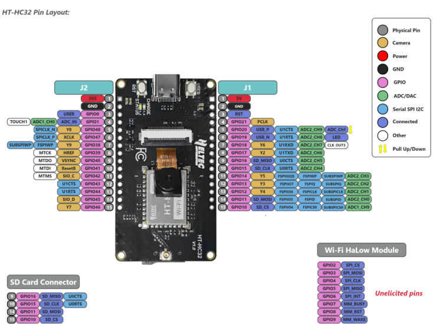
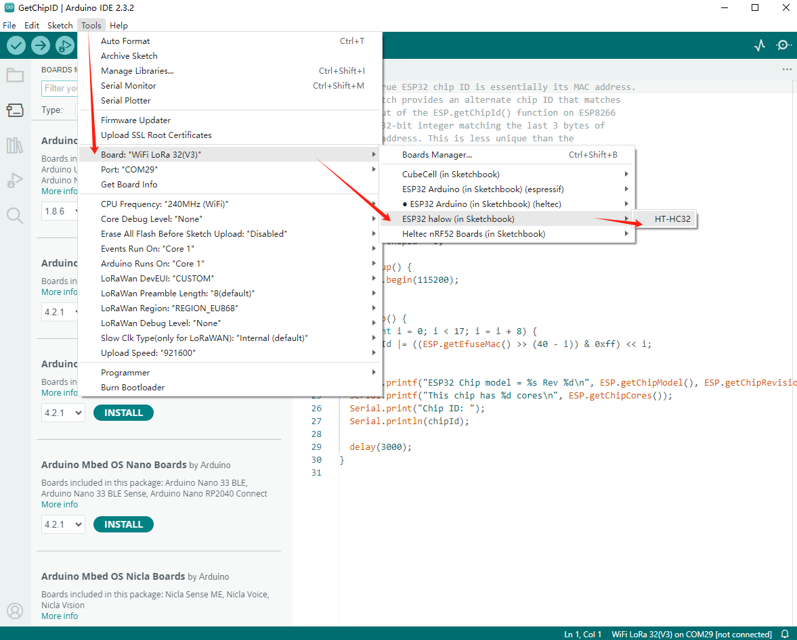
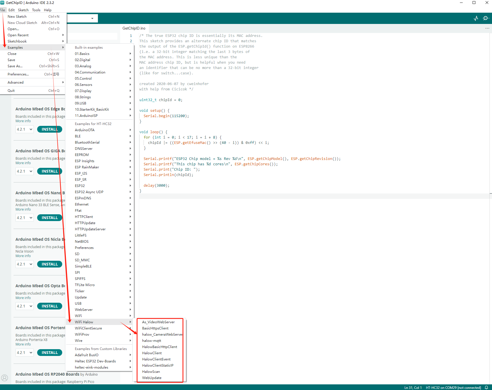

**HT-H7608 Gateway(AP) Mode**

{ht_translation}`[简体中文]:[English]`

This topic describes the use of HT-H7608 Gateway(AP) mode.
## HT-H7608 Gateway(AP) Mode Summary
AP mode is a basic operating mode of the HT-H7608. In this mode, the HT-H7608 acts as a Wi-Fi HaLow gateway, connecting other Wi-Fi HaLow nodes to the LAN or the internet.

As shown below:


## Enter Configuration page

``` {warning} Do not enter configuration mode while connected to a network cable. If you do this accidentally, disconnect the power and reconnect.
```

1. Press the button with the SIM needle for 3 seconds until the yellow light is on and release it.

   

2. Using the configuration tool (PC or laptop), find the Wi-Fi named "HT-H7608-xxxx-2G" and connect to it. The default password is "heltec.org".

   

3. Enter "10.42.0.1" in your browser to navigate to the configuration page, the default account as "root" and password as "heltec.org".

   

## Basic Settings
1. Enter the configuration page and select "**Standard Wi-Fi HaLow**", click `next`.

   

2. Select "**Access Point**", click `next`.

   

3. Set the relevant parameters in the pop-up page, with the parameter descriptions as follows:

   - **SSID**, Wi-Fi HaLow hotspot name, which can be left as default.
   - **Password**, Wi-Fi HaLow hotspot password, set it yourself.
   - **Bandwidth**, different bandwidth configurations affect signal coverage, data transfer rate, and interference resistance. Narrower bandwidths (e.g., 1 MHz) offer better coverage and lower power consumption, while wider bandwidths provide higher data rates but have shorter range and higher power consumption.
   - **Channel**, when there are other Wi-Fi HaLow devices in the area, you can reduce interference by setting different channels.

   

(upstream_network)=
## Upsrteam Network
Once you've done this basic setup, you need to choose an "Upstream network" method.

"Upstream network" is the network that carries data outward from your local network to broader networks. The H7608 offers three modes, and you can choose any of them:

- [**None**](none) (LAN, no internet)
- [**Ethernet**](ethernet)
- [**Wi-Fi**](wifi)

(none)=

### None Mode
The "None" mode is typically used for creating a local area network. In "None" mode, devices connected to the H7608 cannot access the internet.


#### None mode IP rules
   - HT-H7608(Gateway): "10.42.0.1" or "192.168.1.1"
   - Wi-Fi HaLow client: The IP is assigned by the HT-H7608 (Gateway), "192.168.1.x".
#### View and change the configuration
Connect PC(laptop) to H7608 through a network cable, enter "10.42.0.1" in the browser, The default username is "root" and the default password is "heltec.org". Then you can enter the H7608-AP configuration interface, you can view or change the relevant configuration information.


--------------------

(ethernet)=

### Ethernet Mode
In "Ethernet" mode, the H7608-Gateway is connected to the internet via ethernet cable, so Wi-Fi HaLow devices connected to its hotspot are also connected to the internet.


**Apply**, when the green or blue light remains steady, it indicates that the network connection is successful.

Choose either Bridge or Router mode based on your needs. The main difference between them lies in the IP assignment rules, for more details, please refer to [Ethernet mode IP rules](ethernet-ip)

(ethernet-ip)=
#### Ethernet Mode IP rules
   - HT-H7608(Gateway): The upstream regular router connected to the H7608 assigns the IP. You can obtain it from the router's management interface.
   - Wi-Fi HaLow client: In Router mode, the IP is assigned by the HT-H7608 (Gateway), while in Bridge mode, it is assigned directly by the regular router.
#### View and change the configuration
1. Connect the PC(laptop) to the upstream regular router and access its configuration page.
2. Obtain the IP of the HT-H7608.
3. Enter the IP address in the browser to access its configuration page. The default username is "root" and the default password is "heltec.org". Then you can enter the H7608-AP configuration interface, you can view or change the relevant configuration information.


-------------------------

### Wi-Fi Mode
In "Wi-Fi" mode, the H7608-Gateway is connected to the internet via Wi-Fi 2.4G, so Wi-Fi HaLow devices connected to its hotspot are also connected to the internet.


Enter the SSID and password of the upstream router's Wi-Fi.

**Apply**, when the green or blue light remains steady, it indicates that the network connection is successful.

#### Wi-Fi Mode IP rules
   - HT-H7608(Gateway): The upstream regular router connected to the H7608 assigns the IP. You can obtain it from the router's management interface.
   - Wi-Fi HaLow client: The IP is assigned by the HT-H7608 (Gateway).
#### View and change the configuration
1. Connect the PC(laptop) to the upstream regular router and access its configuration page.
2. Obtain the IP of the HT-H7608.
3. Enter the IP address in the browser to access its configuration page. The default username is "root" and the default password is "heltec.org". Then you can enter the H7608-AP configuration interface, you can view or change the relevant configuration information.


---------------------------

For other modes of the HT-H7608, please refer to the [HT-H7608 user manual](https://docs.heltec.org/en/wifi_halow/ht-h7608/index.html).