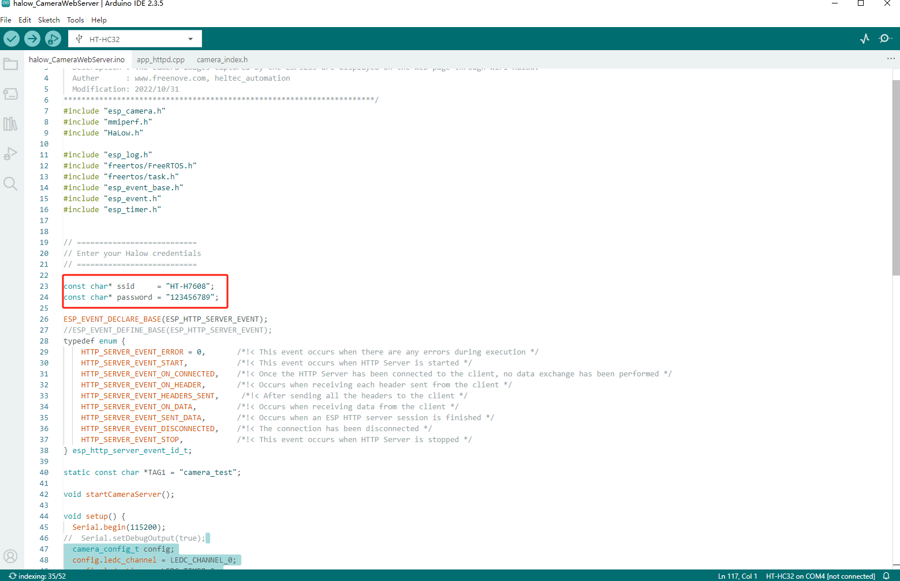
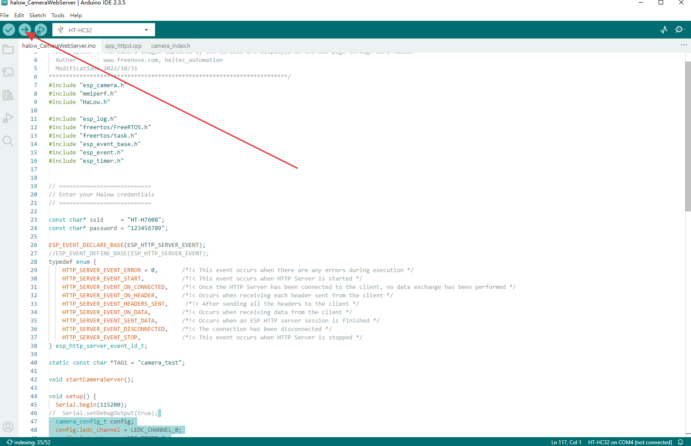
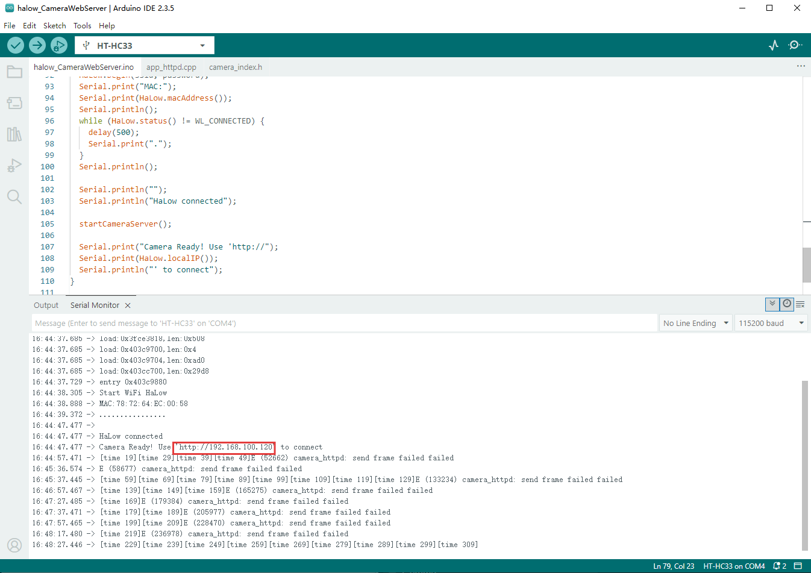
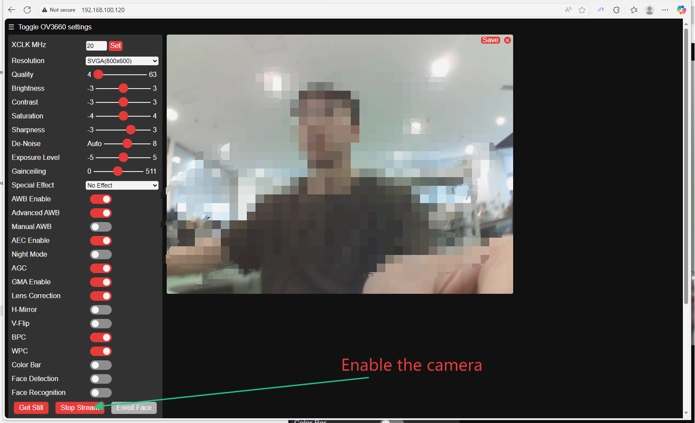

**HT-HC32/33 ESP-HaLowCamera**

:ht_translation:`[简体中文]:[Eglish]`

Introduction
============
ESP-HaLowCamera is a development board with integrated camera, based on the ESP32-S3 MCU and Wi-Fi HaLow module.

.. note::
   The device can only operate as a HaLow STA (Station/client) and cannot function as a HaLow AP (Access Point).

.. image:: ./img/01.png
   :align: center
   :width: 500px 

Feature
-------

- ESP32-S3+MM6108, integrated Wi-Fi, Bluetooth, and Wi-Fi HaLow three network connections
- CP2102 USB-to-serial chip.
- Long transmission range, up to over 1~2km.
- Integrated camera.
- Integrated SD card.
- Type-C USB interface.
- SH1.25-2 battery interface.
- Supports the Arduino development environment.

Components
----------

.. image:: ./img/02.png
   :align: center
   :width: 700px

__________

Basic Resources
===============

- `ESP-HaLowCamera Datasheet <https://resource.heltec.cn/download/HT-HC32/Datasheet>`_
- `ESP-HaLowCamera Schematic Diagram <https://resource.heltec.cn/download/HT-HC32/Schematic_diagram>`_
- `ESP-HaLowCamera development framework on GitHub <https://github.com/HelTecAutomation/ESP_HaLow>`_

Pin Layout
==========

.. image:: ./img/03.png
   :align: center
   :width: 600px

For description of function names, please refer to `ESP-HaLowCamera Datasheet <https://resource.heltec.cn/download/HT-HC32/Datasheet>`_.

------------------------------------------

Get started
===========

Required Hardware
-----------------

- `ESP-HaLowCamera <https://heltec.org/project/ht-hc32/>`_
- USB Type-C cable
- Computer running Windows, Linux, or macOS

.. note::

  Be sure to use an appropriate USB cable. Some cables are for charging only and do not provide the needed data lines nor work for programming the boards.

Hardware Connection
-------------------
The installation direction of SDcard and camera is shown below.

.. image:: ./img/06.png
   :align: center
   :width: 600px

Required Software
-----------------

- `Arduino IDE <https://www.arduino.cc/en/software>`_
- `Git <https://git-scm.com/downloads/win>`_ (GitHub installation required)

Installing the development framework
------------------------------------
Heltec provides an Arduino-based development framework that includes basic ESP32 code and sample Wi-Fi HaLow code.

For installation, please refer to this link: `Heltec ESP_HaLow Development Framework Installation Guide <https://docs.heltec.org/en/wifi_halow/get_started/index.html>`_.

Programming
-----------
Once you have the framework and libraries installed, connect your computer to the board and start programming nodes.

Example: 
^^^^^^^^^^^^^^^
1. Connect your node to the computer with a USB cable.

2. Open `Arduino IDE` -> `Tools`, correctly select the board.

.. image:: ./img/04.png
   :align: center
   :width: 800px

3. Select `File` -> `Example` -> `WiFi HaLow` -> `halowCameraWebServer`.

.. image:: ./img/05.png
   :align: center
   :width: 800px

4. Fill in the SSID and password for the WiFi HaLow AP side.

5. Compile and upload the code.

6. After the code is uploaded, open the device serial monitor, where you can see the IP address of the HC32.

7. When your device and the HC32 are on the same network segment, you can access the camera by visiting the HC32's IP address. For example, connect your phone/computer to the network provided by the HaLow AP.

   
FAQs
=====

- `HT-HC32 Frequently Asked Questions <https://docs.heltec.org/en/wifi_halow/ht-hc32/faq/index.html>`_

Heltec General Docs
===================
-->[General Docs]<-- <https://docs.heltec.org/general/index.html>
