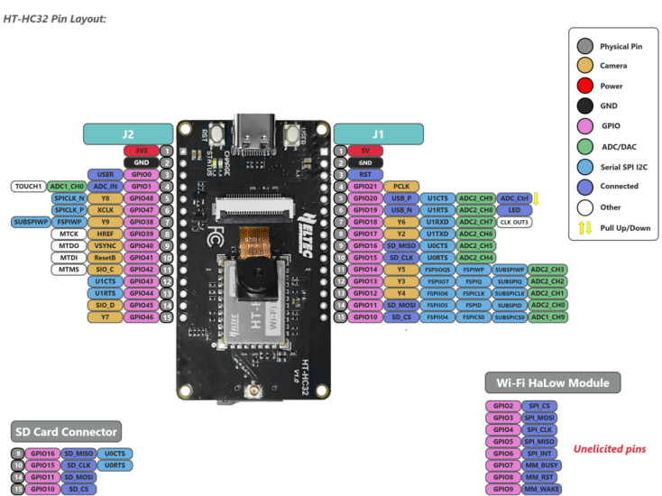
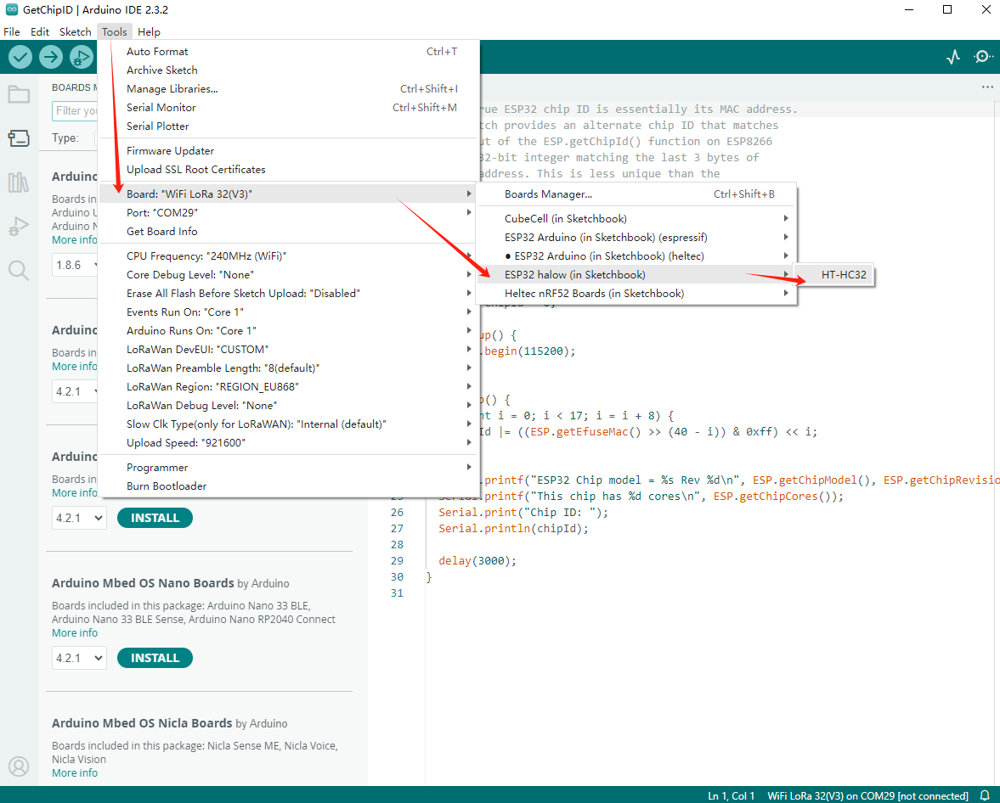

**HT-HC32 ESP-HaLowCamera**

:ht_translation:`[简体中文]:[Eglish]`

**This document is still under construction and will be completed soon.**

Introduction
============
ESP-HaLowCamera is a development board with integrated camera, based on the ESP32-S3 MCU and Wi-Fi HaLow module.It is designed for long-range, high-speed wireless communication. With support for transmission distances of over 1 km and speeds of up to 32 Mbps, it is ideal for IoT applications that require reliable, high-performance connectivity.

.. image:: ./img/01.png
   :align: center
   :width: 800px 

Feature
-------

- The MCU is the ESP32-S3, and the Wi-Fi HaLow module is HT-HC01.
- Integrated CP2102 USB-to-serial chip.
- Long transmission range, up to over 1~2km.
- Fast transmission speed, with a maximum of 32 Mbps.
- Low power consumption design with strong penetration.
- Integrated 2 megapixel camera.
- Integrated SD card slot for easy local deployment and data storage.
- Type-C USB interface with a complete voltage regulator, ESD protection, short circuit protection, RF shielding, and other protection measures.
- Onboard SH1.25-2 battery interface, integrated lithium battery management system.
- Integrated Wi-Fi, Bluetooth, and Wi-Fi HaLow three network connections.
- Supports the Arduino development environment.

Components
----------

.. image:: ./img/02.png
   :align: center
   :width: 800px

__________

Basic Resources
===============

- `ESP-HaLowCamera Datasheet <https://resource.heltec.cn/download/HT-HC32/Datasheet>`_
- `ESP-HaLowCamera Schematic Diagram <https://resource.heltec.cn/download/HT-HC32/Schematic_diagram>`_
- `ESP-HaLowCamera development framework on GitHub <https://resource.heltec.cn/download/HT-HC32/Schematic_diagram>`_

Pin Layout
==========

For description of function names, please refer to `ESP-HaLowCamera Datasheet <https://resource.heltec.cn/download/HT-HC32/Datasheet>`_.

------------------------------------------

Get started
===========

Required Hardware
-----------------

- `ESP-HaLowCamera <https://heltec.org/project/ht-hc32/>`_
- USB Type-C cable
- Computer running Windows, Linux, or macOS

.. note::

  Be sure to use an appropriate USB cable. Some cables are for charging only and do not provide the needed data lines nor work for programming the boards.

Hardware Connection
-------------------
The installation direction of SDcard and camera is shown below.

Required Software
-----------------

- `Arduino IDE <https://www.arduino.cc/en/software>`_
- `Git <https://git-scm.com/downloads/win>`_ (GitHub installation required)

Installing the development framework
------------------------------------
Heltec provides an Arduino-based development framework that includes basic ESP32 code and sample Wi-Fi HaLow code.

For installation, please refer to this link: `Heltec ESP_HaLow Development Framework Installation Guide <https://docs.heltec.org/en/wifi_halow/get_started/index.html>`_.

Programming
-----------
Once you have the framework and libraries installed, connect your computer to the board and start programming nodes.

Example
^^^^^^^
1. Connect your node to the computer with a USB cable.

2. Open `Arduino IDE` -> `Tools`, correctly select the board.

3. Select `File` -> `Example` to find the example you want. The location of the Wi-Fi HaLow related code is circled in the figure below.

.. image:: ./img/05.png
   :align: center
   :width: 800px

4. Adapt your code to your needs.

5. Compile & Upload

FAQs
=====

- `HT-HC32 Frequently Asked Questions <https://docs.heltec.org/en/wifi_halow/ht-hc32/faq/index.html>`_

Heltec General Docs
===================
-->[General Docs]<-- <https://docs.heltec.org/general/index.html>
