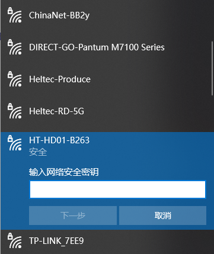
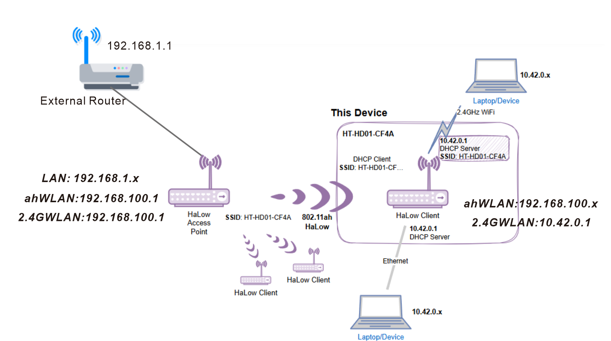

# HD01 Access Configuration

{ht_translation}`[简体中文]:[English]`

The HD01 offers three methods to access the configuration page—you may use any one of them:
- [Via AP remote access](via-ap-romote-access),To use this mode, ensure the device's AP hotspot/Ethernet is active and connected. Devices in Bridge mode cannot use this method.
- [IP-Based connection](ip-based-connection),This mode requires both you and the device to be on the same LAN, and you must be able to connect to it via its IP address.
- [Configuration Mode](reset-up), The device must enter configuration mode, during which normal operation will be temporarily suspended.

(via-ap-romote-access)=

## Via AP/Ethernet access
**To use this mode, ensure the device's AP hotspot/Ethernet is active and connected. Devices in Bridge mode cannot use this method.**

``` {tip} The HD01's default mode is not Bridge, so you can use this method.
```

1. Connect the PC(Laptop) to the Dongle 2.4G-AP(or Ethernet). The default SSID is **HT-HD01-xxxx**, and the default password is **heltec.org**.



2. Enter “192.168.100.1” or “10.42.0.1” in the browser (depending on the mode of operation of the device, if you are not sure which one to enter, you can try both, If neither address can be connected, please use alternative methods). 


3. Default account "**root**", default password **"heltec.org"**.

-----------------------------

(ip-based-connection)=

## IP-Based connection
**This mode requires both you and the device to be on the same LAN, and you must be able to connect to it via its IP address.**

1. Connect the PC(Laptop) to the same LAN as the device, and go to the upstream device configration page. Find the IP address of the corresponding device. In the default configuration:
- The Dongle-AP's IP is provided by the external router.
- The Dongle-STA's IP is provided by the Dongle-AP.
- The terminal device's IP is provided by the Dongle-STA.



If your device has changed the network connection mode, please refer to the [**Wi-Fi HaLow IP Allocation Rules**](https://docs.heltec.org/en/wifi_halow/ht-hd01/ip_rules.html). 

2. Go to this address, default account "**root**", default password "**heltec.org**".


----------------------------------

(reset-up)=

## Configutation Mode
The **Configuration mode** can allow you to reconfigure the whole device. The device must enter configuration mode, during which normal operation will be temporarily suspended.

``` {tip} If the configuration hasn't been apply in this mode, the existing configuration will still be retained.
```

1. **Disconnect the Ethernet cable**. If you entered configuration mode while connected via Ethernet, you won't be able to configure Wi-Fi. In this case, you need to unplug the network cable and power-cycle the device.

2. Press and hold the device button 3 seconds until the orange light turns on, then release the button. Subsequently, orange light and green light (blue light) will flash alternately, indicating that the device has entered reset mode.


3. At this point, the device will provide a dedicated AP hotspot for configuration. The default SSID is **HT-HD01-xxxx**, and the default password is **heltec.org**. Connect your PC(Laptop) to it.


4. Access **10.42.0.1** in your browser. The default username is **root**, and the default password is **heltec.org**.


5. By adhering to the instructions and prompts available on the configuration interface, each stage of the process can be executed methodically.

