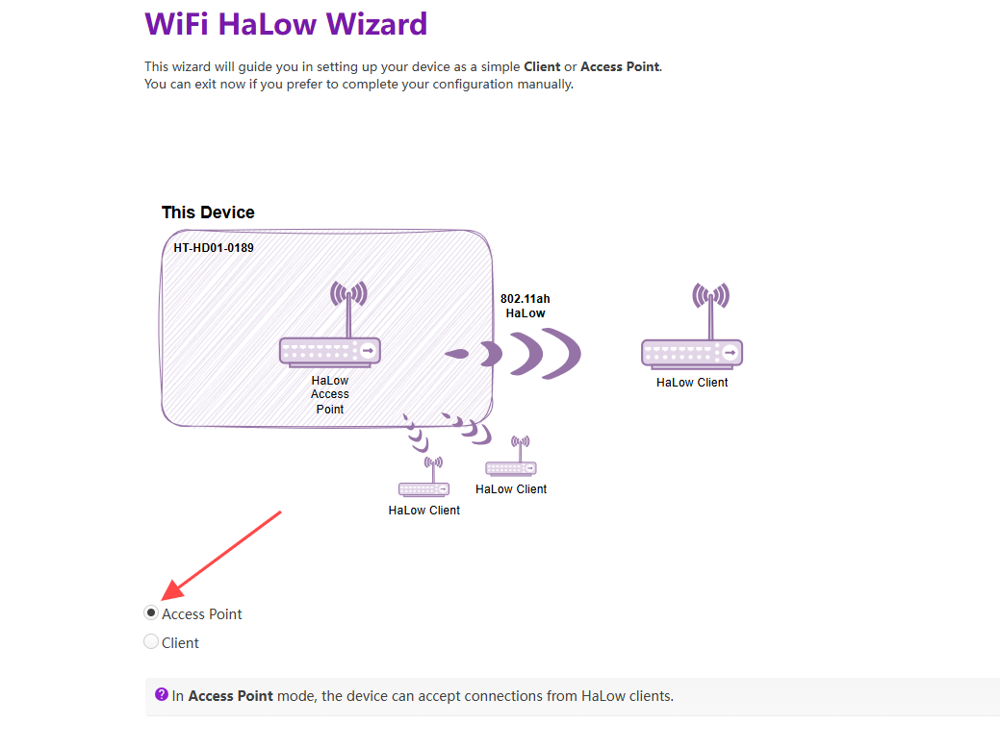

# AP Setup Guide

{ht_translation}`[简体中文]:[English]`

**This document describes how to configure the HD01 in AP(Access Point) mode.**

------------------------------------------------------

1. Please ensure you have accessed the device's configuration page. If you need guidance on accessing the configuration interface, please refer to this link:

[Access Configuration](https://docs.heltec.org/en/wifi_halow/ht-hd01/access_configuration_page.html)

2. For devices not in configuration mode: Simply click **Wizards** to proceed. 


For configuration mode access, the following parameters must be set:
- **Country**, Only devices with the same Country setting can communicate with each other.
- **Hostname**, refers to the hostname of your device in the Wi-Fi HaLow network. 


3. Select "**Standard WiFi HaLow**", click `next`.


4. Select `Access Point` mode and click `Next`.



5. Set the parameters for the HaLow hotspot and click `Next`.


- **SSID**: Wi-Fi HaLow hotspot name. The STA must establish connectivity through it.
- **Password**: Wi-Fi HaLow hotspot password.
- **Bandwidth**: Different bandwidth configurations affect signal coverage, data transfer rate, and interference resistance. Narrower bandwidths (e.g., 1 MHz) offer better coverage and lower power consumption, while wider bandwidths provide higher data rates but have shorter range and higher power consumption.
- **Channel**: Each bandwidth has specific frequencies as its channels. When there are other Wi-Fi HaLow devices in the area, you can reduce interference by setting different channels.

6. Select the **Upstream Network** connection method and **Traffic Mode**. The upstream network determines the device's internet access method, while **Traffic Mode** governs how downstream devices obtain IP addresses. Regardless of your selection, the topology diagram and on-screen instructions will dynamically update to reflect your configuration. 


7. Enable/Disable "2.4GHz WiFi AP", Set the SSID and password for the 2.4GHz hotspot, then click **Next**.

``` {tip} If don't have stringent low-power requirements, we recommend enabling this feature to facilitate subsequent device management.
```


8. Click **Apply** to complete the device configuration. 

9. If using an Ethernet cable as your upstream network, remember to connect the cable. Upon successful network connection, the device indicator will maintain a solid cyan or purple illumination. 

``` {warning} The RJ45 cable is indicated by cyan, while the USB-C cable is indicated by purple. If the LED color doesn't match your selected cable type, press the function button to toggle between modes.
```


------------------------------------------------------

## Related Links
- [HaLow Dongle User Guide](https://docs.heltec.org/en/wifi_halow/ht-hd01/index.html)
- [HaLow Dongle STA Setup Guide](https://docs.heltec.org/en/wifi_halow/ht-hd01/sta.html)