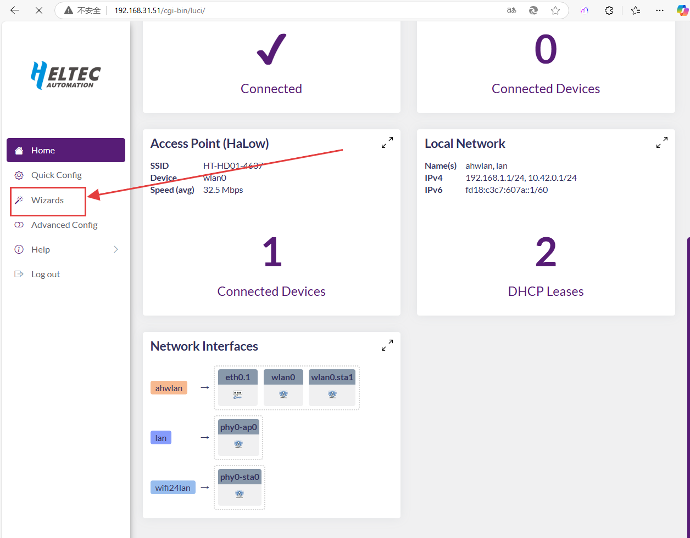
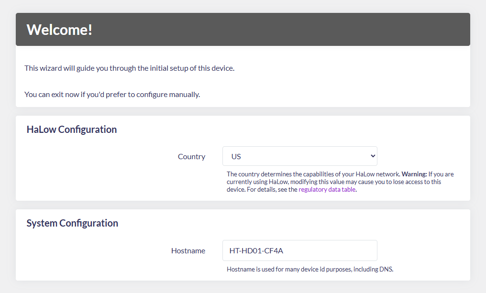
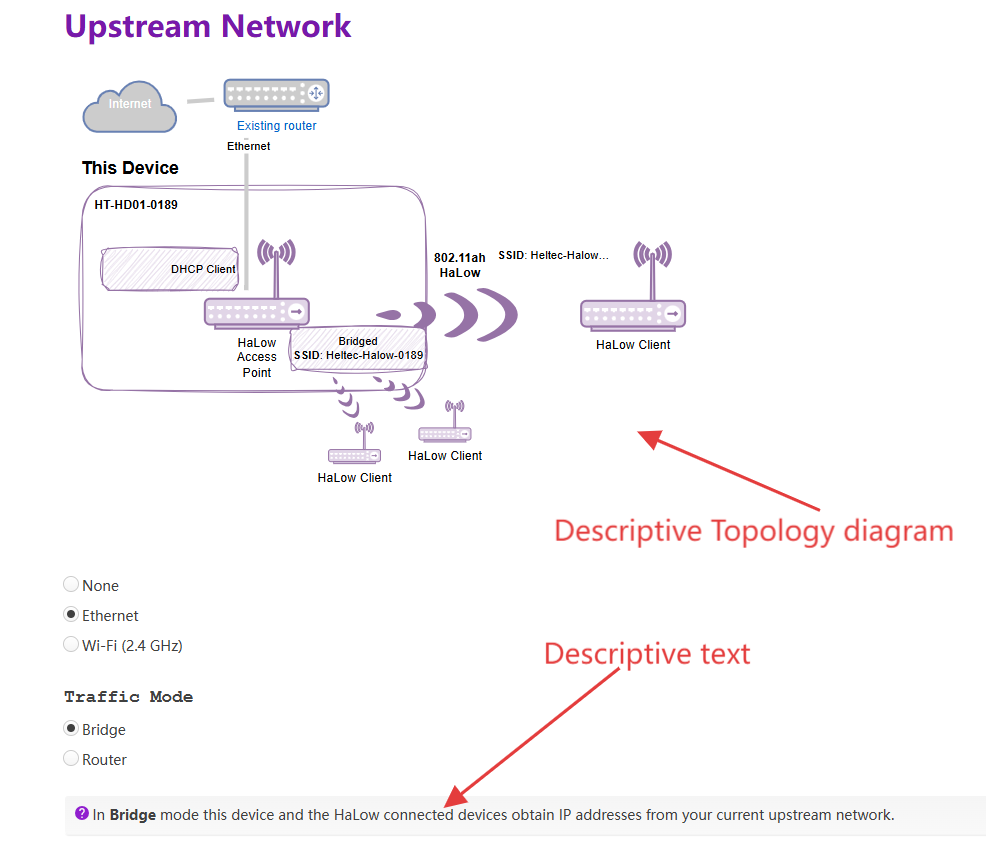
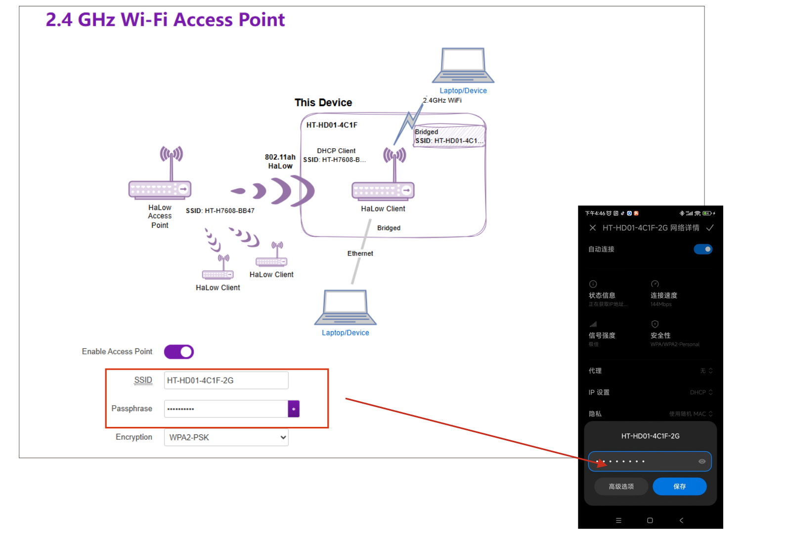

# STA Setup Guide

{ht_translation}`[简体中文]:[English]`

**This document describes how to configure the HD01 in STA(Station/client) mode.**

------------------------------------------------------
1. Please ensure you have accessed the device's configuration page. If you need guidance on accessing the configuration interface, please refer to this link:

[Access Configuration](https://docs.heltec.org/en/wifi_halow/ht-hd01/access_configuration_page.html)

2. For devices not in configuration mode: Simply click **Wizards** to proceed. 

For configuration mode access, the following parameters must be set:
- **Country**, Only devices with the same Country setting can communicate with each other.
- **Hostname**, refers to the hostname of your device in the Wi-Fi HaLow network. 

3. Select "**Standard WiFi HaLow**", click `next`.

4. Select `Client` mode and click `Next`.

5. Scan or manually enter the SSID and password of the HaLow-AP, and click `Next`.

5. Select **Traffic Mode**, which determines the downstream network mode provided by this MeshPoint device. Regardless of your selection, the topology diagram and on-screen instructions will dynamically update to reflect your configuration. 

7. Enable/Disable "2.4GHz WiFi AP", Set the SSID and password for the 2.4GHz hotspot, then click **Next**. This 2.4GHz access point is configured for your terminal devices. The hotspot must remain enabled, otherwise its Wi-Fi functionality will be unavailable.

------------------------------------

## Related Links
- [HaLow Dongle User Guide](https://docs.heltec.org/en/wifi_halow/ht-hd01/index.html)
- [HaLow Dongle STA Setup Guide](https://docs.heltec.org/en/wifi_halow/ht-hd01/sta.html)