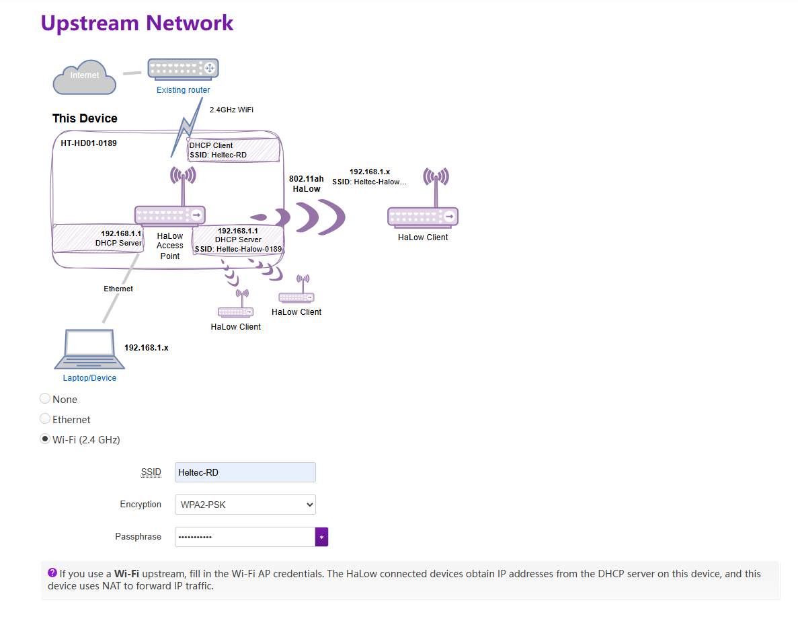

# AP Setup Guide

{ht_translation}`[简体中文]:[English]`

## Summary
This document describes how to configure the HD01 in any state to AP mode, as well as the key parameter settings for this mode. 

------------------------------------------------------

## Access Wiards Page
Before all, make sure your device is in "**Wizards mode**".If you don't know how, please refer to either one of these two links:
- [Via Configration -> Wizards Page](https://docs.heltec.org/en/wifi_halow/ht-hd01/quick_started.html#access-configuration-page),
- [Via Reset up mode](https://docs.heltec.org/en/wifi_halow/ht-hd01/quick_started.html#reset-up)

------------------------------------------------------

## Setup
1. Configure the following parameters(*This steps appear when performing a complete reset of the device. If you enter through the configuration page, they will be automatically skipped*):
    - `Country`. Please set it according to your region, and ensure that the AP and STA regions are consistent.
    - `Hostname` refers to the hostname of your device in the Wi-Fi HaLow network.
    - `Standard Wi-Fi HaLow`, slect a wizard you need，Standard Wi-Fi HaLow means AP-STA mode.

2. Select `Access Point` mode and click `Next`.

3. Set the parameters for the HaLow hotspot and click `Next`.

- **SSID**: Wi-Fi HaLow gateway (AP) hotspot name.
- **Password**: Wi-Fi HaLow hotspot gateway (AP) password.
- **Bandwidth**: Different bandwidth configurations affect signal coverage, data transfer rate, and interference resistance. Narrower bandwidths (e.g., 1 MHz) offer better coverage and lower power consumption, while wider bandwidths provide higher data rates but have shorter range and higher power consumption.
- **Channel**: Each bandwidth has specific frequencies as its channels. When there are other Wi-Fi HaLow devices in the area, you can reduce interference by setting different channels.

4. Choose the mode to access the upstream network. In the factory default state, the AP is set to **Ethernet-Router** mode.

- **None** mode cannot connect to the network and is typically used for building a local area network.
- The difference between the two **Ethernet** modes lies mainly in the IP allocation rules. Please choose according to your needs and the configuration page instructions.
- If you choose **WiFi(2.4G)**, you will need to enter the SSID and password for the upstream Wi-Fi network.

5. Choose whether to enable 2.4G Wi-Fi. If enabled, you can set its SSID, password, and Ecryption.

6. Click "Save&Aplly". The HaLow AP network has been created.

------------------------------------------------------

## Related Links
- [HaLow Dongle User Guide](https://docs.heltec.org/en/wifi_halow/ht-hd01/index.html)
- [HaLow Dongle STA Setup Guide](https://docs.heltec.org/en/wifi_halow/ht-hd01/sta.html)