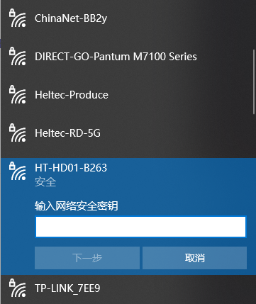
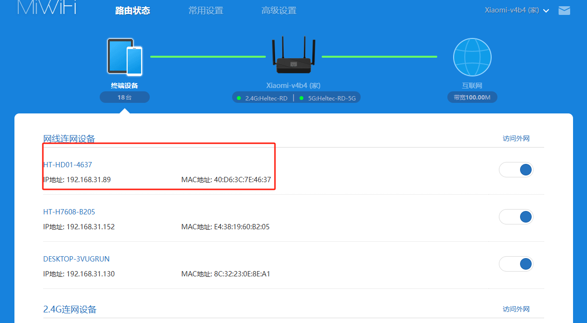

**HaLow Dongle Gateway(AP) Mode**

{ht_translation}`[简体中文]:[English]`

*Although the HT-HD01 is set to pair and configure by default upon manufacturing, you might need to connect to an upstream 2.4G Wi-Fi network, adjust signal strength, modify transmission bandwidth, and change SSID password in certain scenarios*.

------------------------------------

(config_page)=
# Enter Configuration page

HD01 has two method enter the configuration page, you can choose either one of them:

- [AP Remote Access(recommended)](ap_remote)

- [IP-Based Connection](ip_base)

(ap_remote)=
## AP Remote Access(recommended)
By default, the Dongle's 2.4G Wi-Fi is enabled. Through the 2.4G Wi-Fi it provides, you can access the device's IP address to enter the configuration page. The specific steps are as follows.

1. Locate the Wi-Fi hotspot provided by the device, connect your computer (or tablet) to this hotspot via Wi-Fi or Ethernet. Typically, its default SSID is **HT-HD01-xxxx**, and the default password is **heltec.org**.

2. Access **192.168.100.1** in your browser. The default username is **root**, and the default password is **heltec.org**.

(ip_base)=
## IP-Based Connection

1. Connect the upstream router Dongle-AP is connected to, enter the management page, and find the IP address of Dongle-AP.

        
2. Go to this IP address, default account "**root**", default password "**heltec.org**".
   
     

-----------------------------

# Basic Settings
In the `Quick Config` section of the configuration page, you can modify some basic settings. Inculde:

- **Country**.
- **SSID**, Please make sure to distinguish between Wi-Fi HaLow and 2.4G.
- **Password**, Please make sure to distinguish between Wi-Fi HaLow and 2.4G.
- **Bandwidth**, different bandwidth configurations affect signal coverage, data transfer rate, and interference resistance. Narrower bandwidths (e.g., 1 MHz) offer better coverage and lower power consumption, while wider bandwidths provide higher data rates but have shorter range and higher power consumption.
- **Channel**, each bandwidth have some specific frequency as its channels, when there are other Wi-Fi HaLow devices in the area, you can reduce interference by setting different channels.

--------------------------

# Access Via Wi-Fi-2.4G
The default upstream access mode for Dongle-AP is **Ethernet-Router**. If you want to enable other upstream access modes, such as Wi-Fi connection, you can follow the steps below to configure it.
1. Click the **Wizard** section of the configuration page.

2. Select “**Access Point**”, click `Next`.

3. Set the relevant parameters in the pop-up page, with the parameter descriptions as follows:

   - **SSID**, Wi-Fi HaLow hotspot SSID, you can freely choose settings or keep them as default.
   - **Password**, Wi-Fi HaLow hotspot password, you can freely choose settings or keep them as default..
   - **Bandwidth**, different bandwidth configurations affect signal coverage, data transfer rate, and interference resistance. Narrower bandwidths (e.g., 1 MHz) offer better coverage and lower power consumption, while wider bandwidths provide higher data rates but have shorter range and higher power consumption.
   - **Channel**, each bandwidth have some specific frequency as its channels, when there are other Wi-Fi HaLow devices in the area, you can reduce interference by setting different channels.

4. Select the Wi-Fi (2.4G) you want to connect and input its SSID and password, then click on "Next."

5. "Enable Access Point", we suggest enabling it, which will creat a 2.4G network, so greatly facilitate your configuration and device management.

------------------------------------------

# Setup a new Dongle-AP
In some cases, you might not be able to connect to the HaLow Dongle device via IP or AP settings. In such scenarios, the **Wizards mode** can assist you in reconfiguring a brand-new HaLow Dongle device from scratch. Follow the guidance provided by the wizard according to your specific requirements to complete the reconfiguration process step-by-step.
## Enter Wizard Mode 
1. Press and hold the device button until the orange light turns on, then release the button.

2. At this point, the device will provide a dedicated AP hotspot for configuration. The default SSID is **HT-HD01-xxxx**, and the default password is **heltec.org**. Connect your PC(Laptop) to it.

3. Access **192.168.4.1** in your browser. The default username is **root**, and the default password is **heltec.org**.

## Configuration

Refer to the ["Generic Wi-Fi HaLow Configuration Guide - AP Mode"](https://docs.heltec.org/en/wifi_halow/halow_guide/gateway.html) for specific configuration procedures.

------------------------------------------------------

# Related Links
- [HaLow Dongle User Guide](https://docs.heltec.org/en/wifi_halow/ht-hd01/index.html)
- [HaLow Dongle STA Setup Guide](https://docs.heltec.org/en/wifi_halow/ht-hd01/sta.html)