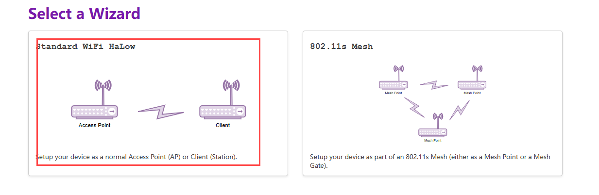
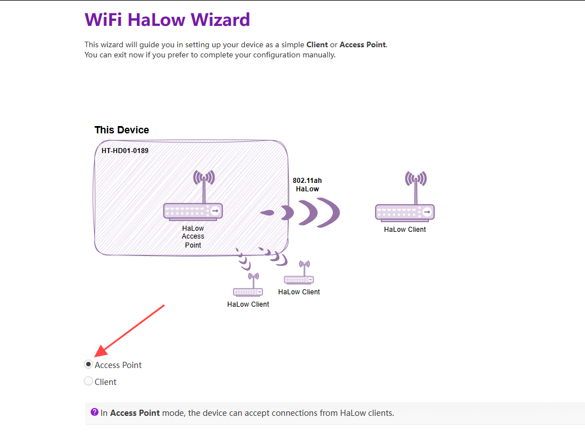
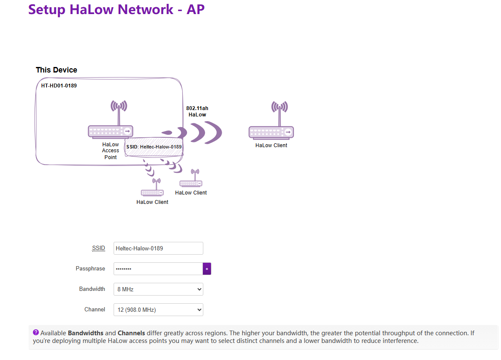

# **HaLow Dongle Gateway(AP) Mode**

{ht_translation}`[简体中文]:[English]`

Although the HT-HD01 is set to pair and configure by default upon manufacturing, you might need to connect to an upstream 2.4G Wi-Fi network, adjust signal strength, modify transmission bandwidth, and change SSID password in certain scenarios.

This topic describes how to enable the Gateway (Access Point) mode on the Heltec Wi-Fi HaLow device.

## Summary
Access Point(AP) mode is a basic operating mode. In Access Point mode, the device can accept connections from HaLow clients.

As shown below:


------------------------------------

(config_page)=
## Enter Configuration page

HD01 has three method enter the configuration page, you can choose either one of them:

- [AP Remote Access(recommended)](ap_remote)

- [IP-Based Connection](ip_base)

- [Via Configuring hotspot connection](hotspot)

(ap_remote)=
### AP Remote Access(recommended)
By default, the Dongle's 2.4G Wi-Fi is enabled. Through the 2.4G Wi-Fi it provides, you can access the device's IP address to enter the configuration page. The specific steps are as follows.

1. Locate the Wi-Fi hotspot provided by the device, connect your computer (or tablet) to this hotspot via Wi-Fi or Ethernet. Typically, its default SSID is **HT-HD01-xxxx**, and the default password is **heltec.org**.


2. Access **192.168.100.1** in your browser. The default username is **root**, and the default password is **heltec.org**.


(ip_base)=
### IP-Based Connection

1. Connect the PC(Laptop) to the same network as the device, and go to the router's control page.
     
2. Find the IP address of the corresponding device.
     

     
3. Go to this IP address, default account "root", default password "heltec.org".
     
     

(hotspot)=
### Via Configuring hotspot connection  
1. Press and hold the device button until the orange light turns on, then release the button.


2. At this point, the device will provide a dedicated AP hotspot for configuration. The default SSID is **HT-HD01-xxxx**, and the default password is **heltec.org**. Connect your PC(Laptop) to it.


3. Access **192.168.4.1** in your browser. The default username is **root**, and the default password is **heltec.org**.


-----------------------------

## Basic Settings
1. Enter the configuration page, select the `Country`, set the `Hostname`, and click `Apply`. "Hostname" refers to the hostname of your device in the Wi-Fi HaLow network.

2. Select "**Standard Wi-Fi HaLow**", click `Next`.



3. Select "**Access Point**", click `Next`.



4. Set the relevant parameters in the pop-up page, with the parameter descriptions as follows:



   - **SSID**, Wi-Fi HaLow gateway(AP) hotspot name.
   - **Password**, Wi-Fi HaLow hotspot gateway(AP) password.
   - **Bandwidth**, different bandwidth configurations affect signal coverage, data transfer rate, and interference resistance. Narrower bandwidths (e.g., 1 MHz) offer better coverage and lower power consumption, while wider bandwidths provide higher data rates but have shorter range and higher power consumption.
   - **Channel**, each bandwidth have some specific frequency as its channels, when there are other Wi-Fi HaLow devices in the area, you can reduce interference by setting different channels.

``` {tip} Available Bandwidths and Channels differ greatly across regions. The higher your bandwidth, the greater the potential throughput of the connection. If you're deploying multiple HaLow access points you may want to select distinct channels and a lower bandwidth to reduce interference.
```

--------------------------------

(upstream_network)=
## Upstream Network Description
Once you've done this basic setup, you need to choose an **"Upstream network"** method, That is **the way the AP connects to a regular router**.


In the default configuration, the Dongle-AP is set to `Ethernet` -> `router` mode.

The differences between the various modes are as follows. Please choose according to your requirements:

- **None**, your device will have a static IP address and run a DHCP server on all interfaces, the HaLow and non-HaLow networks will be isolated from each other.

- **Ethernet**, **we recommend choosing Bridge mode**, the another mode is "Router". The main difference between them lies in the IP assignment rules.

   - **Bridge**: In Bridge mode this device and the HaLow connected devices obtain IP addresses from your current upstream network.
   - **Router**: In Router mode the HaLow connected devices obtain IP addresses from the DHCP server on this device, and this device uses NAT to forward IP traffic.

- **Wi-Fi(2.4G)**, If you use a Wi-Fi upstream, fill in the Wi-Fi AP credentials. The HaLow connected devices obtain IP addresses from the DHCP server on this device, and this device uses NAT to forward IP traffic.

---------------------------

## Enable 2.4G Wi-Fi Access Point
This HaLow device is also capable of 2.4 GHz Wi-Fi.**It is highly recommended that you enable this feature, as it will greatly simplify your configuration process.**


You need to set the 2.4G Access Point's `SSID`, `Password`, `Encryption`.


------------------------------------------------------

## Complete configuration
Configuration and apply.

When the green or blue light remains steady, it indicates that the network connection is successful.

``` {note} In Ethernet mode, the blue light indicates a USB cable connection, while the green light indicates an RJ45 cable connection. If the light color does not match the connected cable, press the button to change it to the corresponding color.
```

-----------------------------------------------------

## View Configuration Information
### Via Enter Configuration page
Please refer to the content in Section 2: "[Accessing the Configuration Page](config_page)" to view the relevant configuration information of the device.
### Via serial tool
You can also connect the device to your computer via a USB cable and use a serial port tool on your computer to view the device's relevant information.

``` {tip} The serial port chip is CP210X. Click here to download the driver: [CP210X Driver](https://resource.heltec.cn/download/tools/CP210x_Universal_Windows_Driver.zip).
```

------------------------------------

For other modes , please refer to the [Wi-Fi HaLow Using guide](https://docs.heltec.org/en/wifi_halow/halow_guide/index.html).