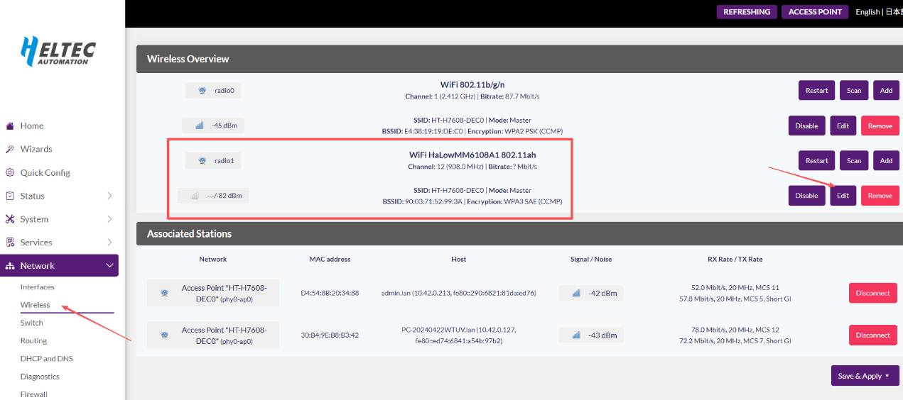
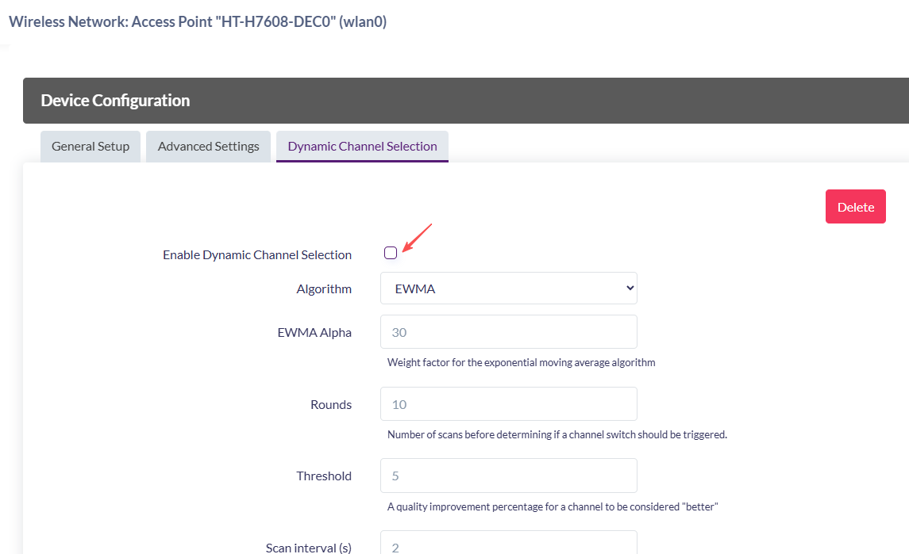
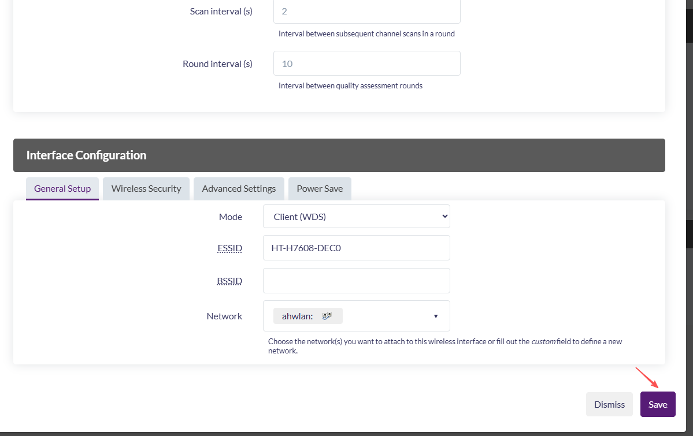

# HT-HD01 FAQ

{ht_translation}`[简体中文]:[English]`

## The configuration page cannot be accessed when reset up via Wi-Fi.
Do not enter the reset up mode via Wi-Fi while connecting the network cable. If this situation occurs, please unplug the power and network cable, and then re-enter the configuration mode.

---------------------------------------

## How do you get device's information and IP address?
Refer to [Get dongle IP address](https://docs.heltec.org/en/wifi_halow/ht-hd01/index.html#view-and-change-the-configuration)
- Look in the upstream router: Introduction  ht-h7608 latest documentation
- Connect to the 2.4GWi-Fi provided by the dongle and enter “192.168.1.1” or “10.42.0.1” in the browser (depending on the mode of operation of the device, if you are not sure which one to enter, you can try both). You will see the IP of the connected device and the IP of the Dongle itself.

-------------------------------------

## Resetting devices

1. [AP Mode Guide](https://docs.heltec.org/en/wifi_halow/ht-hd01/ap.html)
2. [STA Mode Guide](https://docs.heltec.org/en/wifi_halow/ht-hd01/sta.html)

## Factory resetting
If you forget your account password and can't connect to your device, please long press the device button for 7 seconds to completely reset. After reset, please follow the above steps.

## To maximize the transmission distance
To maximize the transmission distance of your device, consider the following strategies:
1. Reduce Bandwidth. Generally, the smaller the bandwidth of the AP, the longer the transmission distance. Lower bandwidth increases sensitivity and range but reduces the data rate.
2. The communication quality between the AP and STA is best when their antennas are parallel. Typically, positioning both antennas vertically upward ensures optimal performance.
3. Place the antennas within line of sight (LOS) to minimize obstructions.
4. Install the AP antenna in a high, unobstructed location (e.g., on a rooftop or pole) to maximize coverage and reduce interference.

## For automatic device reset

In the 2025-08-07 firmware, the HT-H7608 introduced an automatic frequency-hopping mechanism for the HaLow Access Point. However, enabling both Mesh and HaLow Access Point simultaneously may cause the device to reboot. Two solutions are currently available.
Once the device has rebooted and started successfully (indicated by the red light turning off), immediately enter Configuration Mode (refer to [this document](https://docs.heltec.org/en/wifi_halow/ht-hd01/quick_started.html) for instructions). After entering Configuration Mode, follow the steps below to configure the device:
1. Do not enable HaLow Access Point when using Mesh.
2. If HaLow Access Point needs to be enabled in Mesh mode, it is necessary to disable Dynamic Channel Selection in advance on the configuration page and save the configuration.

