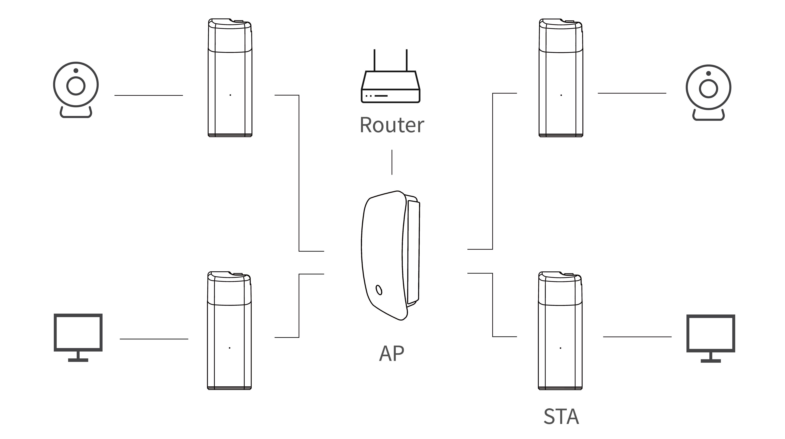

**HT-HD01 Wi-Fi HaLow Dongle User Guide**

:ht_translation:`[简体中文]:[Eglish]`

Introduction
------------
HT-HD01 is a plug-and-play  long-range communicator based on Wi-Fi HaLow can replace Ethernet cables in certain scenarios. Pair two devices for use, or work with the HaLow gateway.

.. image:: ./img/01.png
   :align: center
   :width: 500px

Feature
-------

- Long transmission range, up to 1km.
- Plug and play, simple configuration.
- IEEE 802.11ah standard.
- Both Wi-Fi and Ethernet supported, WiFi HaLow and 2.4GHz dual-band design.
- Firequency range: 902~928 MHz.
- Seamlessly connected to traditional networks.

Components
----------

.. image:: ./img/02.png
   :align: center
   :width: 700px

------------------------------------------------

Quick Started(Default paired mode)
----------------------------------
We have provided a plug-and-play mode for the HT-HD01 to help you get started more quickly. The devices are pre-paired at the factory, and you can use them directly without any configuration.

.. image:: ./img/04.jpg
   :align: center

1. Connect the Dongle-AP to the upstream router and power it on. 

.. image:: ./img/11.jpg
   :align: center
   :width: 700px 

There are two ways to connect to the upstream router, you can choose any one of them:

- Via Ethernet cable: just plug in the cable directly.
- Via 2.4G Wi-Fi: refer to `Dongle AP Setting <https://docs.heltec.org/en/wifi_halow/ht-hd01/ap.html#access-via-wifi-2.4g>`_

When the device's red light changes to blue or green and stays on, it indicates that the device is functioning properly.

.. warning::
   The blue light of the device represents a USB-C cable, and the green light represents an RJ45 cable. If the color of your indicator does not match the type of network cable you are connected to, you need to change the color of the indicator by pressing the button.

2. Power on the Dongle-STA. When the device's red light changes to blue or green and stays on, it indicates that the device is functioning properly.

.. image:: ./img/12.jpg
   :align: center
   :width: 700px

.. tip::
   If your STA device is no longer paired with the AP, you need to reconfigure the STA. Please refer to the `Dongle STA Setup Guide <https://docs.heltec.org/en/wifi_halow/ht-hd01/sta.html>`_.

3. Connect your device to the Dongle-STA via ethernet cable or 2.4G WiFi.

- Default 2.4G Wi-Fi SSID:HT-HD01-XXXX
- Default Password:heltec.org

.. image:: ./img/13.jpg
   :align: center
   :width: 700px

.. warning::
   The blue light of the device represents a USB-C cable, and the green light represents an RJ45 cable. If the color of your indicator does not match the type of network cable you are connected to, you need to change the color of the indicator by pressing the button.
   
--------------------------------------------------------

Work with HaLow Gateway
-----------------------
HT-HD01 can be work as a normal HaLow client, and connected to the HaLow gateway(such as `HT-H7608 <https://heltec.org/project/ht-h7608/>`_.)

Please refer to the `Dongle STA Setup Guide <https://docs.heltec.org/en/wifi_halow/ht-hd01/sta.html>`_.

----------------------------------------------------------

View Configuration Information
------------------------------
HD01 has three method enter the configuration page, you can choose either one of them.

AP Remote Access
~~~~~~~~~~~~~~~~
1. Connect the PC(Laptop) to the Dongle 2.4G AP.The default SSID is **HT-HD01-xxxx**, and the default password is **heltec.org**.
2. Enter “192.168.100.1”(AP) or “10.42.0.1”(STA) in the browser (depending on the mode of operation of the device, if you are not sure which one to enter, you can try both). 

3. Default account "**root**", default password **"heltec.org"**. You will see some device and the IP of the Dongle itself.

IP-Based Connection
~~~~~~~~~~~~~~~~~~~

1. Connect the PC(Laptop) to the same LAN as the device, and go to the configration page. Find the IP address of the corresponding device.

Here, LAN refers to the network that provides the IP for the device to be viewed, and the configuration page refers to the configuration page of the device that creates this network. In the default configuration:

- The Dongle-AP's IP is provided by the external router.
- The Dongle-STA's IP is provided by the Dongle-AP.
- The terminal device's IP is provided by the Dongle-STA.

If your device has changed the network connection mode, please refer to the `Wi-Fi HaLow IP Allocation Rules <https://docs.heltec.org/en/wifi_halow/ht-hd01/ip_rules.html>`_.

2. Go to this address, default account "root", default password "heltec.org".

.. image:: ./img/09.png
   :align: center
   :width: 500px

3. From this page, you can view the device information or change the relevant Settings.

.. image:: ./img/10.png
   :align: center
   :width: 500px

Via serial tool
~~~~~~~~~~~~~~~

You can also connect the device to your computer via a USB cable and use a serial port tool on your computer to view the device's relevant information.

.. tip::
   The serial port chip is CP210X. Click here to download the driver: `CP210X Driver <https://resource.heltec.cn/download/tools/CP210x_Universal_Windows_Driver.zip>`_.

Configuration Reload Mode
-------------------------
In some cases, you might not be able to connect to the HaLow Dongle device via IP or AP settings. In such scenarios, the **Reload mode** can assist you in reconfiguring a brand-new HaLow Dongle device from scratch. Follow the guidance provided by the wizard according to your specific requirements to complete the reconfiguration process step-by-step.

.. tip::
If the configuration hasn't been apply in this mode, the existing configuration will still be retained.

1. Press and hold the device button 3 seconds until the orange light turns on, then release the button.

.. image:: ./img/07.jpg
   :align: center
   :width: 500px

2. At this point, the device will provide a dedicated AP hotspot for configuration. The default SSID is **HT-HD01-xxxx**, and the default password is **heltec.org**. Connect your PC(Laptop) to it.

.. image:: ./img/ap/09.png
   :align: center
   :width: 500px

3. Access **192.168.4.1** in your browser. The default username is **root**, and the default password is **heltec.org**.

.. image:: ./img/09.png
   :align: center
   :width: 500px

4. Depending on your needs, configure the device accordingly.The configuration methods can be referred to in the `"Generic Wi-Fi HaLow Configuration Guide - AP Mode" <https://docs.heltec.org/en/wifi_halow/halow_guide/index.html#>`_ for specific configuration procedures.

-------------------------------------

Factory Reset Mode
------------------

.. warning::
In this mode, all existing configurations on the device are completely erased. You must reconfigure it anew before use.

1. Press and hold the device button 10 seconds until the white light turns on, then release the button.

.. image:: ./img/07.jpg
   :align: center
   :width: 500px

2. At this point, the device will provide a dedicated AP hotspot for configuration. The default SSID is **HT-HD01-xxxx**, and the default password is **heltec.org**. Connect your PC(Laptop) to it.

.. image:: ./img/ap/09.png
   :align: center
   :width: 500px

3. Access **192.168.4.1** in your browser. The default username is **root**, and the default password is **heltec.org**.

.. image:: ./img/09.png
   :align: center
   :width: 500px

4. Depending on your needs, configure the device accordingly.The configuration methods can be referred to in the `"Generic Wi-Fi HaLow Configuration Guide - AP Mode" <https://docs.heltec.org/en/wifi_halow/halow_guide/index.html#>`_ for specific configuration procedures.

IP Allocation Rules
-------------------
`Wi-Fi HaLow IP Allocation Rules <https://docs.heltec.org/en/wifi_halow/ht-hd01/ip_rules.html>`_.

Frequently asked questions
--------------------------

`HD01 Frequently Asked Questions <faq>`_

Hardware Update Log
-------------------

`HD01 Hardware Update Log <hardware_update_log>`_

Related Links
-------------

- `Wi-Fi HaLow general user guide <https://docs.heltec.org/en/wifi_halow/halow_guide/index.html>`_
- `HT-H7608 Wi-Fi HaLow Gateway <https://docs.heltec.org/en/wifi_halow/ht-h7608/index.html>`_
- Technical Support: support@heltec.cn
- `HD01 Resource station <https://resource.heltec.cn/download/HT-HD01>`_
