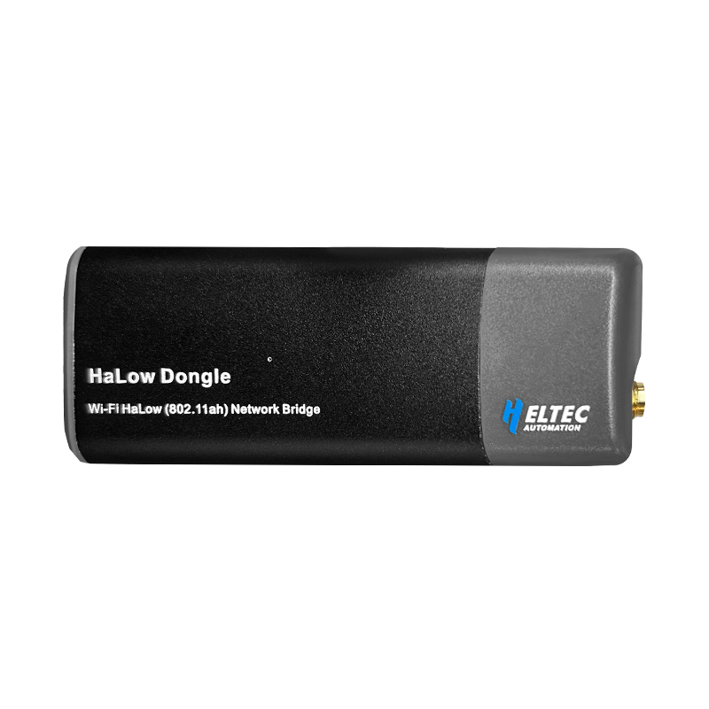
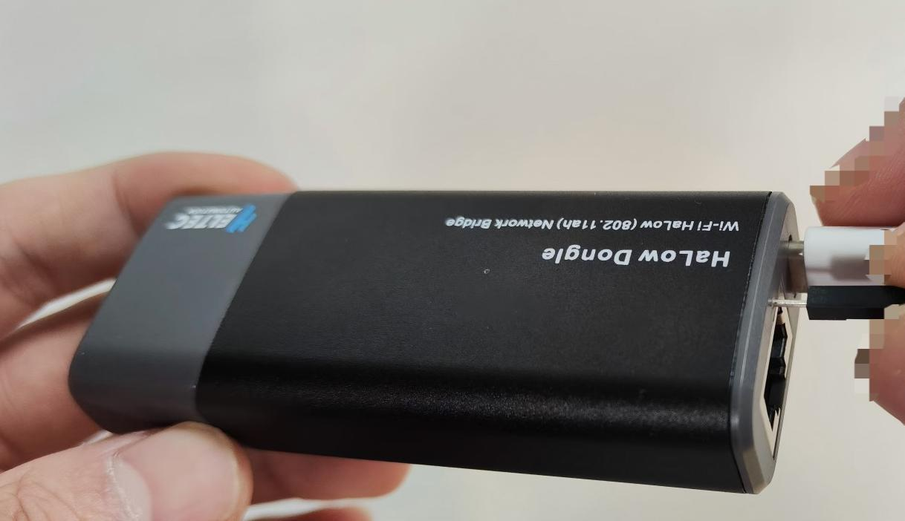
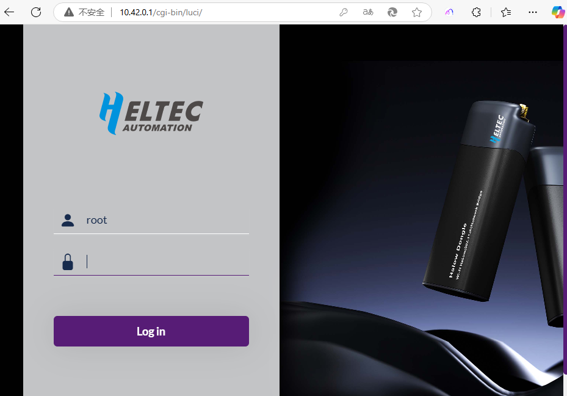
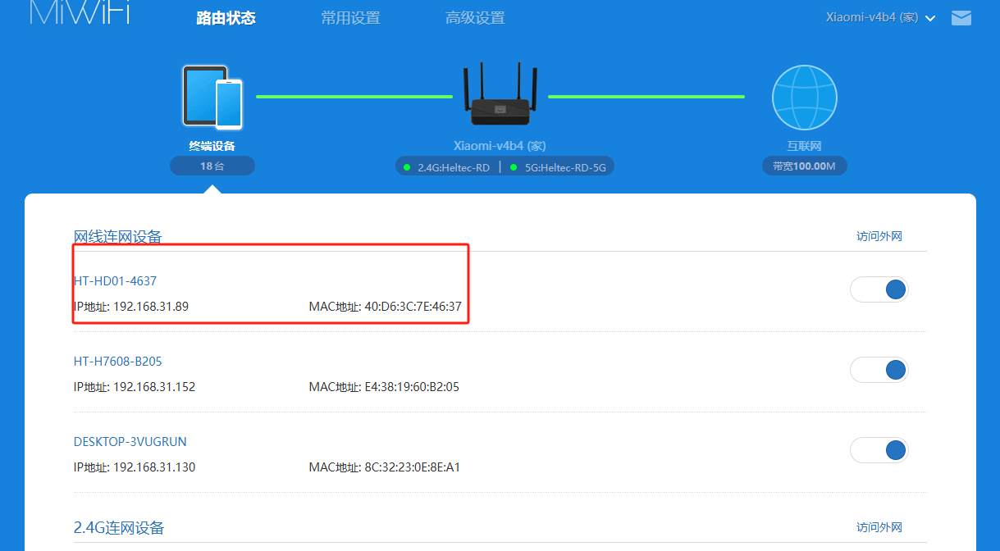
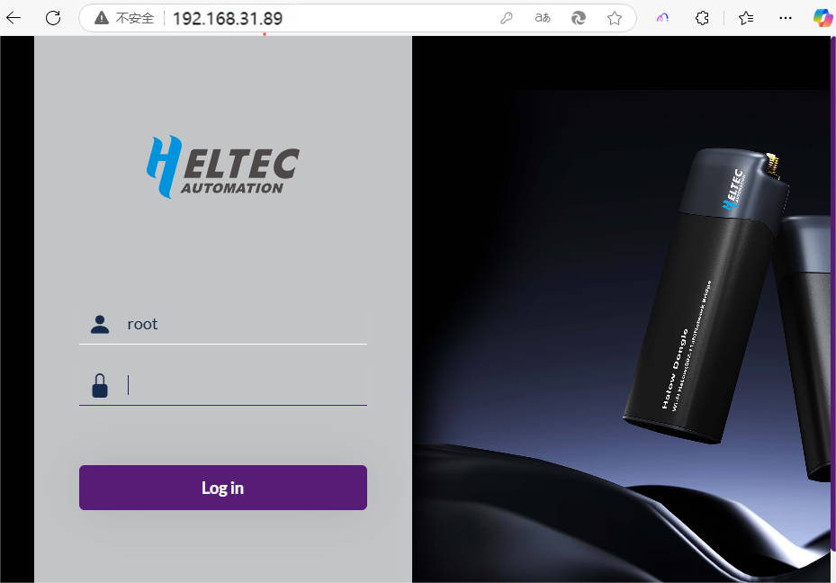

**HT-HD01 Wi-Fi HaLow Dongle**

:ht_translation:`[简体中文]:[Eglish]`

Introduction
------------
HT-HD01 is a plug-and-play network bridge designed to significantly extend the transmission range of traditional networks.

Feature
-------
- Long transmission range, up to 1km.
- IEEE 802.11ah standard.
- Both Wi-Fi and Ethernet supported, WiFi HaLow and 2.4GHz dual-band design.
- Large capacity allows access to a large number of devices simultaneously.
- High transmission rate, 32.5Mbps@8MHz, 15Mbps@4MHz.
- Firequency range: 902~928 MHz.
- High penetration.
- Seamlessly connected to traditional networks.
- Offers four bandwidth modes: 1/2/4/8MHz.
- Plug and play, simple configuration.
- Lightweight and easy to deploy.
- Rich in modes and strong in extensibility.

Components
----------

.. image:: ./img/02.png
   :align: center
   :width: 700px

----------------------------------------------------------------

Quick Started
-------------
We have provided a plug-and-play mode for the HT-HD01 to help you get started more quickly.

.. image:: ./img/02.png
   :align: center
   :width: 700px

1. Access Point  
Connect the AP to the upstream router and power it on. When the red light goes off and the green light stays on, it indicates that the device has successfully joined the network and obtained an IP address.

.. tip:: 

   If you cannot use an Ethernet cable and instead use Wi-Fi to connect to the upstream network, please refer to the topic: `Reconfiguration <#section_one>`_

2. Station(Client)  
Under default conditions, your device is already paired. You only need to power on the STA device, and it will be able to communicate with the AP.

.. tip:: 
   If you need to re-pair, please refer to: `Reconfiguration <#section_one>`_
   
3. Start Using  
You can directly connect your device to the RJ45 or USB-C port, or you can use the device's Wi-Fi to connect.
- Default 2.4G Wi-Fi SSID:HT-HD01-XXXX
- Default Password:heltec.org

-----------------------------------------------------------------

.. _section_one:

Reconfiguration
---------------
If the default mode does not meet your needs, you can access the device's configuration page to set and modify the relevant parameters.

Enter configuration Page
^^^^^^^^^^^^^^^^^^^^^^^^

.. warning::
   If you're using Wi-Fi for configuration, you'll need to unplug the cable before powering on.

1. Powered on, press the button with the SIM needle for 3 seconds until the yellow light is on and release it.

2. There are two ways to connect to the configuration network of the device, either of which you can choose:
   - **Via Ethernet**, using a cable directly to connect the computer to the HT-HD01.
   - **Via Wi-Fi**, use your computer to find a WiFi hotspot named HT-HD01-xxxx and connect to it.

3. Enter "10.42.0.1" in your browser to navigate to the configuration page, the default account as "root" and password as "heltec.org".

----------------------------------------------------------

Configuration
^^^^^^^^^^^^^
Please refer to the following link to set up your device:

- `Access Point setup guide <https://docs.heltec.org/en/wifi_halow/halow_guide/gateway.html>`_
- `Station(Client) setup guide <https://docs.heltec.org/en/wifi_halow/halow_guide/station.html>`_

----------------------------------------------------------------------------------------------------

View and change the configuration
---------------------------------
1. Connect the PC(Laptop) to the same network as the device, and go to the router's control page.

.. tip:: 
   By default, connect to your upstream router. If not, then you need to determine how your device's IP is obtained, as described in the `Wi-Fi Setup Guide <https://docs.heltec.org/en/wifi_halow/halow_guide/>`_.

2. Find the IP address of the corresponding device.

3. Go to this address, default SSID "root", default password "heltec.org".

4. From this page, you can view the device information or change the relevant Settings.