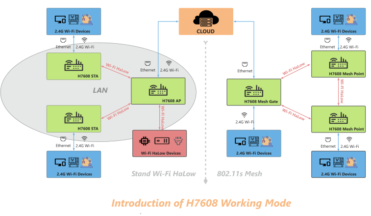

**HT-HD01 Wi-Fi HaLow Dongle**

:ht_translation:`[简体中文]:[Eglish]`

**This document is still under construction and will be completed soon.**

Summry
------
HT-HD01 is a plug-and-play network bridge designed to significantly extend the transmission range of traditional networks.

Feature
-------

- Long transmission range: up to 1km, and even farther within the visual distance.
- IEEE 802.11ah standard.
- Both Wi-Fi and Ethernet supported, WiFi HaLow and 2.4GHz dual-band design.
- Large capacity allows access to a large number of devices simultaneously.
- High transmission rate, 32.5Mbps@8MHz, 15Mbps@4MHz.
- Firequency range: 902~928 MHz.
- High penetration.
- Seamlessly connected to traditional networks.
- Offers four bandwidth modes: 1/2/4/8MHz.
- Plug and play, simple configuration.
- Lightweight and easy to deploy.
- Rich in modes and strong in extensibility.
