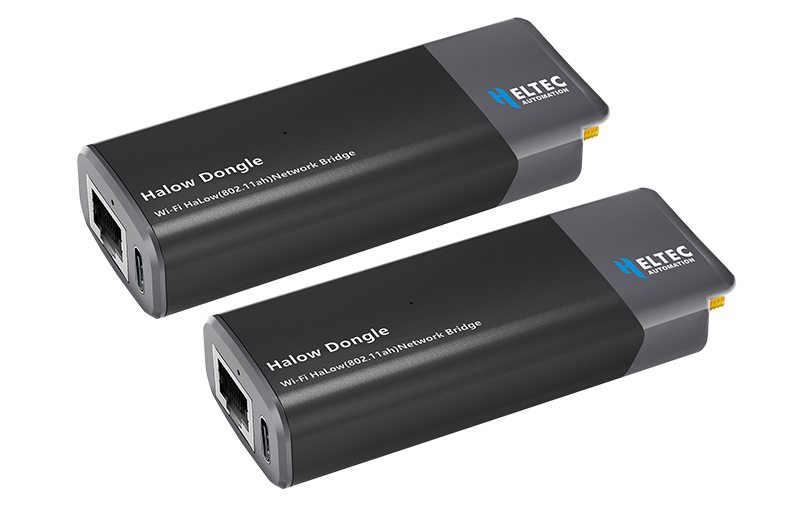
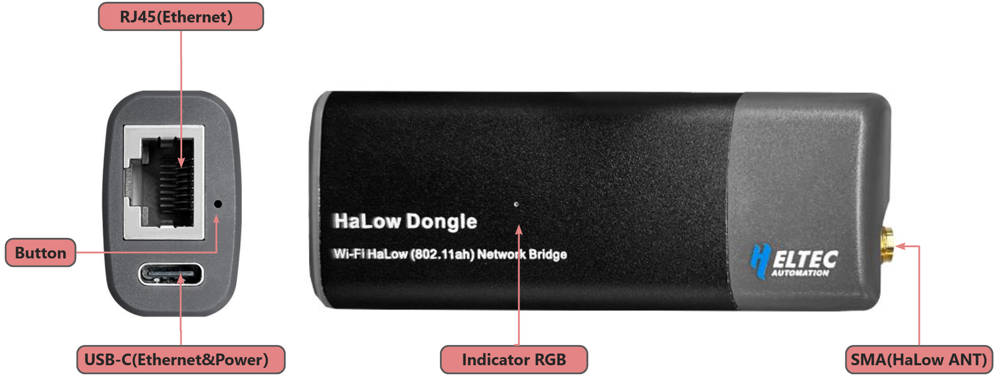
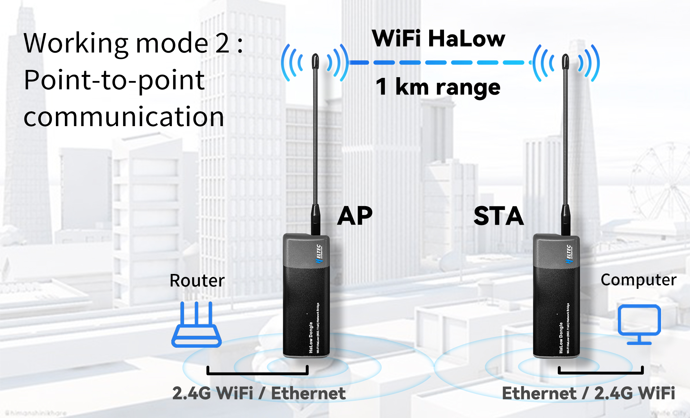
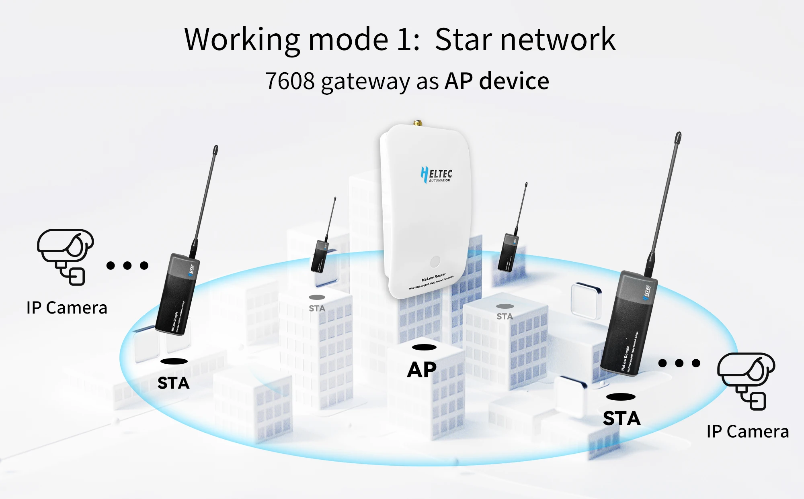
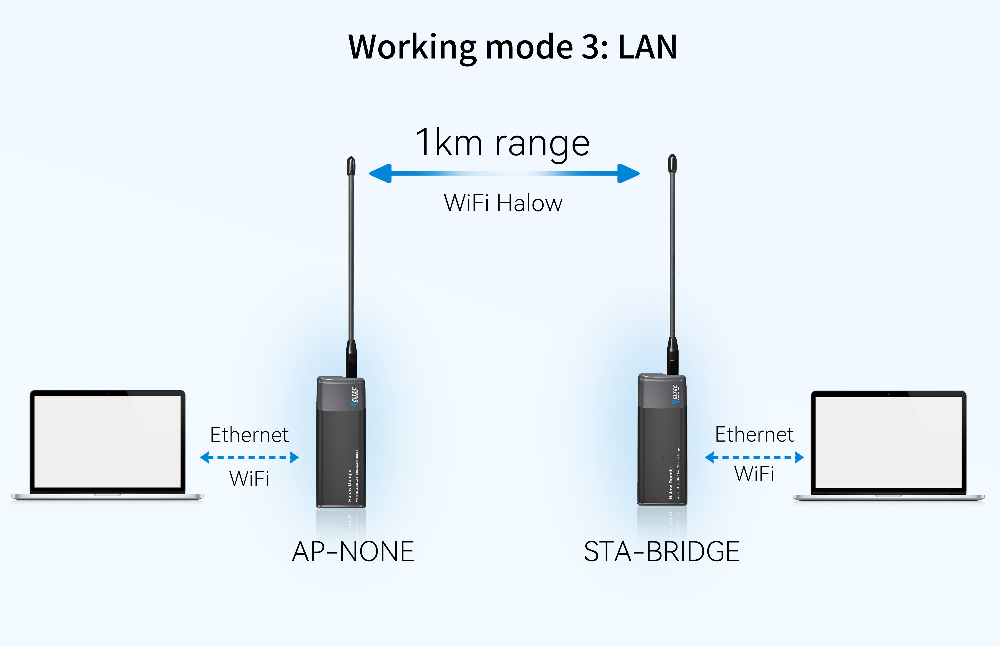

HT-HD01 Wi-Fi HaLow Dongle User Guide
=====================================

:ht_translation:`[简体中文]:[Eglish]`

Introduction
------------
HT-HD01 is a plug-and-play  long-range communicator based on Wi-Fi HaLow can replace Ethernet cables in certain scenarios. Pair two devices for use, or work with the HaLow gateway.

Feature
-------

- Long transmission range, up to 1km.
- Plug and play, simple configuration.
- IEEE 802.11ah standard.
- Both Wi-Fi and Ethernet supported, WiFi HaLow and 2.4GHz dual-band design.
- Firequency range: 902~928 MHz.
- Seamlessly connected to traditional networks.

--------------------------------------------------

HT-HD01 LED Status Description
================================

The following table describes the LED behavior of the HT-HD01 device during various operating states.

LED Color & Behavior                  Description
====================================  =============================================
Red light blinking                    Device is booting up
Red light steady on                   Button pressed
Yellow light steady on (after 3s)     Enters configuration mode
White light steady on (after 7s)      Restores factory settings
Green & Yellow alternate blink        Config mode (via Wi-Fi & Ethernet)
Blue & Yellow alternate blink         Config mode (via Wi-Fi & USB)
Green light blinking                  STA mode via Ethernet — HaLow not connected
Green light steady on                 STA mode via Ethernet — HaLow connected
Blue light blinking                   STA mode via USB — HaLow not connected
Blue light steady on                  STA mode via USB — HaLow connected
Cyan light blinking                   AP mode via Ethernet — input not connected
Cyan light steady on                  AP mode via Ethernet — input connected
Purple light blinking                 AP mode via USB — input not connected
Purple light steady on                AP mode via USB — input connected

------------------------------------

Components
----------

------------------------------------

Network Mode
------------

AP-STA: Point to Point
^^^^^^^^^^^^^^^^^^^^^^

AP-STA: Star Topology
^^^^^^^^^^^^^^^^^^^^^

AP-STA: LAN
^^^^^^^^^^^^^^^^^^^

Mesh Networking
^^^^^^^^^^^^^^^

.. image:: ./img/18.jpg
   :align: center
   :width: 500px

--------------------------------------

.. toctree::
   :maxdepth: 2
   
   Overview<https://docs.heltec.org/en/wifi_halow/ht-hd01/index.html>
   Quick Start(Plug&Play)<quick_started>
   Access Configuration Page<access_configuration_page>
   AP-STA Mode <ap-sta/index>
   Mesh Mode <mesh/index>
   Building Local Area Network(LAN)<lan>
   IP Allocation Rules<ip_rules>
   Frequently Asked Questions<faq>
   Hardware Update Log<hardware_update_log>
   OTA Firmware Upgrade<ota>
   Heltec General<https://docs.heltec.org/general/index.html>

HD01 Related Links
------------------

- `Wi-Fi HaLow general user guide <https://docs.heltec.org/en/wifi_halow/halow_guide/index.html>`_
- `HT-H7608 Wi-Fi HaLow Gateway <https://docs.heltec.org/en/wifi_halow/ht-h7608/index.html>`_
- Technical Support: support@heltec.cn
- `HD01 Resource station <https://resource.heltec.cn/download/HT-HD01>`_

   