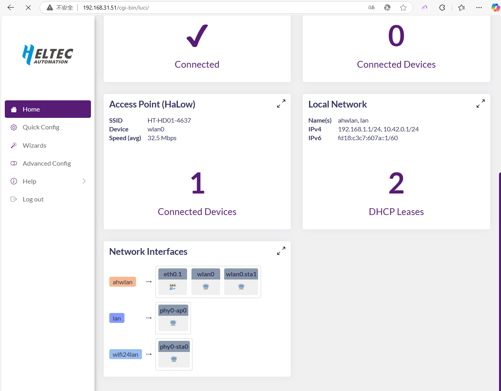

HT-HD01 Wi-Fi HaLow Dongle User Guide
=====================================

:ht_translation:`[简体中文]:[Eglish]`

Introduction
------------
HT-HD01 is a plug-and-play network bridge designed to significantly extend the transmission range of traditional networks.

.. image:: ./img/01.png
   :align: center
   :width: 500px

Feature
-------

- Long transmission range, up to 1km.
- Plug and play, simple configuration.
- IEEE 802.11ah standard.
- Both Wi-Fi and Ethernet supported, WiFi HaLow and 2.4GHz dual-band design.
- Firequency range: 902~928 MHz.
- Seamlessly connected to traditional networks.

Components
----------

.. image:: ./img/02.png
   :align: center
   :width: 700px

------------------------------------------------

Quick Started(Default paired mode)
----------------------------------
We have provided a plug-and-play mode for the HT-HD01 to help you get started more quickly.

.. image:: ./img/13.jpg
   :align: center
   :width: 700px 

1. Connect the Dongle-AP to the upstream router and power it on. 

.. image:: ./img/11.jpg
   :align: center
   :width: 700px 

   There are two ways to connect to the upstream router, you can choose any one of them:
   - Via Ethernet cable: just plug in the cable directly.
   - Via 2.4G Wi-Fi: refer to `Dongle AP Setting <https://docs.heltec.org/en/wifi_halow/ht-hd01/ap.html>`_

   When the device's red light changes to blue or green and stays on, it indicates that the device is functioning properly.

.. warning::
   The blue light of the device represents a USB-C cable, and the green light represents an RJ45 cable. If the color of your indicator does not match the type of network cable you are connected to, you need to change the color of the indicator by pressing the button.

2. Power on the Dongle-STA. Under default conditions, your device is already paired. When the device's red light changes to blue or green and stays on, it indicates that the device is functioning properly.

.. image:: ./img/12.jpg
   :align: center
   :width: 700px

.. tip::
   If your STA device is no longer paired with the AP, you need to reconfigure the STA. Please refer to the `Dongle STA Setup Guide <https://docs.heltec.org/en/wifi_halow/ht-hd01/sta.html>`_.

3. You can directly connect your device to the Dongle-STA via ethernet cable or 2.4G WiFi.

- Default 2.4G Wi-Fi SSID:HT-HD01-XXXX
- Default Password:heltec.org

.. image:: ./img/13.jpg
   :align: center
   :width: 700px

.. warning::
   The blue light of the device represents a USB-C cable, and the green light represents an RJ45 cable. If the color of your indicator does not match the type of network cable you are connected to, you need to change the color of the indicator by pressing the button.
   
--------------------------------------------------------

Work with HaLow Gateway
-----------------------
HT-HD01 can be work as a normal HaLow client, and connected to the HaLow gateway(such as `HT-H7608 <https://heltec.org/project/ht-h7608/>`_.)

.. image:: ./img/13.jpg
   :align: center
   :width: 700px 

Please refer to the `Dongle STA Setup Guide <https://docs.heltec.org/en/wifi_halow/ht-hd01/sta.html>`_.

----------------------------------------------------------

View Configuration Information
------------------------------
IP-Based Connection
~~~~~~~~~~~~~~~~~~~
1. Connect the PC(Laptop) to the same network as the device, and go to the router's control page.

.. tip:: 
   By default, connect to your upstream router. If not, then you need to determine how your device's IP is obtained, as described in the `Wi-Fi Setup Guide <https://docs.heltec.org/en/wifi_halow/halow_guide/>`_.

2. Find the IP address of the corresponding device.

.. image:: ./img/08.png
   :align: center
   :width: 500px

3. Go to this address, default account "root", default password "heltec.org".

.. image:: ./img/09.png
   :align: center
   :width: 500px

4. From this page, you can view the device information or change the relevant Settings.

AP Remote Access
~~~~~~~~~~~~~~~~
1. Connect the PC(Laptop) to the Dongle 2.4G AP.
2. Enter “192.168.100.1” or “10.42.0.1” in the browser (depending on the mode of operation of the device, if you are not sure which one to enter, you can try both). You will see the IP of the connected device and the IP of the Dongle itself.

Frequently asked questions
--------------------------

.. toctree::
    :maxdepth: 1

    HD01 Frequently Asked Questions<faq>

Hardware Update Log
-------------------

.. toctree::
    :maxdepth: 1

    HD01 Hardware Update Log<hardware_update_log>

Related Links
-------------

- `Wi-Fi HaLow general user guide <https://docs.heltec.org/en/wifi_halow/halow_guide/index.html>`_
- `HT-H7608 Wi-Fi HaLow Gateway <https://docs.heltec.org/en/wifi_halow/ht-h7608/index.html>`_
- Technical Support: support@heltec.cn
- `HD01 Resource station <https://resource.heltec.cn/download/HT-HD01>`_
