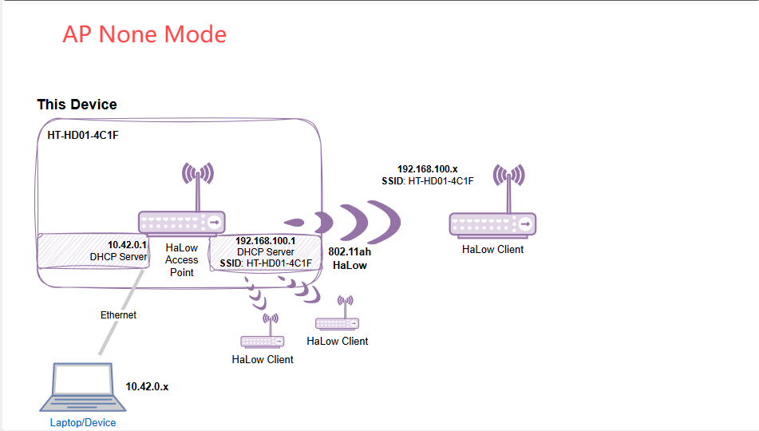
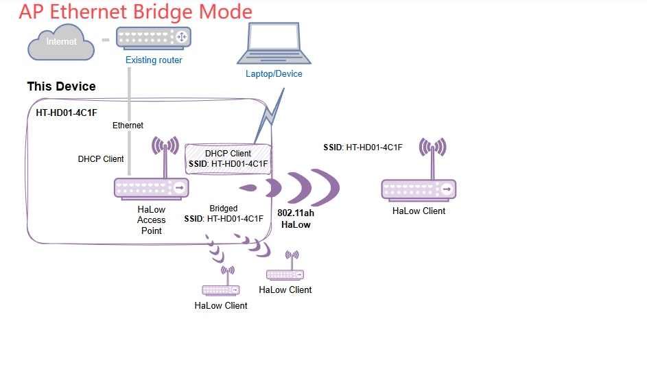
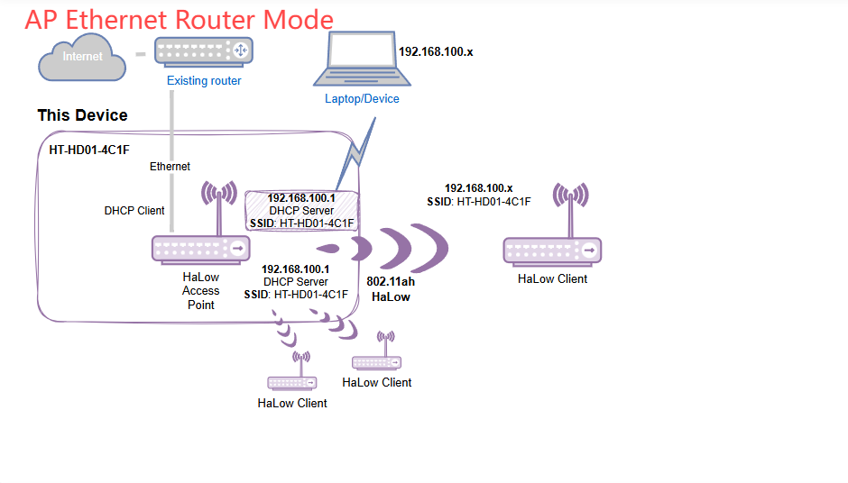
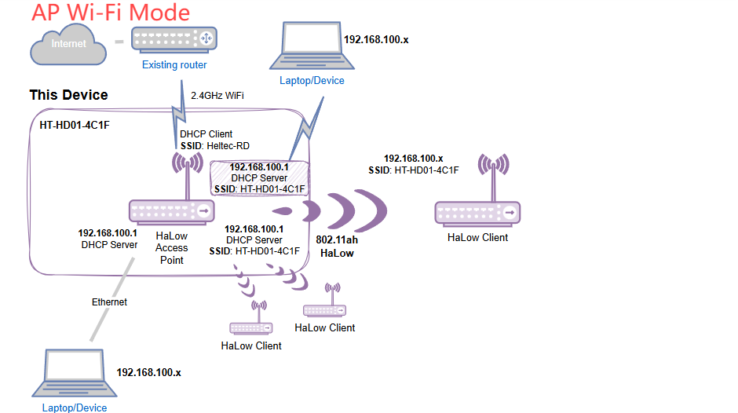
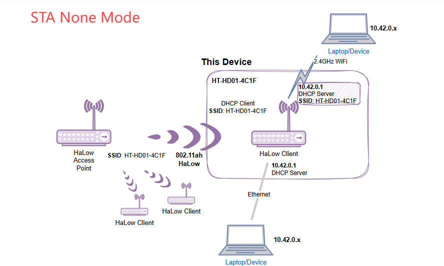
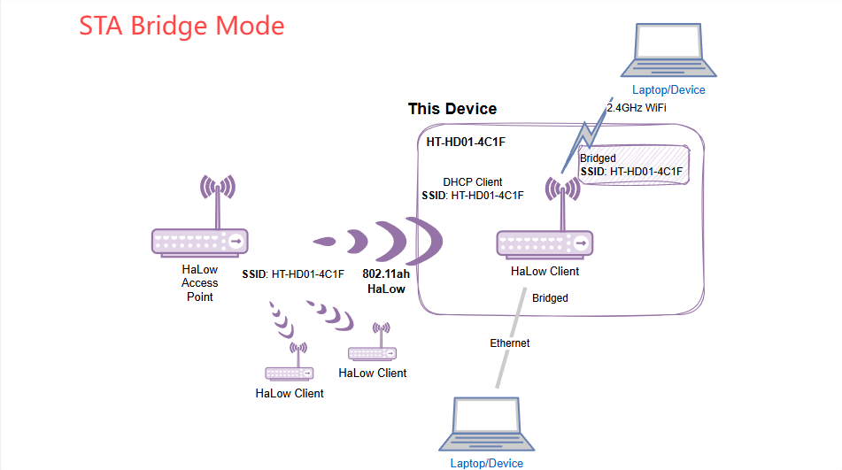
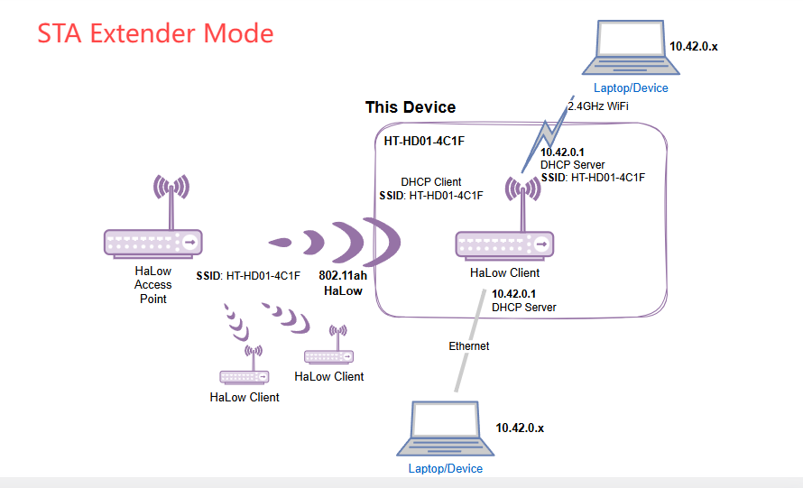

# HaLow Dongle IP Allocation Rules

{ht_translation}`[简体中文]:[English]`

The HaLow Dongle is a network bridge based on Wi-Fi HaLow technology, operating in both AP (Access Point) and STA (Station) modes. This configuration establishes a network structure as follows: Upstream Router → Dongle-AP → Dongle-STA → Terminal Devices.

Depending on the operating mode, the device's IP allocation rules are as follows:

## Upstream Router's IP Allocation

The upstream router provides the **IP address** to the **Dongle-AP**.

## Dongle-AP Operating Modes

In the **Dongle-AP** operating mode, the device's behavior and IP allocation rules are as follows:

| Mode                     | 2.4G Wi-Fi or Ethernet Devices | HaLow STA                    |
| ------------------------ | ------------------------------ | ---------------------------- |
| **NONE Mode**            | 10.42.0.x                      | 192.168.100.x                |
| **Ethernet-Bridge Mode** | No IP allocation               | Allocated by upstream router |
| **Ethernet-Router Mode** | 192.168.100.x                  | 192.168.100.x                |
| **Wi-Fi Mode**           | 192.168.100.x                  | 192.168.100.x                |

------

## Dongle-STA Operating Modes

In the **Dongle-STA** operating mode, the device's IP allocation rules are as follows:

| Mode              | IP Address for Terminal Devices |
| ----------------- | ------------------------------- |
| **NONE Mode**     | 10.42.0.x                       |
| **Bridge Mode**   | Allocated by Dongle-AP, If the AP is also in Bridge mode, it is allocated by the upstream router |
| **Extender Mode** | 10.42.0.x                       |

