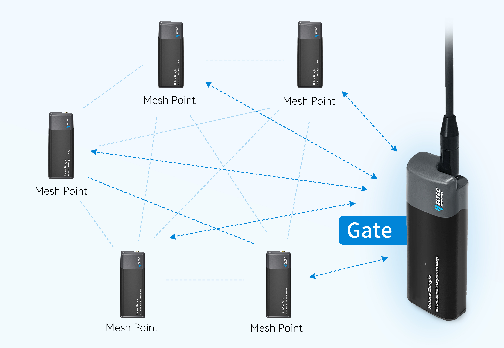

HT-HD01 Mesh Mode User Guide
============================

:ht_translation:`[简体中文]:[Eglish]`

Introduction
------------
The HD01 supports Mesh networking mode, and you can even use it to achieve relay functionality. However, please note the following three points:

- In this mode, one node must act as the MeshGate to connect to the upstream network, while the other nodes serve as MeshPoints.
- In this mode, only devices with the same MeshID can communicate with each other.
- The transmission rate decreases by 50% with each relay.

For configuration instructions, please refer to the following link:

.. toctree::
   :maxdepth: 2
   MeshGate<meshgate>
   MeshPoint<meshpoint>

HD01 Related Links
------------------

- `Access Configuration Page <https://docs.heltec.org/en/wifi_halow/ht-hd01/quick_started.html#access-configuration-page>`_
- `HaLow AP-STA <https://docs.heltec.org/en/wifi_halow/ht-hd01/ap-sta.html>`_

   