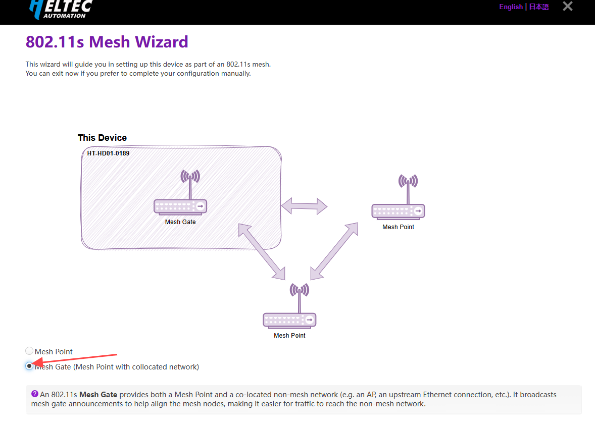

# HD01 MeshGate Setup Guide

{ht_translation}`[简体中文]:[English]`

**This document describes how to configure the HD01 in Mesh Gate mode.**

----------------------------

1. Please ensure you have accessed the device's configuration page. If you need guidance on accessing the configuration interface, please refer to this link:

[Access Configuration](https://docs.heltec.org/en/wifi_halow/ht-hd01/access_configuration_page.html)

2. For devices not in configuration mode: Simply click **Wizards** to proceed. 


For configuration mode access, the following parameters must be set:
- **Country**, Only devices with the same Country setting can communicate with each other.
- **Hostname**, refers to the hostname of your device in the Wi-Fi HaLow network. 


3. Select "**802.11s Mesh Wizard**", click `next`.


4. Select "**Mesh Gate**", click `next`.



5. Set the relevant parameters in the pop-up page, with the parameter descriptions as follows:

- **Mesh ID** & **Passphrase**, Set a Mesh ID and passphrase, and only devices with the same ID and Passphrase can form a Mesh network.
- **Bandwidth** & **Channel**, Available Bandwidths and Channels differ greatly across regions. The higher your bandwidth, the greater the potential throughput of the connection. If you're deploying multiple HaLow access points you may want to select distinct channels and a lower bandwidth to reduce interference.


6. Select the **Upstream Network** connection method and **Traffic Mode**. The upstream network determines the device's internet access method, while Traffic Mode governs how downstream devices obtain IP addresses. Regardless of your selection, the topology diagram and on-screen instructions will dynamically update to reflect your configuration. 


If Wi-Fi is selected as the upstream network, enter the SSID and password of the target network connection here.


7. Enable/Disable "2.4GHz WiFi AP", Set the SSID and password for the 2.4GHz hotspot, then click **Next**.

``` {tip} If don't have stringent low-power requirements, we recommend enabling this feature to facilitate subsequent device management.
```


8. Click **Apply** to complete the device configuration. 

9. If using an Ethernet cable as your upstream network, remember to connect the cable. Upon successful network connection, the device indicator will maintain a solid cyan or purple illumination. 

``` {warning} The RJ45 cable is indicated by cyan, while the USB-C cable is indicated by purple. If the LED color doesn't match your selected cable type, press the function button to toggle between modes.
```


------------------------------------

## Related Links
- [Access Configuration Page](https://docs.heltec.org/en/wifi_halow/ht-hd01/quick_started.html#access-configuration-page)
- [HaLow AP-STA](https://docs.heltec.org/en/wifi_halow/ht-hd01/ap-sta/index.html)
- [Mesh Point](https://docs.heltec.org/en/wifi_halow/ht-hd01/mesh/meshpoint.html)