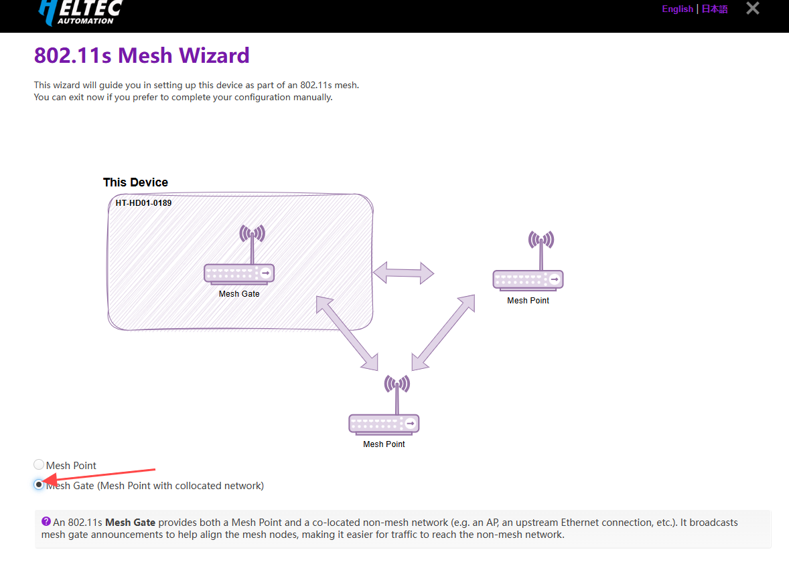
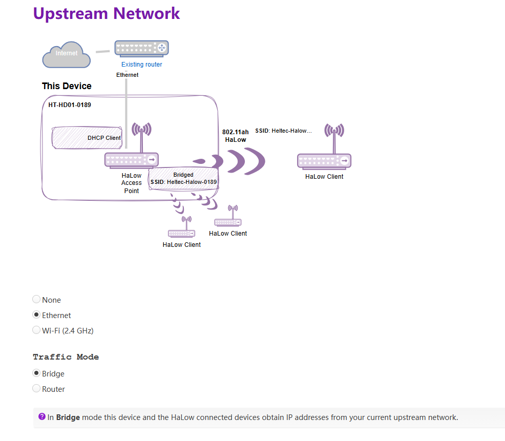

# HD01 MeshGate Setup Guide

{ht_translation}`[简体中文]:[English]`

**This document describes how to configure the HD01 in Mesh Gate mode.**

----------------------------

1. Please ensure you have accessed the device's configuration page. If you need guidance on accessing the configuration interface, please refer to this link:

[Access Configuration](https://docs.heltec.org/en/wifi_halow/ht-hd01/access_configuration_page.html)

2. Click the **Wizard** option. If you accessed this mode via Configuration Mode, you must select the `Country`, set the `Hostname`, and click `next`.
- **Country**, Only devices with the same Country setting can communicate with each other.
- **Hostname**, refers to the hostname of your device in the Wi-Fi HaLow network. 

3. Select "**802.11s Mesh Wizard**", click `next`.

4. Select "**Mesh Gate**", click `next`.

5. Set the relevant parameters in the pop-up page, with the parameter descriptions as follows:

- **Mesh ID** & **Passphrase**, Set a Mesh ID and passphrase, and only devices with the same ID and Passphrase can form a Mesh network.
- **Bandwidth** & **Channel**, Available Bandwidths and Channels differ greatly across regions. The higher your bandwidth, the greater the potential throughput of the connection. If you're deploying multiple HaLow access points you may want to select distinct channels and a lower bandwidth to reduce interference.

6. Select the **upstream network** connection method. For guidance on choosing the appropriate mode, please refer to the instructions on the configuration page and select according to your specific requirements.

7. Enable/Disable "2.4GHz WiFi AP": If you don't have stringent low-power requirements, we recommend enabling this feature to facilitate subsequent device management.

8. Click **Apply** to complete the device configuration.

------------------------------------

## Related Links
- [HaLow Dongle Mesh Point](https://docs.heltec.org/en/wifi_halow/ht-hd01/mesh/meshpoint.html)
- [HaLow Dongle AP-STA Setup Guide](https://docs.heltec.org/en/wifi_halow/ht-hd01/ap-sta.html)