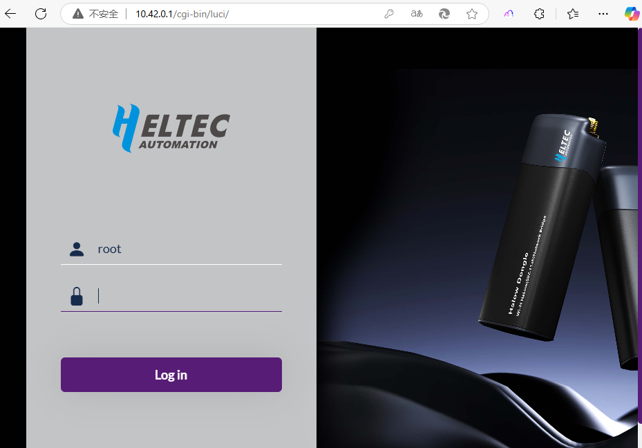
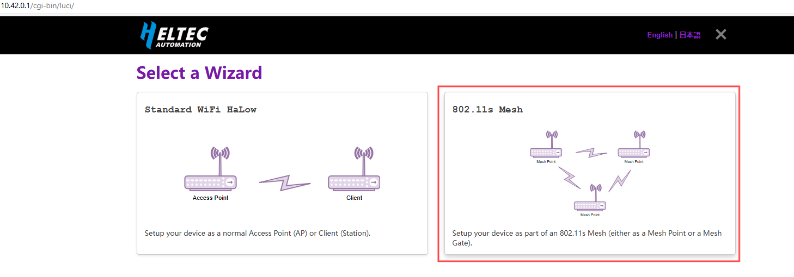

# Wi-Fi HaLow Mesh Point Mode

{ht_translation}`[简体中文]:[English]`

**This document describes how to configure the HD01 in Mesh Point mode.**

------------------------------------

1. Please ensure you have accessed the device's configuration page. If you need guidance on accessing the configuration interface, please refer to this link:

[Access Configuration](https://docs.heltec.org/en/wifi_halow/ht-hd01/access_configuration_page.html)

2. Click the **Wizard** option. If you accessed this mode via Configuration Mode, you must select the `Country`, set the `Hostname`, and click `next`.
- **Country**, Only devices with the same Country setting can communicate with each other.
- **Hostname**, refers to the hostname of your device in the Wi-Fi HaLow network. 

3. Select "**802.11s Mesh Wizard**", click `next`.

4. Select "**Mesh Point**", click `next`.

   

5. Set the relevant parameters in the pop-up page, with the parameter descriptions as follows:

- **Mesh ID** & **Passphrase**, Set a Mesh ID and passphrase, and only devices with the same ID and Passphrase can form a Mesh network.
- **Bandwidth** & **Channel**, Available Bandwidths and Channels differ greatly across regions. The higher your bandwidth, the greater the potential throughput of the connection. If you're deploying multiple HaLow access points you may want to select distinct channels and a lower bandwidth to reduce interference.

After completing the above steps, click `Next`.

5. Select [Traffic Mode], which determines the downstream network mode provided by this MeshPoint device. For guidance on mode selection, refer to the configuration page's detailed descriptions of each available mode. 

------------------------------------

For other modes , please refer to the [Wi-Fi HaLow Usage guide](https://docs.heltec.org/en/wifi_halow/halow_guide/index.html).

